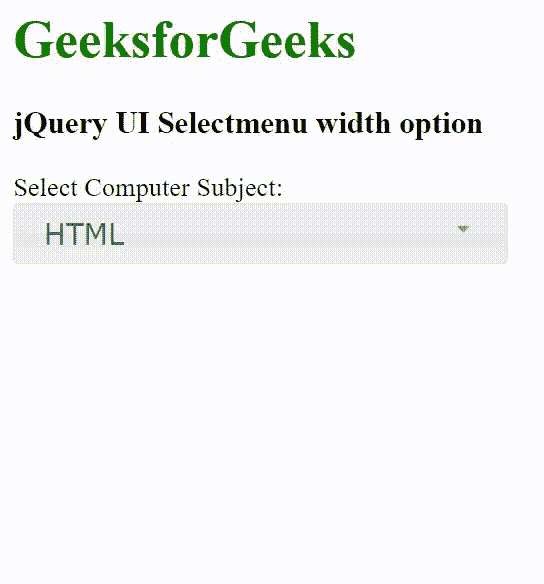

# jquery ui select menu width option

> 哎哎哎:# t0]https://www . geeksforgeeks . org/jquery-ui-select menu-width 选项/

jQuery UI 由 GUI 小部件、视觉效果和使用 HTML、CSS 和 jQuery 实现的主题组成。jQuery 用户界面非常适合为网页构建用户界面。
jQuery UI Selectmenu 宽度选项用于设置选项菜单的宽度，以像素为单位。如果宽度值设置为空，则使用原生选择的宽度。

**语法:**

```html
$( ".selector" ).selectmenu({
  width: val
});
```

**CDN 链接:**首先，添加项目所需的 jQuery UI 脚本。

> <link rel="”stylesheet”" href="”//code.jquery.com/ui/1.12.1/themes/smoothness/jquery-ui.css”">
> <脚本 src =//code . jquery . com/jquery-1 . 12 . 4 . js "></脚本>
> <脚本 src =//code . jquery . com/ui/1 . 12 . 1/jquery-ui . js "></脚本>

**示例:**

## 超文本标记语言

```html
<!doctype html>
<html lang="en">

<head>
    <meta charset="utf-8">
    <link rel="stylesheet" href=
    "//code.jquery.com/ui/1.12.1/themes/smoothness/jquery-ui.css">
    <script src="//code.jquery.com/jquery-1.12.4.js"></script>
    <script src="//code.jquery.com/ui/1.12.1/jquery-ui.js"></script>
    <style>
        label {
            display: block;
        }
    </style>
</head>

<body>
    <h1 style="color: green;">GeeksforGeeks</h1>

    <h3>jQuery UI Selectmenu width option</h3>

    <label for="sub">Select Computer Subject:</label>

    <select name="sub" id="sub">
        <option value="Slower">HTML</option>
        <option value="Slow">CSS</option>
        <option value="Medium">JavaScript</option>
        <option value="Fast">Java</option>
        <option value="Faster">Python</option>
    </select>

    <script>
        $("#sub").selectmenu({
            width: 300
        });
    </script>
</body>

</html>
```

**输出:**



**参考:**[https://API . jquery ui . com/select menu/# option-width](https://api.jqueryui.com/selectmenu/#option-width)