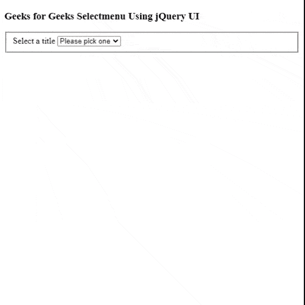

# jQuery UI Selectmenu

> 哎哎哎:# t0]https://www . geeksforgeeks . org/jquery-ui-select menu/

在本文中，我们将使用 jQuery UI *selectmenu* 小部件构建一个选择菜单，该小部件可以为我们提供选择选项。我们可以使用这个小部件为不同的动作制作一个表单。

**语法:**

```html
$( ".selector" ).selectmenu();
```

**参数:**不接受任何参数。

**返回值:**从 jQuery 界面返回选择菜单。

**预编译文件:**请下载库，然后使用下面给定脚本的路径。

> <link rel="”stylesheet”" href="”//code.jquery.com/ui/1.12.1/themes/base/jquery-ui.css”">
> <脚本 src = " https://code . jquery . com/jquery-1 . 12 . 4 . js "></脚本>
> <脚本 src = " https://code . jquery . com/ui/1 . 12 . 1/jquery-ui . js "></脚本>

**示例:**在本例中，我们可以看到，我们将使用 jQuery UI 的*选择菜单*小部件构建一个简单的选择菜单。

## 超文本标记语言

```html
<!doctype html>
<html lang="en">

<head>
    <meta charset="utf-8">
    <meta name="viewport" content=
        "width=device-width, initial-scale=1">

    <link href=
"http://ajax.googleapis.com/ajax/libs/jqueryui/1.8.16/
               themes/ui-lightness/jquery-ui.css" 
               rel="stylesheet" type="text/css" />

    <script src="https://code.jquery.com/jquery-1.12.4.js">
    </script>
    <script src="https://code.jquery.com/ui/1.12.1/jquery-ui.js">
    </script>

    <script>
        $(function () {
            $("#title").selectmenu();
        });
    </script>
    <style>
        .ui-menu {
            width: 150px;
        }

        .widget-header {
            padding: 0.2em;
            color: white;
        }
    </style>
</head>

<body>
    <h3>
        Geeks for Geeks Selectmenu 
        Using jQuery UI
    </h3>

    <div>
        <form action="#">
            <fieldset>
                <label for="title">Select a title</label>
                <select name="title" id="title">
                    <option disabled selected>
                        Please pick one</option>
                    <option>Python</option>
                    <option>Java</option>
                    <option>HTML</option>
                    <option>C++</option>
                    <option>Other</option>
                </select>
            </fieldset>
        </form>
    </div>
</body>

</html>
```

**输出:**



**参考资料:**[https://jquery ui . com/select menu/](https://jqueryui.com/selectmenu/)