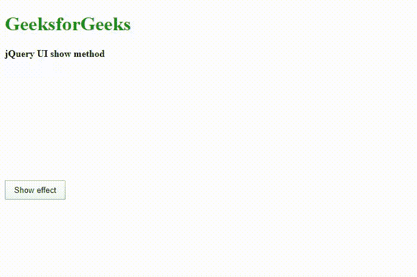
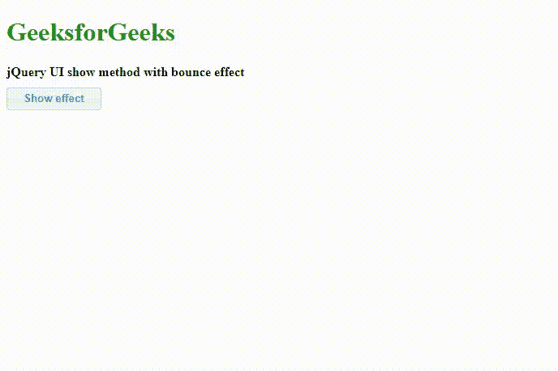
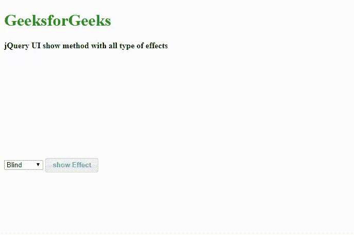

# jQuery UI | show()方法

> 原文:[https://www.geeksforgeeks.org/jquery-ui-show-method/](https://www.geeksforgeeks.org/jquery-ui-show-method/)

jQuery UI 框架的 **show()** 方法为匹配的选定元素显示或管理所有类型的视觉效果，这些元素的样式是在用户界面的 CSS 代码中设计的。

**语法:**

```html
(selector).show( effectType[, options ] [, duration ] [, complete ] );

```

**参数:**它接受一个参数“效果类型”，这是将要添加的视觉效果的类型。

*   **效果类型:**类型为*弦*。它指定用于过渡的效果类型。
*   **选项:**类型为*对象。*它指定了放松的特定设置所需的选项。
*   **时长:**类型为*号*或*弦*。这指定了动画效果应该运行多长时间，例如*快*、*慢*或*400 毫秒*
*   **完成:**这是动画效果完成时调用的回调方法。

**返回值:**返回给定视觉效果的选中元素。

**jQuery 界面链接:**

> <link>href = " https://code . jquery . com/ui/1 . 10 . 4/themes/ui-light/jquery-ui . CSS " rel = " style sheet " type = " text/CSS "/
> T4】src = " https://code . jquery . com/jquery-1 . 10 . 2 . js ">/script>

**示例 1:** 在下面的示例中， **show()** 功能在 jQuery 代码中实现，以*摇动*效果类型和*时间*和*距离*作为选项，一个回调函数作为参数，显示匹配元素的视觉效果。回调函数在效果完成或在屏幕上完成后调用。回调函数在过程中完成效果后淡出容器。

```html
<!DOCTYPE html>
<html lang="en">

<head>
    <meta charset="utf-8">
    <meta name="viewport" content=
        "width=device-width, initial-scale=1">

    <title>jQuery UI show() method</title>

    <link href=
"https://code.jquery.com/ui/1.10.4/themes/ui-lightness/jquery-ui.css"
        rel="stylesheet">

    <script src=
"https://code.jquery.com/jquery-1.10.2.js">
    </script>

    <script src=
"https://code.jquery.com/ui/1.10.4/jquery-ui.js">
    </script>

    <style>
        .height {
            height: 10px;
        }

        .divClass {
            width: 400px;
            height: 180px;
        }

        #btnID {
            padding: .5em 1em;
            text-decoration: none;
        }

        #container {
            position: relative;
            width: 260px;
            height: 145px;
            padding: 0.3em;
            border: 1px solid black
        }
    </style>

    <script>
        $(function () {

            function showEffect() {

                // Run the show  method with shake effect
                $("#container").show("shake", { times: 10,
                        distance: 200 }, 2000, callback);
            };

            // Callback method
            function callback() {
                setTimeout(function () {
                    $("#container:visible")
                        .removeAttr("style").fadeOut();
                }, 2000);
            };
            $("#btnID").click(function () {
                showEffect();
                return false;
            });
            $("#container").hide();
        });
    </script>
</head>

<body>
    <h1 style="color:green">GeeksforGeeks</h1>

    <b>jQuery UI show method </b>
    <div class="height"></div>

    <div class="divClass">
        <div id="container">
            <p>
                This is jQuery UI show method demonstration,
                which displays the matched elements.The
                 matched element will show the element with
                  the chosen effect in the jQuery code.
            </p>
        </div>
    </div>

    <div class="height"></div>
    <button id="btnID">Show effect</button>
</body>

</html>
```

**输出:**


**示例 2:** 在下面的示例中， **show()** 方法的简单实现是在 jQuery 代码中以*弹跳*视觉效果为参数完成的。该方法应用于用户界面页面的“h2”元素。 *ui-corner-all* 和 *ui-state-default* 是 jQuery ui CSS 框架提供的内置类，让 UI 更具交互性和美观性。

```html
<!DOCTYPE html>
<html>

<head>
    <title>
        jQuery UI Show Method with bounce effect
    </title>

    <meta name="viewport" content=
        "width=device-width, initial-scale=1">

    <link href=
"https://code.jquery.com/ui/1.10.4/themes/ui-lightness/jquery-ui.css"
        rel="stylesheet">

    <script src=
        "http://code.jquery.com/jquery-2.1.3.js">
    </script>

    <script src=
        "http://code.jquery.com/ui/1.11.2/jquery-ui.js">
    </script>

    <style>
        #btnID {
            padding: .4em 1.5em;
            text-decoration: none;
        }

        .highlight {
            color: #090;
            font-family: Calibri;
            font-size: 2em;
            text-shadow: 2px 2px #FF0000;
        }

        .height {
            height: 10px;
        }
    </style>

    <script>
        $(document).ready(function () {
            $("h2").hide();
            $("#btnID").click(function () {

                // Show with bounce effect
                $("h2").show("bounce", 3000);
            })
        });
    </script>
</head>

<body>
    <h1 style="color:green">GeeksforGeeks</h1>
    <b>jQuery UI show method with bounce effect</b>
    <div class="height"></div>
    <h2 class="highlight">Learning jQuery UI </h2>

    <button id="btnID" 
        class="ui-corner-all ui-state-default">
        Show effect
    </button>
</body>

</html>
```

**输出:**


**示例 3:**jQuery UI 框架提供了以多种视觉效果为参数的 **show()** 方法。在下面的示例中，我们将演示使用 combobox 菜单选项来由用户选择视觉效果类型的方法。当用户选择效果类型时，会传递到 **show()** 方法进行输出，如输出图像所示。程序员可以根据项目要求编写代码和选择参数。

```html
<!DOCTYPE html>
<html lang="en">

<head>
    <meta charset="utf-8">
    <meta name="viewport" content="width=device-width,
            initial-scale=1">

    <title>jQuery UI Show Method with All effects</title>

    <link href=
"https://code.jquery.com/ui/1.10.4/themes/ui-lightness/jquery-ui.css"
        rel="stylesheet">

    <script src=
        "http://code.jquery.com/jquery-2.1.3.js">
    </script>

    <script src=
        "http://code.jquery.com/ui/1.11.2/jquery-ui.js">
    </script>

    <style>
        .height {
            height: 10px;
        }

        .divClass {
            width: 500px;
            height: 200px;
        }

        #btnID {
            padding: .4em 1em;
            text-decoration: none;
        }

        #container {
            width: 250px;
            height: 180px;
            padding: 0.5em;
            position: relative;
        }

        #container h4 {
            margin: 0;
            padding: 0.3em;
            text-align: center;
        }
    </style>

    <script>
        $(function () {

            // show the selected effect
            // type by the user
            function showEffect() {

                var effectType = $("#typesOfEffectId").val();

                // show the effect with call back
                $("#container").show(effectType, 800, callback);
            };

            // Callback function to get original state
            function callback() {
                setTimeout(function () {
                    $("#container:visible")
                        .removeAttr("style").fadeOut();
                }, 2000);
            };

            // Set effect from select menu value
            $("#btnID").on("click", function () {
                showEffect();
            });

            $("#container").hide();
        });
    </script>
</head>

<body>
    <h1 style="color:green">GeeksforGeeks</h1>
    <b>jQuery UI show method with all type of effects</b>

    <div class="height"></div>

    <div class="divClass">
        <div id="container" class="ui-widget-content ui-corner-all">
            <h4 class="ui-widget-header ui-corner-all">Show</h4>
            <p>
                In this tutorial, we are going to learn about
                jQuery UI framework show method with different
                variety of effects.
            </p>
        </div>
    </div>

    <select name="effectTypes" id="typesOfEffectId">
        <option value="blind">Blind</option>
        <option value="clip">Clip</option>
        <option value="drop">Drop</option>
        <option value="explode">Explode</option>
        <option value="fade">Fade</option>
        <option value="fold">Fold</option>
        <option value="highlight">Highlight</option>
        <option value="puff">Puff</option>
        <option value="pulsate">Pulsate</option>
        <option value="slide">Slide</option>
    </select>

    <button id="btnID" class="ui-state-default ui-corner-all">
        show Effect
    </button>
</body>

</html>
```

**输出:**
