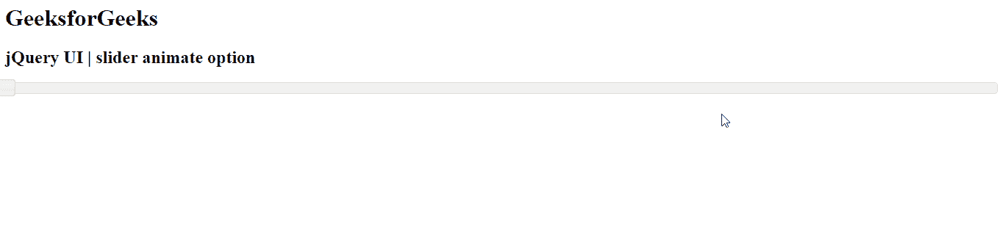
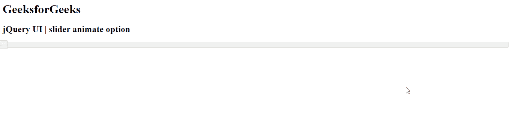
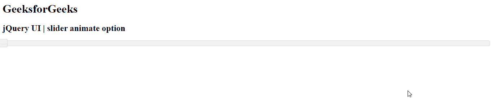

# jQuery 用户界面滑块动画选项

> 原文:[https://www . geesforgeks . org/jquery-ui-slider-animate-option/](https://www.geeksforgeeks.org/jquery-ui-slider-animate-option/)

jQuery UI 由 GUI 小部件、视觉效果和使用 jQuery、CSS 和 HTML 实现的主题组成。jQuery 用户界面非常适合为网页构建用户界面。jQueryUI 通过滑块小部件为我们提供了一个滑块控件。滑块帮助我们使用给定的范围获得某个值。在本文中，我们将看到如何制作滑块的动画。当*选项设置为*真*时，当您直接单击滑块轴上的任意点时，将创建动画效果*

**语法:**

```
$(".selector").slider(
   { animate: value }
);
```

**参数:**该选项接受如下讨论的三个参数:

*   **布尔值:**如果设置为*真*，滑块将被激活。默认情况下，该值为*假*
*   **字符串:**用于设置滑块光标速度的字符串值。可用值为*慢速、正常、快速*。
*   **数字:**动画的持续时间，以毫秒为单位。

**CDN 链接:**首先，添加项目所需的 jQuery UI 脚本。

> <link href="“https://code.jquery.com/ui/1.10.4/themes/ui-lightness/jquery-ui.css”" rel="“stylesheet”">
> <脚本 src = " https://code . jquery . com/jquery-1 . 10 . 2 . js "></脚本>
> <脚本 src = " https://code . jquery . com/ui/1 . 10 . 4/jquery-ui . js "></脚本>

**示例 1:** 在本例中，我们将使用布尔值。

## 超文本标记语言

```
<!DOCTYPE html>
<html lang="en">
  <head>
    <meta charset="utf-8" />
    <link href=
"https://code.jquery.com/ui/1.10.4/themes/ui-lightness/jquery-ui.css"
      rel="stylesheet"/>
    <script src=
"https://code.jquery.com/jquery-1.10.2.js">
    </script>
    <script src=
"https://code.jquery.com/ui/1.10.4/jquery-ui.js">
    </script>
    <script>
      $(function () {
        $("#gfg").slider({ animate: true });
      });
    </script>
  </head>

  <body>
    <h1>GeeksforGeeks</h1>
    <h2>jQuery UI | slider animate option</h2>
    <div id="gfg"></div>
  </body>
</html>
```

**输出:**



**示例 2:** 在本例中，我们将使用字符串值。

## 超文本标记语言

```
<!DOCTYPE html>
<html lang="en">
  <head>
    <meta charset="utf-8" />
    <link href=
"https://code.jquery.com/ui/1.10.4/themes/ui-lightness/jquery-ui.css"
      rel="stylesheet"/>
    <script src=
"https://code.jquery.com/jquery-1.10.2.js">
    </script>
    <script src=
"https://code.jquery.com/ui/1.10.4/jquery-ui.js">
    </script>

    <script>
      $(function () {
        $("#gfg").slider({ animate: "fast" });
      });
    </script>
  </head>

  <body>
    <h1>GeeksforGeeks</h1>
    <h2>jQuery UI | slider animate option</h2>
    <div id="gfg"></div>
  </body>
</html>
```

**输出:**



**示例 3:** 在本例中，我们将使用数值。

## 超文本标记语言

```
<!DOCTYPE html>
<html lang="en">
  <head>
    <meta charset="utf-8" />
    <link href=
"https://code.jquery.com/ui/1.10.4/themes/ui-lightness/jquery-ui.css"
      rel="stylesheet"/>
    <script src=
"https://code.jquery.com/jquery-1.10.2.js">
    </script>
    <script src=
"https://code.jquery.com/ui/1.10.4/jquery-ui.js">
    </script>

    <script>
      $(function () {
        $("#gfg").slider({ animate: 1000 });
      });
    </script>
  </head>

  <body>
    <h1>GeeksforGeeks</h1>
    <h2>jQuery UI | slider animate option</h2>
    <div id="gfg"></div>
  </body>
</html>
```

**输出:**



**参考:**T2】https://api.jqueryui.com/slider/#option-animate