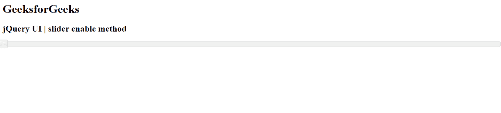

# jQuery 用户界面滑块启用()方法

> 原文:[https://www . geesforgeks . org/jquery-ui-slider-enable-method/](https://www.geeksforgeeks.org/jquery-ui-slider-enable-method/)

jQuery UI 由 GUI 小部件、视觉效果和使用 jQuery、CSS 和 HTML 实现的主题组成。jQuery 用户界面非常适合为网页构建用户界面。 jQueryUI 通过滑块小部件为我们提供了一个滑块控件。滑块帮助我们使用给定的范围获得某个值。在本文中，我们将看到如何启用 jQuery 用户界面滑块。
使用**启用()方法**启用当前滑块。

**语法:**

```html
$( ".selector" ).slider("enable");
```

**方法:**首先，添加项目所需的 jQuery UI 脚本。

> <link href="“https://code.jquery.com/ui/1.10.4/themes/ui-lightness/jquery-ui.css”" rel="“stylesheet”">
> <脚本 src = " https://code . jquery . com/jquery-1 . 10 . 2 . js "></脚本>
> <脚本 src = " https://code . jquery . com/ui/1 . 10 . 4/jquery-ui . js "></脚本>

**示例:**

## 超文本标记语言

```html
<!doctype html>
<html lang="en">

<head>
    <meta charset="utf-8">
    <link href=
"https://code.jquery.com/ui/1.10.4/themes/ui-lightness/jquery-ui.css"
        rel="stylesheet">

    <script src=
        "https://code.jquery.com/jquery-1.10.2.js">
    </script>

    <script src=
        "https://code.jquery.com/ui/1.10.4/jquery-ui.js">
    </script>

    <script>
        $(function() {
            $("#gfg").slider();
            $("#gfg").slider("enable");
        });
    </script>
</head>

<body>
    <h1>GeeksforGeeks</h1>
    <h2>jQuery UI | slider enable method</h2>
    <div id="gfg"></div>
</body>

</html>
```

**输出:**

