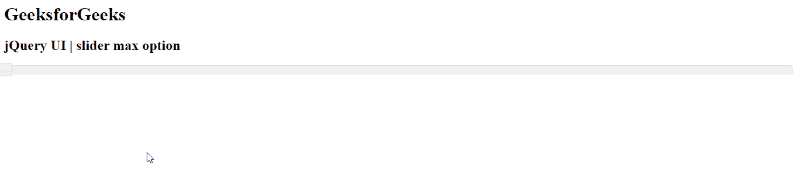
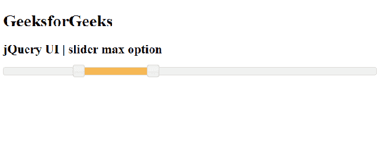

# jQuery 用户界面滑块最大选项

> 原文:[https://www.geeksforgeeks.org/jquery-ui-slider-max-option/](https://www.geeksforgeeks.org/jquery-ui-slider-max-option/)

jQuery UI 由 GUI 小部件、视觉效果和使用 jQuery、CSS 和 HTML 实现的主题组成。jQuery 用户界面非常适合为网页构建用户界面。jQuery UI 通过滑块小部件为我们提供了一个滑块控件。滑块帮助我们使用给定的范围获得某个值。在本文中，我们将看到如何在滑块中设置 *max* 选项。*最大值*选项用于设置滑块的上限。

**语法:**

```
$(".selector").slider(
   { max : 20}
);
```

**参数:**该选项接受一个参数，如下所述。

*   **数字:**要设置的滑块的上限。

**CDN 链接:**首先，添加项目所需的 jQuery UI 脚本。

> <link href="“https://code.jquery.com/ui/1.10.4/themes/ui-lightness/jquery-ui.css”" rel="“stylesheet”">
> <脚本 src = " https://code . jquery . com/jquery-1 . 10 . 2 . js "></脚本>
> <脚本 src = " https://code . jquery . com/ui/1 . 10 . 4/jquery-ui . js "></脚本>

**示例 1:** 在本例中，我们将使用最大数值 15。

## 超文本标记语言

```
<!doctype html>
<html lang = "en">
   <head>
      <meta charset = "utf-8">
      <link href = 
"https://code.jquery.com/ui/1.10.4/themes/ui-lightness/jquery-ui.css"
         rel = "stylesheet">
      <script 
         src = 
"https://code.jquery.com/jquery-1.10.2.js">
      </script>
      <script 
         src = 
"https://code.jquery.com/ui/1.10.4/jquery-ui.js">
      </script>

      <script>
         $(function() {
            $( "#gfg" ).slider(
               {max : 15}
            );
         });
      </script>
   </head>

   <body>
      <h1>GeeksforGeeks</h1> 
      <h2>jQuery UI | slider max option</h2>
      <div id="gfg"></div>
   </body>
</html>
```

**输出:**



**示例 2:** 在本例中，我们将使用*范围*选项，其中*最小，最大*数值为 0 和 500。

## 超文本标记语言

```
<!doctype html>
<html lang = "en">
   <head>
      <meta charset = "utf-8">
      <link href = 
"https://code.jquery.com/ui/1.10.4/themes/ui-lightness/jquery-ui.css"
         rel = "stylesheet">
      <script src = 
"https://code.jquery.com/jquery-1.10.2.js">
      </script>
      <script src = 
"https://code.jquery.com/ui/1.10.4/jquery-ui.js">
      </script>
      <script>
         $(function() {
          $( "#gfg" ).slider({
              range: true,
              min: 0,
              max: 500,
              values: [ 100, 300 ],
           });
         });         
      </script>
   </head>

   <body>
      <h1>GeeksforGeeks</h1> 
      <h2>jQuery UI | slider max option</h2>
      <div id = "gfg"></div>
   </body>
</html>
```

**输出:**



**参考:**[https://API . jquery ui . com/slider/# option-max](https://api.jqueryui.com/slider/#option-max)