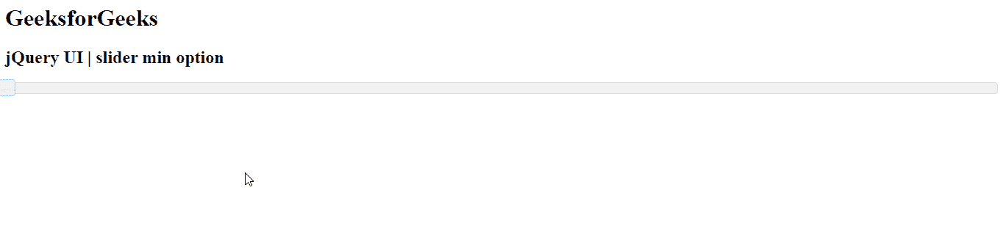
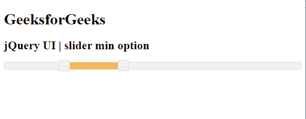

# jQuery 用户界面滑块最小选项

> 原文:[https://www.geeksforgeeks.org/jquery-ui-slider-min-option/](https://www.geeksforgeeks.org/jquery-ui-slider-min-option/)

jQuery UI 由 GUI 小部件、视觉效果和使用 jQuery、CSS 和 HTML 实现的主题组成。jQuery 用户界面非常适合为网页构建用户界面。jQueryUI 通过滑块小部件为我们提供了一个滑块控件。滑块帮助我们使用给定的范围获得某个值。在本文中，我们将看到如何在滑块中设置 **min** 选项。最小选项用于设置滑块的较低范围。

**语法:**

```html
$(".selector").slider(
   { min : 20}
);
```

**参数:**该选项接受一个参数，如下所述。

*   **数字:**要设置的滑块的下限范围。默认情况下，该值为**0**T4

**CDN 链接:**首先，添加项目所需的 jQuery UI 脚本。

> <link href="“https://code.jquery.com/ui/1.10.4/themes/ui-lightness/jquery-ui.css”" rel="“stylesheet”">
> <脚本 src = " https://code . jquery . com/jquery-1 . 10 . 2 . js "></脚本>
> <脚本 src = " https://code . jquery . com/ui/1 . 10 . 4/jquery-ui . js "></脚本>

**示例 1:** 在本例中，我们将使用最小值作为 2。

## 超文本标记语言

```html
<!DOCTYPE html>
<html lang="en">
  <head>
    <meta charset="utf-8" />
    <link href=
"https://code.jquery.com/ui/1.10.4/themes/ui-lightness/jquery-ui.css"
      rel="stylesheet"/>
    <script src=
"https://code.jquery.com/jquery-1.10.2.js">
    </script>
    <script src=
"https://code.jquery.com/ui/1.10.4/jquery-ui.js">
    </script>

    <script>
      $(function () {
        $("#gfg").slider({ min: 2, max: 8 });
      });
    </script>
  </head>

  <body>
    <h1>GeeksforGeeks</h1>
    <h2>jQuery UI | slider min option</h2>
    <div id="gfg"></div>
  </body>
</html>
```

**输出:**



**示例 2:** 在本例中，我们将使用*范围*选项，滑块的值和最小、最大数值分别为 0 和 100。

## 超文本标记语言

```html
<!DOCTYPE html>
<html lang="en">
  <head>
    <meta charset="utf-8" />
    <link href=
"https://code.jquery.com/ui/1.10.4/themes/ui-lightness/jquery-ui.css"
      rel="stylesheet"/>
    <script src=
"https://code.jquery.com/jquery-1.10.2.js">
    </script>
    <script src=
"https://code.jquery.com/ui/1.10.4/jquery-ui.js">
    </script>

    <script>
      $(function () {
        $("#gfg").slider({
          range: true,
          values: [20, 40],
          min: 0,
          max: 100,
        });
      });
    </script>
  </head>

  <body>
    <h1>GeeksforGeeks</h1>
    <h2>jQuery UI | slider min option</h2>
    <div id="gfg"></div>
  </body>
</html>
```

**输出:**



**参考:**[https://API . jquery ui . com/slider/# option-min](https://api.jqueryui.com/slider/#option-min)