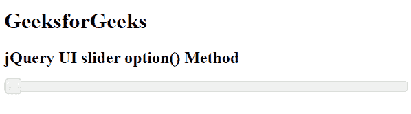
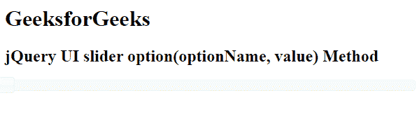
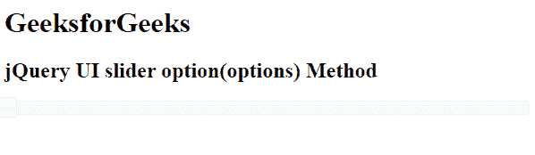
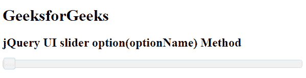

# jQuery UI 滑块选项()方法

> 原文:[https://www . geesforgeks . org/jquery-ui-slider-option-method/](https://www.geeksforgeeks.org/jquery-ui-slider-option-method/)

jQuery UI 由 GUI 小部件、视觉效果和使用 HTML、CSS 和 jQuery 实现的主题组成。jQuery 用户界面非常适合为网页构建用户界面。它通过滑块小部件为我们提供了一个滑块控件。滑块帮助我们使用给定的范围获得某个值。在本文中，我们将看到如何在 jQuery UI 滑块中使用**选项()方法**。**选项()方法**用于获取特定当前滑块选项的对象。

**语法:**

```html
option(optionName) Method
$( ".selector" ).slider( "option", "disabled" );
```

或者

```html
option() Method
$( ".selector" ).slider("option");
```

或者

```html
option(optionName, value) Method
$( ".selector" ).slider( "option", "disabled", true );

```

或者

```html
option(options) Method
$( ".selector" ).slider( "option", { disabled: true } );
```

**方法:**首先，添加项目所需的 jQuery UI 脚本。

> <link href="“https://code.jquery.com/ui/1.10.4/themes/ui-lightness/jquery-ui.css”" rel="“stylesheet”">

**例 1:** 本例描述了 option()方法的实现。

## 超文本标记语言

```html
<!doctype html>
<html lang="en">

<head>
    <meta charset="utf-8">
    <link href=
"https://code.jquery.com/ui/1.10.4/themes/ui-lightness/jquery-ui.css"
        rel="stylesheet">
    <script src="https://code.jquery.com/jquery-1.10.2.js">
    </script>
    <script src="https://code.jquery.com/ui/1.10.4/jquery-ui.js">
    </script>

    <script>
        $(function() {
            $("#gfg").slider();
            var a = $("#gfg").slider("option");
            console.log(a)
        });
    </script>
</head>

<body>
    <h1>GeeksforGeeks</h1>
    <h2>jQuery UI slider option() method</h2>

    <div id="gfg"></div>
</body>

</html>
```

**输出:**



**例 2:** 本例描述了 option(optionName，value)方法的实现。

## 超文本标记语言

```html
<!doctype html>
<html lang="en">

<head>
    <meta charset="utf-8">
    <link href=
"https://code.jquery.com/ui/1.10.4/themes/ui-lightness/jquery-ui.css"
        rel="stylesheet">
    <script src="https://code.jquery.com/jquery-1.10.2.js">
    </script>
    <script src="https://code.jquery.com/ui/1.10.4/jquery-ui.js">
    </script>

    <script>
        $(function() {
            $("#gfg").slider();
            $("#gfg").slider("option", "disabled", true);
        });
    </script>
</head>

<body>
    <h1>GeeksforGeeks</h1>
    <h2>jQuery UI slider option(optionName, value) Method</h2>

    <div id="gfg"></div>
</body>

</html>
```

**输出:**



**例 3:** 本例描述了 option(选项)方法的实现。

## 超文本标记语言

```html
<!doctype html>
<html lang="en">

<head>
    <meta charset="utf-8">
    <link href=
"https://code.jquery.com/ui/1.10.4/themes/ui-lightness/jquery-ui.css"
        rel="stylesheet">
    <script src="https://code.jquery.com/jquery-1.10.2.js">
    </script>
    <script src="https://code.jquery.com/ui/1.10.4/jquery-ui.js">
    </script>

    <script>
        $(function() {
            $("#gfg").slider();
            $("#gfg").slider("option", {
                disabled: true
            });
        });
    </script>
</head>

<body>
    <h1>GeeksforGeeks</h1>
    <h2>jQuery UI slider option(options) Method</h2>
    <div id="gfg"></div>
</body>

</html>
```

**输出:**



**例 4:** 本例描述了 option(optionName)方法的实现。

## 超文本标记语言

```html
<!doctype html>
<html lang="en">

<head>
    <meta charset="utf-8">
    <link href=
"https://code.jquery.com/ui/1.10.4/themes/ui-lightness/jquery-ui.css"
        rel="stylesheet">
    <script src="https://code.jquery.com/jquery-1.10.2.js">
    </script>
    <script src="https://code.jquery.com/ui/1.10.4/jquery-ui.js">
    </script>

    <script>
        $(function() {
            $("#gfg").slider();
            var a = $("#gfg").slider("option", "disabled");
            console.log(a)
        });
    </script>
</head>

<body>
    <h1>GeeksforGeeks</h1>
    <h2>jQuery UI slider option(optionName) Method</h2>

    <div id="gfg"></div>
</body>

</html>
```

**输出:**



**参考:**T2】https://api.jqueryui.com/category/widgets/