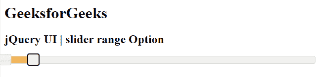
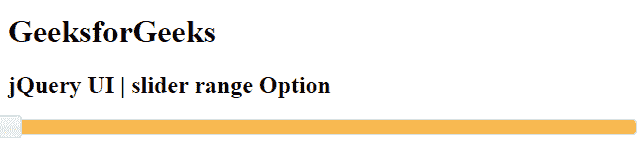
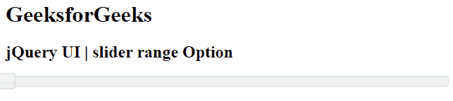

# jQuery 用户界面滑块范围选项

> 原文:[https://www . geesforgeks . org/jquery-ui-slider-range-option/](https://www.geeksforgeeks.org/jquery-ui-slider-range-option/)

jQuery 用户界面由图形用户界面小部件、视觉效果和使用 jQuery、CSS 和 HTML 实现的主题组成。jQuery 用户界面非常适合为网页构建用户界面。jQuery UI 通过滑块小部件为我们提供了一个滑块控件。滑块帮助我们使用给定的范围获得某个值。在本文中，我们将看到如何在滑块中设置**范围**选项。**范围**选项用于设置滑块的范围。

**语法:**

```html
$(".selector").slider(
   { range : 'string' | boolean}
);
```

**参数:**该选项接受如下所述的两个参数。

*   **字符串:**要设置的滑块范围。可用值有最小值、最大值
*   **布尔值:**如果设置为**真**，滑块有两个手柄。默认情况下，该值为**假**。

**CDN 链接:**首先，添加 jQuery UI 脚本 CDN 链接，这是您的任务所需要的。

> <link href="“https://code.jquery.com/ui/1.10.4/themes/ui-lightness/jquery-ui.css”" rel="“stylesheet”">

以下示例说明了 jQuery 用户界面滑块范围选项:

**示例 1:** 在本例中，我们将使用布尔值，并将 is 设置为 **true** 。

## 超文本标记语言

```html
<!DOCTYPE html>
<html lang="en">
    <head>
        <meta charset="utf-8" />
        <link href=
"https://code.jquery.com/ui/1.10.4/themes/ui-lightness/jquery-ui.css" 
              rel="stylesheet" />
        <script src=
"https://code.jquery.com/jquery-1.10.2.js">
        </script>
        <script src=
"https://code.jquery.com/ui/1.10.4/jquery-ui.js">
        </script>

        <script>
            $(function () {
                $("#gfg").slider({ range: true });
            });
        </script>
    </head>
    <body>
        <h1>GeeksforGeeks</h1>
        <h2>jQuery UI | slider range Option</h2>
        <div id="gfg"></div>
    </body>
</html>
```

**输出:** 

**示例 2:** 在本例中，我们将使用字符串值，并将其设置为**最大值**

## 超文本标记语言

```html
<!DOCTYPE html>
<html lang="en">
    <head>
        <meta charset="utf-8" />
        <link href=
"https://code.jquery.com/ui/1.10.4/themes/ui-lightness/jquery-ui.css" 
              rel="stylesheet" />
        <script src=
"https://code.jquery.com/jquery-1.10.2.js">
        </script>
        <script src=
"https://code.jquery.com/ui/1.10.4/jquery-ui.js">
        </script>
        <script>
            $(function () {
                $("#gfg").slider({ range: "max" });
            });
        </script>
    </head>

    <body>
        <h1>GeeksforGeeks</h1>
        <h2>jQuery UI | slider range Option</h2>
        <div id="gfg"></div>
    </body>
</html>
```

**输出:** 

**示例 3:** 在本例中，我们将使用字符串值作为 **min** 。

## 超文本标记语言

```html
<!DOCTYPE html>
<html lang="en">
    <head>
        <meta charset="utf-8" />
        <link href=
"https://code.jquery.com/ui/1.10.4/themes/ui-lightness/jquery-ui.css" 
              rel="stylesheet" />
        <script src=
"https://code.jquery.com/jquery-1.10.2.js">
        </script>
        <script src=
"https://code.jquery.com/ui/1.10.4/jquery-ui.js">
        </script>
        <script>
            $(function () {
                $("#gfg").slider({ range: "min" });
            });
        </script>
    </head>

    <body>
        <h1>GeeksforGeeks</h1>
        <h2>jQuery UI | slider range Option</h2>
        <div id="gfg"></div>
    </body>
</html>
```

**输出:** 

**参考:**T2】https://api.jqueryui.com/slider/#option-range