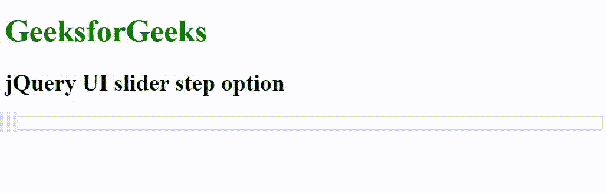

# jQuery UI 滑块步骤选项

> 原文:[https://www.geeksforgeeks.org/jquery-ui-slider-step-option/](https://www.geeksforgeeks.org/jquery-ui-slider-step-option/)

jQuery UI 由 GUI 小部件、视觉效果和使用 HTML、CSS 和 jQuery 实现的主题组成。jQuery 用户界面非常适合为网页构建用户界面。jQuery UI 滑块步长选项用于设置滑块在最小值和最大值之间的步长(每个间隔或步长的数量)。

**语法:**

```html
$( ".selector" ).slider({
  step: 5
});
```

**CDN 链接:**首先，添加项目所需的 jQuery UI 脚本。

> <link rel="”stylesheet”" href="”//code.jquery.com/ui/1.12.1/themes/smoothness/jquery-ui.css”">
> <脚本 src =//code . jquery . com/jquery-1 . 12 . 4 . js "></脚本>
> <脚本 src =//code . jquery . com/ui/1 . 12 . 1/jquery-ui . js "></脚本>

**示例:**

## 超文本标记语言

```html
<!DOCTYPE html>
<html lang="en">

<head>
    <meta charset="utf-8">
    <link rel="stylesheet" href=
    "//code.jquery.com/ui/1.12.1/themes/base/jquery-ui.css">
    <script src="https://code.jquery.com/jquery-1.12.4.js">
    </script>
    <script src="https://code.jquery.com/ui/1.12.1/jquery-ui.js">
    </script>
    <style>
        .highlight {
            background: green;
        }
    </style>
    <script>
        $(function () {
            $("#gfg").slider({
                step: 10
            });
        });
    </script>
</head>

<body>
    <h1 style="color: green;">GeeksforGeeks</h1>
    <h2>jQuery UI slider step option</h2>
    <div id="gfg"></div>
</body>

</html>
```

**输出:**



**参考:**T2】https://api.jqueryui.com/slider/#option-step