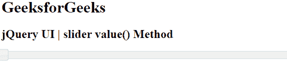
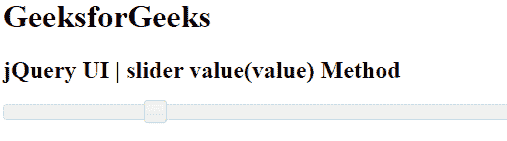

# jQuery UI 滑块值()方法

> 原文:[https://www . geesforgeks . org/jquery-ui-slider-value-method/](https://www.geeksforgeeks.org/jquery-ui-slider-value-method/)

jQuery 用户界面由图形用户界面小部件、视觉效果和使用 jQuery、CSS 和 HTML 实现的主题组成。jQuery 用户界面非常适合为网页构建用户界面。jQueryUI 通过滑块小部件为我们提供了一个滑块控件。滑块帮助我们使用给定的范围获得某个值。在本文中，我们将看到如何在 jQuery UI 滑块中使用**值()** 方法。

**值()** 方法用于获取滑块的当前值。这个方法有一个子方法叫做**值(value)** 方法，这里我们可以设置滑块的值。

**语法:**

```html
$( ".selector" ).slider("value");
```

```html
$( ".selector" ).slider("value", number);
```

```html
var a = $( ".selector" ).slider("value", number);
```

**参数:**

*   **值:**是需要设置的数值。
*   **number:** 是一个要取值的数值指标。

**CDN 链接:**首先，添加项目所需的 jQuery UI 脚本。

> <link href="“https://code.jquery.com/ui/1.10.4/themes/ui-lightness/jquery-ui.css”" rel="“stylesheet”">

**示例 1:** 在本例中，我们使用了**值()**方法来获取每次点击的滑块值。

## 超文本标记语言

```html
<!DOCTYPE html>
<html lang="en">
    <head>
        <meta charset="utf-8" />
        <link href=
"https://code.jquery.com/ui/1.10.4/themes/ui-lightness/jquery-ui.css" 
              rel="stylesheet" />
        <script src=
"https://code.jquery.com/jquery-1.10.2.js"></script>
        <script src=
"https://code.jquery.com/ui/1.10.4/jquery-ui.js"></script>

        <script>
            $(function () {
                $("#gfg").slider();
                $("#gfg").slider("value");
            });
            function gfgg() {
                var a = $("#gfg").slider("value");
                console.log(a);
            }
        </script>
    </head>

    <body>
        <h1>GeeksforGeeks</h1>
        <h2>jQuery UI | slider value() Method</h2>
        <div id="gfg" onclick="gfgg()"></div>
    </body>
</html>
```

**输出:**



**示例 2:** 在本例中，我们使用了**值(value)** 方法来设置滑块值，以获得特定索引上的滑块，这里是 24。

## 超文本标记语言

```html
<!DOCTYPE html>
<html lang="en">
    <head>
        <meta charset="utf-8" />
        <link href=
"https://code.jquery.com/ui/1.10.4/themes/ui-lightness/jquery-ui.css" 
              rel="stylesheet" />
        <script src=
"https://code.jquery.com/jquery-1.10.2.js"></script>
        <script src=
"https://code.jquery.com/ui/1.10.4/jquery-ui.js"></script>

        <script>
            $(function () {
                $("#gfg").slider();
                $("#gfg").slider("value", 24);
            });
            function gfgg() {
                $("#gfg").slider("value");
            }
        </script>
    </head>

    <body>
        <h1>GeeksforGeeks</h1>
        <h2>jQuery UI | slider value(value) Method</h2>
        <div id="gfg" onclick="gfgg()"></div>
    </body>
</html>
```

**输出:**



**参考:**T2】https://api.jqueryui.com/slider/#method-value