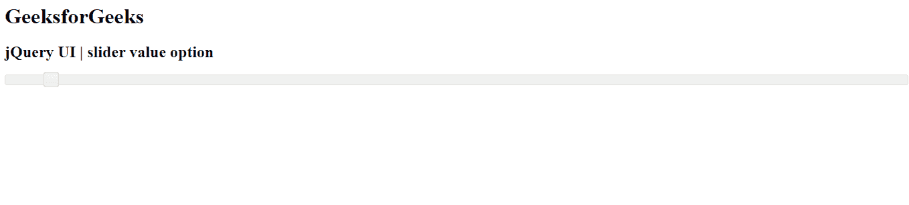
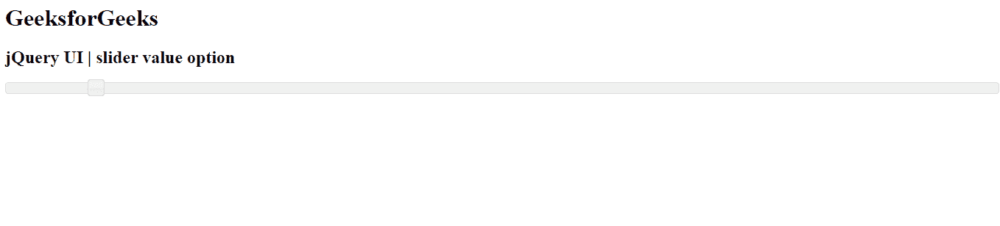

# jQuery 用户界面滑块值选项

> 原文:[https://www . geesforgeks . org/jquery-ui-slider-value-option/](https://www.geeksforgeeks.org/jquery-ui-slider-value-option/)

jQuery UI 由 GUI 小部件、视觉效果和使用 jQuery、CSS 和 HTML 实现的主题组成。jQuery 用户界面非常适合为网页构建用户界面。 jQuery UI 通过滑块小部件为我们提供了一个滑块控件。滑块帮助我们使用给定的范围获得某个值。在本文中，我们将看到如何在滑块中设置 **值** 选项。 **值** 选项用于设置滑块的初始值。

**语法:**

```html
$(".selector").slider(
   { value : 10}
);
```

**参数:**滑块方法接受一个选项作为参数，如下所述。

*   **号:** T he 号的初始值待设定。默认为 **1** 。

**方法:**首先，添加项目所需的 jQuery UI 脚本。

> <link href="“https://code.jquery.com/ui/1.10.4/themes/ui-lightness/jquery-ui.css”" rel="“stylesheet”">

**示例 1:** 在本例中，我们将使用数值 5。

## 超文本标记语言

```html
<!doctype html>
<html lang="en">

<head>
    <meta charset="utf-8">
    <link href=
"https://code.jquery.com/ui/1.10.4/themes/ui-lightness/jquery-ui.css"
        rel="stylesheet">
    <script src="https://code.jquery.com/jquery-1.10.2.js"></script>

    <script src="https://code.jquery.com/ui/1.10.4/jquery-ui.js">
    </script>

    <script>
        $(function() {
            $("#gfg").slider({
                value: 5
            });
        });
    </script>
</head>

<body>
    <h1>GeeksforGeeks</h1>
    <h2>jQuery UI | slider value option</h2>
    <div id="gfg"></div>
</body>

</html>
```

**输出:**



**示例 2:** 在本例中，我们将使用数字值作为 9。

## 超文本标记语言

```html
<!doctype html>
<html lang="en">

<head>
    <meta charset="utf-8">
    <link href=
"https://code.jquery.com/ui/1.10.4/themes/ui-lightness/jquery-ui.css"
        rel="stylesheet">
    <script src="https://code.jquery.com/jquery-1.10.2.js"></script>

    <script src="https://code.jquery.com/ui/1.10.4/jquery-ui.js">
    </script>

    <script>
        $(function() {
            $("#gfg").slider({
                value: 9
            });
        });
    </script>
</head>

<body>
    <h1>GeeksforGeeks</h1>
    <h2>jQuery UI | slider value option</h2>
    <div id="gfg"></div>
</body>

</html>
```

**输出:**

