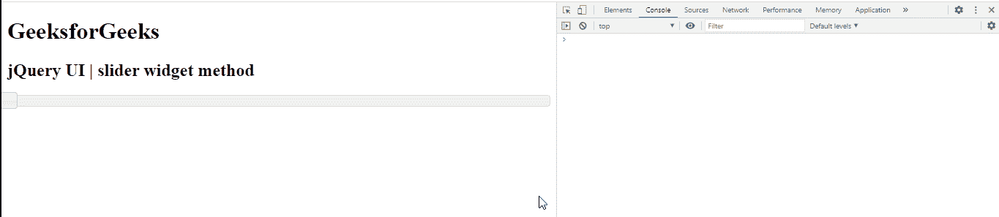

# jQuery UI Slider 小部件()方法

> 原文:[https://www . geesforgeks . org/jquery-ui-slider-widget-method/](https://www.geeksforgeeks.org/jquery-ui-slider-widget-method/)

jQuery 用户界面由图形用户界面小部件、视觉效果和使用 jQuery、CSS 和 HTML 实现的主题组成。jQuery 用户界面非常适合为网页构建用户界面。jQueryUI 通过滑块小部件为我们提供了一个滑块控件。滑块帮助我们使用给定的范围获得某个值。在本文中，我们将看到如何在 jQuery UI 滑块中使用**小部件**方法。**小部件** **方法**用于返回包含滑块的 jQuery 对象。

**语法:**

```html
var a = $( ".selector" ).slider("widget");
```

**参数:**此方法不接受任何参数。

**CDN 链接:** 首先，添加 jQuery UI 脚本的 CDN 链接，为你的任务所需。

> <link href="“https://code.jquery.com/ui/1.10.4/themes/ui-lightness/jquery-ui.css”" rel="“stylesheet”">

**示例:**在本例中，我们将使用返回 jquery 对象的 widget 方法。

## 超文本标记语言

```html
<!DOCTYPE html>
<html lang = "en">
   <head>
      <meta charset = "utf-8">
      <link href = 
"https://code.jquery.com/ui/1.10.4/themes/ui-lightness/jquery-ui.css"
            rel = "stylesheet" />
      <script src = 
"https://code.jquery.com/jquery-1.10.2.js">
     </script>
      <script src = 
"https://code.jquery.com/ui/1.10.4/jquery-ui.js">
     </script>

      <script>
         $(function() {
            $( "#gfg" ).slider();
               $( "#gfg" ).slider("value");
         });
         function gfgg(){
            var a = $( "#gfg" ).slider("widget");
            console.log(a)
         }
      </script>
   </head>

   <body>
      <h1>GeeksforGeeks</h1> 
      <h2>jQuery UI | slider widget method</h2>
      <div id = "gfg" onclick="gfgg()"></div>
   </body>
</html>
```

**输出:**



**参考:**T2**https://api.jqueryui.com/spinner/#method-widget**T5】