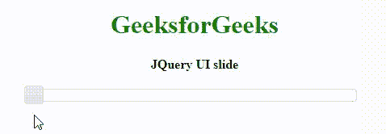
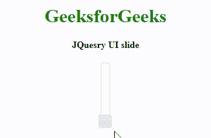
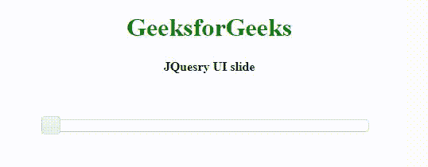
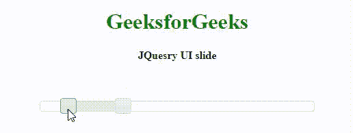
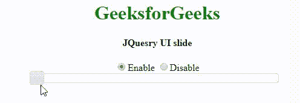

# jquery ui | slider

> 哎哎哎:# t0]https://www . geeksforgeeks . org/jquery-ui-slider/

Jquery UI 中的**滑块**功能可以用来选择数字数据作为用户的输入。Slider 在网页上有很多应用，比如用于音量控制、颜色选择器、控制各种图像的大小和分辨率等。我们将在代码中使用 CDN 链接来添加不同的库和样式。要像其他 jQuery UI 小部件一样显示这个滑块，我们必须链接到 jQuery 和 jQuery UI。将此代码复制到您的 HTML 文件中，通过 CDN(内容交付网络)将文件链接到 jquery 和 jquery 用户界面。这里我们使用了谷歌的 CDN，但是你也可以使用 jquery 或者微软的 CDN

> <link href="’https://ajax.googleapis.com/ajax/libs/jqueryui/1.12.1/themes/ui-lightness/jquery-ui.css’rel=’stylesheet’">

连接到 jQuery 用户界面后，我们现在可以在网页上使用滑块功能。就像任何其他 jQuery 代码一样，滑块函数也写在 HTML 文档的脚本标签中。
以下示例将说明 **jQuery UI 滑块**
**示例:**

```html
<!DOCTYPE html>
<html>
<head>
    <title>jQuery UI| Slider</title>
    <link rel="stylesheet" href=
"https://ajax.googleapis.com/ajax/libs/jqueryui/1.12.1/themes/smoothness/jquery-ui.css">
    <style>
        h1 {
            color: green;
        }

        div {
            width: 400px;
        }
    </style>
</head>

<body>
    <center>
        <h1>GeeksforGeeks</h1>
        <h4>JQuery UI slide</h4>
        <div id="my_slider"></div>
        <div id=my_display></div>

        <script>
            $(document).ready(function() {
                $(function() {
                    $("#my_slider").slider({
                        slide: function(event, ui) {
                            $("#my_display").html(ui.value);
                        }
                    });
                });
            })
        </script>
        <script src=
"https://ajax.googleapis.com/ajax/libs/jquery/3.4.1/jquery.min.js">
        </script>
        <script src=
"https://ajax.googleapis.com/ajax/libs/jqueryui/1.12.1/jquery-ui.min.js">
        </script>
    </center>
</body>

</html>
```

**输出:**


**管理滑块的不同属性:**我们可以控制滑块的不同属性，如步长、方向、最小值、最大值。下面是我们为这些属性赋值的例子。

**示例:**

```html
<!DOCTYPE html>
<html>

<head>
    <title></title>
    <link rel="stylesheet" href=
"https://ajax.googleapis.com/ajax/libs/jqueryui/1.12.1/themes/smoothness/jquery-ui.css">
    <script src=
"https://ajax.googleapis.com/ajax/libs/jquery/3.4.1/jquery.min.js">
    </script>
    <script src=
"https://ajax.googleapis.com/ajax/libs/jqueryui/1.12.1/jquery-ui.min.js">
    </script>
    <style>
        h1 {
            color: green;
        }
    </style>
</head>

<body>
    <center>
        <h1>GeeksforGeeks</h1>
        <h4>JQuesry UI slide</h4>
        <div id="my_slider"></div>
        <div id=my_display></div>

        <script>
            $(document).ready(function() {

                $(function() {
                    $("#my_slider").slider({
                        min: 0,
                        max: 100,
                        step: 2,
                        orientation: "vertical",
                        slide: function(event, ui) {
                            $("#my_display").html(ui.value);
                        }
                    });
                });
            })
        </script>
  </center>
</body>
</html>
```

**输出:**


**滑块事件的处理:**下面是一个滑块的三个事件的例子，一个在滑块开始时，第二个在滑块移动时，第三个在滑块停止时。我们可以在应用程序的这些事件(函数)中使用我们需要的代码。

**示例:**

```html
<!DOCTYPE html>
<html>
<head>
    <title>Handling events of Slider</title>
    <link rel="stylesheet" href=
"https://ajax.googleapis.com/ajax/libs/jqueryui/1.12.1/themes/smoothness/jquery-ui.css">

    <style>
        h1 {
            color: green;
        }

        div {
            width: 400px;
        }
    </style>
</head>

<body>
    <center>
        <h1>GeeksforGeeks</h1>
        <h4>JQuesry UI slide</h4>
        <div id=my_display_event></div>
        <br>
        <br>
        <div id="my_slider"></div>
        <div id=my_display></div>

        <script>
            $(document).ready(function() {

                $(function() {
                    $("#my_slider").slider({
                        slide: function(event, ui) {
                            $("#my_display").html(ui.value);
                            $("#my_display_event").html('Slider on move...');
                        },
                        start: function(event, ui) {
                            $("#my_display_event").html('Slider Started...');
                        },
                        stop: function(event, ui) {
                            $("#my_display_event").html('Slider Stopped...');
                        }
                    });
                });

            })
        </script>
        <script src=
"https://ajax.googleapis.com/ajax/libs/jquery/3.4.1/jquery.min.js">
        </script>
        <script src=
"https://ajax.googleapis.com/ajax/libs/jqueryui/1.12.1/jquery-ui.min.js">
        </script>
    </center>

</body>

</html>
```

**输出:**


**使用滑块选择一组数字:**我们也可以使用滑块选择一个起始值，使用另一个滑块选择一个终止值来选择一组数字。
T3】例:

```html
<!DOCTYPE html>
<html>

<head>
    <title>Handling events of Slider</title>
    <link rel="stylesheet" href=
"https://ajax.googleapis.com/ajax/libs/jqueryui/1.12.1/themes/smoothness/jquery-ui.css">

    <style>
        h1 {
            color: green;
        }

        div {
            width: 400px;
        }
    </style>
</head>

<body>
    <center>
        <h1>GeeksforGeeks</h1>
        <h4>JQuesry UI slide</h4>
        <div id=my_display_event></div>
        <br>
        <br>
        <div id="my_slider"></div>
        <div id=my_display></div>

        <script>
            $(document).ready(function() {

                $(function() {
                    $("#my_slider").slider({
                        min: 0,
                        max: 100,
                        values: [10, 30],
                        range: true,
                        slide: function(event, ui) {
                            $("#my_display_start").html("Start value:" + ui.values[0]),
                                $("#my_display_end").html("End value:" + ui.values[1]);
                        }
                    });
                });

            })
        </script>
        <script src=
"https://ajax.googleapis.com/ajax/libs/jquery/3.4.1/jquery.min.js">
        </script>
        <script src=
"https://ajax.googleapis.com/ajax/libs/jqueryui/1.12.1/jquery-ui.min.js">
        </script>
    </center>

</body>

</html>
```

**输出:**


**启用/禁用滑块:**我们可以通过在输入法中指定滑块来启用或禁用滑块。在下面的例子中，我们使用一对单选按钮来启用/禁用滑块。单击相应的单选按钮会收集值(变量名为 my_val)，并相应地设置滑块的状态。
T3】例:

```html
<!DOCTYPE html>
<html>

<head>
    <title>Enabling/Disabling a Slider</title>
    <style>
        h1 {
            color: green;
        }

        div {
            width: 400px;
        }
    </style>
</head>

<body>
    <center>
        <h1>GeeksforGeeks</h1>
        <h4>JQuesry UI slide</h4>
        <input type=radio name=radio_1 value=enable checked>Enable
        <input type=radio name=radio_1 value=disable>Disable
        <br>
        <div id="my_slider"></div>
        <div id=my_display></div>

        <link rel="stylesheet" href=
"https://ajax.googleapis.com/ajax/libs/jqueryui/1.12.1/themes/smoothness/jquery-ui.css">
        <script src=
"https://ajax.googleapis.com/ajax/libs/jquery/3.4.1/jquery.min.js"></script>
        <script src=
 "https://ajax.googleapis.com/ajax/libs/jqueryui/1.12.1/jquery-ui.min.js"></script>

        <script>
            $(document).ready(function() {

                $(function() {
                    $("#my_slider").slider({
                        slide: function(event, ui) {
                            $("#my_display").html(ui.value);
                        }
                    });
                });

                ///Reading radio button values using change event//
                $("input[type='radio']").change(function() {
                    my_val = $("input[name=radio_1]:checked").val()
                    $("#my_slider").slider(my_val);
                })

            })
        </script>
    </center>
</body>

</html>
```

**输出**
