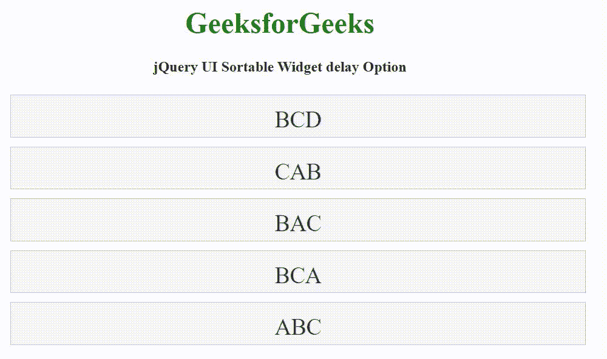

# jQuery UI 可排序延迟选项

> 原文:[https://www . geesforgeks . org/jquery-ui-sortable-delay-option/](https://www.geeksforgeeks.org/jquery-ui-sortable-delay-option/)

jQuery UI 可排序小部件延迟选项用于设置以毫秒为单位的时间，以定义排序应该何时开始。

**语法:**

```html
$( ".selector" ).sortable({
  delay: 150
});
```

**方法:**首先，添加项目所需的 jQuery UI 脚本。

> <link rel="”stylesheet”" href="”//code.jquery.com/ui/1.12.1/themes/base/jquery-ui.css”">

**示例:**

## 超文本标记语言

```html
<!DOCTYPE html>
<html lang="en">

<head>
    <meta charset="utf-8">
    <meta name="viewport" 
          content="width=device-width, initial-scale=1">

    <link rel="stylesheet" href=
        "//code.jquery.com/ui/1.12.1/themes/base/jquery-ui.css">  
    <script 
         src="https://code.jquery.com/jquery-1.12.4.js">
    </script>
    <script 
         src="https://code.jquery.com/ui/1.12.1/jquery-ui.js">
    </script>
    <style>
        #sortable {
            list-style-type: none;
            width: 50%;
        }

        #sortable li {
            margin: 10px 0;
            padding: 0.5em;
            font-size: 25px;
            height: 20px;
        }
    </style>

    <script>
        $(function () {
            $("#sortable").sortable({
                delay: 1000
            });
        });
    </script>
</head>

<body>
    <center>
        <h1 style="color: green;">GeeksforGeeks</h1>

        <h4>jQuery UI Sortable Widget delay Option</h4>

        <ul id="sortable">
            <li class="ui-state-default">BCD</li>
            <li class="ui-state-default">CAB</li>
            <li class="ui-state-default">BAC</li>
            <li class="ui-state-default">BCA</li>
            <li class="ui-state-default">ABC</li>
        </ul>
    </center>
</body>

</html>
```

**输出:**

