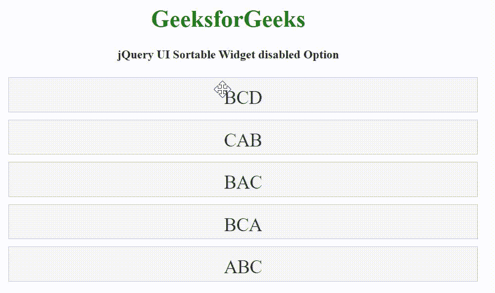

# jQuery UI 可排序禁用选项

> 原文:[https://www . geesforgeks . org/jquery-ui-sortable-disable-option/](https://www.geeksforgeeks.org/jquery-ui-sortable-disabled-option/)

jQuery UI 可排序小部件禁用选项用于禁用可排序元素，如果它设置为真。

**语法:**

```
$( ".selector" ).sortable({
  disabled: true
});
```

**CDN 链接:**首先，添加项目所需的 jQuery UI 脚本。

> <rel = "样式表"链接 href = "/resources/demos/style . CSS ">
> <src = " https://code . jquery . com/jquery-1 . 12 . 4 . js ">/script>

**示例:**

## 超文本标记语言

```
<!DOCTYPE html>
<html lang="en">
  <head>
    <meta charset="utf-8" />
    <meta name="viewport" 
          content="width=device-width, initial-scale=1" />

    <title>jQuery UI Sortable Widget disabled Option</title>

    <link rel="stylesheet"
          href=
"//code.jquery.com/ui/1.12.1/themes/base/jquery-ui.css"/>
    <link rel="stylesheet" href="/resources/demos/style.css" />
    <script src=
"https://code.jquery.com/jquery-1.12.4.js">
    </script>
    <script src=
"https://code.jquery.com/ui/1.12.1/jquery-ui.js">
    </script>
    <style>
      #sortable {
        list-style-type: none;
        width: 50%;
      }

      #sortable li {
        margin: 10px 0;
        padding: 0.5em;
        font-size: 25px;
        height: 20px;
      }
    </style>

    <script>
      $(function () {
        $("#sortable").sortable({
          disabled: true,
        });
      });
    </script>
  </head>

  <body>
    <center>
      <h1 style="color: green">GeeksforGeeks</h1>

      <h4>jQuery UI Sortable Widget disabled Option</h4>

      <ul id="sortable">
        <li class="ui-state-default">BCD</li>
        <li class="ui-state-default">CAB</li>
        <li class="ui-state-default">BAC</li>
        <li class="ui-state-default">BCA</li>
        <li class="ui-state-default">ABC</li>
      </ul>
    </center>
  </body>
</html>
```

**输出:**



**参考:**T2】https://api.jqueryui.com/sortable/#option-disabled