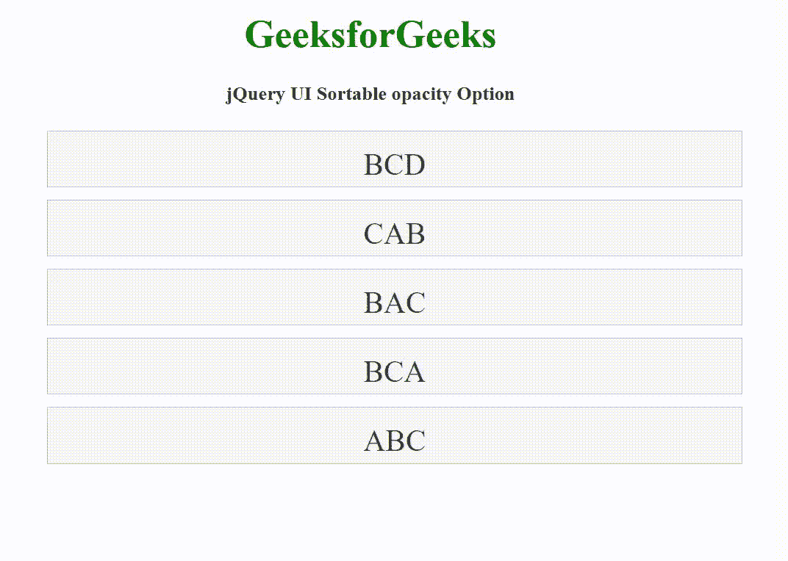

# jQuery 用户界面可排序不透明度选项

> 原文:[https://www . geesforgeks . org/jquery-ui-sortable-不透明度-option/](https://www.geeksforgeeks.org/jquery-ui-sortable-opacity-option/)

jQuery UI 由 GUI 小部件、视觉效果和使用 HTML、CSS 和 jQuery 实现的主题组成。jQuery 用户界面非常适合为网页构建用户界面。jQuery UI 可排序不透明度选项用于设置可排序元素的不透明度。不透明度值介于 0 到 1 之间。

**语法:**

```
$( ".selector" ).sortable({
  opacity: 0.5
});
```

**CDN 链接:**首先，添加项目所需的 jQuery UI 脚本。

> <link rel="”stylesheet”" href="”//code.jquery.com/ui/1.12.1/themes/smoothness/jquery-ui.css”">
> <脚本 src =//code . jquery . com/jquery-1 . 12 . 4 . js "></脚本>
> <脚本 src =//code . jquery . com/ui/1 . 12 . 1/jquery-ui . js "></脚本>

**示例:**

## 超文本标记语言

```
<!DOCTYPE html>
<html lang="en">

<head>
    <meta charset="utf-8">
    <link rel="stylesheet" href=
    "//code.jquery.com/ui/1.12.1/themes/base/jquery-ui.css">
    <script src="https://code.jquery.com/jquery-1.12.4.js">
    </script>
    <script src="https://code.jquery.com/ui/1.12.1/jquery-ui.js">
    </script>

    <style>
        #sortable {
            list-style-type: none;
            width: 50%;
        }

        #sortable li {
            margin: 10px 0;
            padding: 0.5em;
            font-size: 25px;
            height: 20px;
        }
    </style>

    <script>
        $(function () {
            $("#sortable").sortable({
                opacity: 0.5
            });
        });
    </script>
</head>

<body>
    <center>
        <h1 style="color: green;">GeeksforGeeks</h1>

        <h4>jQuery UI Sortable opacity Option</h4>

        <ul id="sortable">
            <li class="ui-state-default">BCD</li>
            <li class="ui-state-default">CAB</li>
            <li class="ui-state-default">BAC</li>
            <li class="ui-state-default">BCA</li>
            <li class="ui-state-default">ABC</li>
        </ul>
    </center>
</body>

</html>
```

**输出:**



**参考:**[https://API . jquery ui . com/sortable/# option-opacity](https://api.jqueryui.com/sortable/#option-opacity)