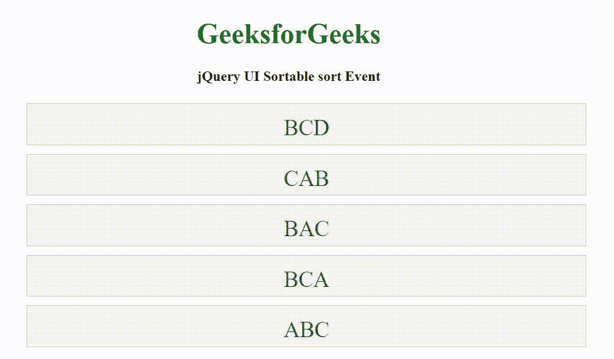

# jQuery UI 可排序排序事件

> 原文:[https://www . geeksforgeeks . org/jquery-ui-sortable-sort-event/](https://www.geeksforgeeks.org/jquery-ui-sortable-sort-event/)

[jQuery UI](https://www.geeksforgeeks.org/jquery-ui-introduction/) 由 GUI 小部件、视觉效果和使用 Query JavaScript 库实现的主题组成。jQuery 用户界面非常适合为网页构建用户界面。它可以用来构建高度交互的 web 应用程序，也可以用来轻松添加小部件。

**jQuery UI 可排序排序**事件用于列表项排序时触发。

**语法:**

*   **用排序回调函数初始化可排序小部件:**

    ```
    $(".selector").selectable({
        sort: function( event, ui ) {}
    });
    ```

*   **将事件侦听器绑定到排序事件:**

    ```
    $( ".selector" ).on( "sort", function( event, ui ) {} );
    ```

**参数:**

*   **事件:**当用户用 DOM 的位置变化停止排序时，触发该事件。
*   **ui:** 这是一个具有以下选项的对象类型。
    *   **助手:**表示排序后的助手的 jQuery 对象。
    *   **项:**表示当前拖动项的 jQuery 对象。
    *   **偏移量:**表示为{顶部，左侧}的辅助对象的当前绝对位置。
    *   **位置:**表示为{顶部，左侧}的辅助对象的当前位置。
    *   **原始位置:**辅助对象的原始位置，表示为{顶部，左侧}。

**CDN 链接:**首先，添加项目所需的 jQuery UI 脚本。

> <link rel="”stylesheet”" href="”//code.jquery.com/ui/1.12.1/themes/smoothness/jquery-ui.css”">
> <脚本 src =//code . jquery . com/jquery-1 . 12 . 4 . js "></脚本>
> <脚本 src =//code . jquery . com/ui/1 . 12 . 1/jquery-ui . js "></脚本>

**示例:**

## 超文本标记语言

```
<!DOCTYPE html>
<html lang="en">

<head>
    <meta charset="utf-8">
    <link rel="stylesheet" href=
"https//code.jquery.com/ui/1.12.1/themes/base/jquery-ui.css">
    <script src=
"https://code.jquery.com/jquery-1.12.4.js">
    </script>
    <script src=
"https://code.jquery.com/ui/1.12.1/jquery-ui.js">
    </script>

    <style>
        #sortable {
            list-style-type: none;
            width: 50%;
        }

        #sortable li {
            margin: 10px 0;
            padding: 0.5em;
            font-size: 25px;
            height: 20px;
        }
    </style>

    <script>
        $(function () {
            $("#sortable").sortable({
                sort: function( event, ui ) {
                    alert("Sort Event Triggered!")
                }
            });
        });
    </script>
</head>

<body>
    <center>
        <h1 style="color: green;">
            GeeksforGeeks
        </h1>

        <h4>jQuery UI Sortable sort Event</h4>

        <ul id="sortable">
            <li class="ui-state-default">BCD</li>
            <li class="ui-state-default">CAB</li>
            <li class="ui-state-default">BAC</li>
            <li class="ui-state-default">BCA</li>
            <li class="ui-state-default">ABC</li>
        </ul>
    </center>
</body>

</html>
```

**输出:**



**参考:**T2】https://api.jqueryui.com/sortable/#event-sort