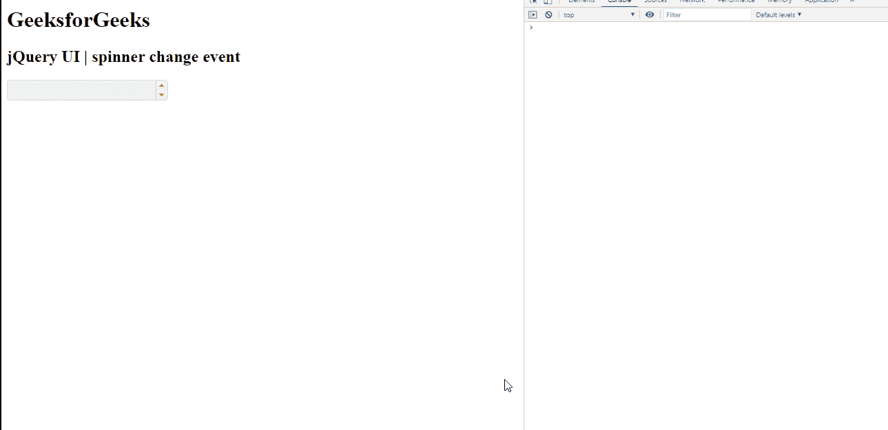

# jQuery 用户界面微调器更改事件

> 原文:[https://www . geesforgeks . org/jquery-ui-spinner-change-event/](https://www.geeksforgeeks.org/jquery-ui-spinner-change-event/)

jQuery UI 由 GUI 小部件、视觉效果和使用 jQuery、CSS 和 HTML 实现的主题组成。jQuery 用户界面非常适合为网页构建用户界面。jQueryUI 微调器小部件帮助我们使用上下箭头来增加和减少输入元素的值。在本文中，我们将看到如何在 jQuery UI 滑块中使用**更改事件**。当微调器的值改变并且输入不再集中在 jQuery 用户界面微调器上时，触发**改变事件**。

**语法:**

```html
$( ".selector" ).spinner({
   change: function( event, ui ) {}
});
```

**CDN 链接:**首先，添加 jQuery UI 脚本 CDN 链接，这是您的任务所需要的。

> <link href="“https://code.jquery.com/ui/1.10.4/themes/ui-lightness/jquery-ui.css”" rel="“stylesheet”">

以下示例说明了 jQuery 用户界面微调器更改事件:

**示例:**

## 超文本标记语言

```html
<!DOCTYPE html>
<html lang="en">
    <head>
        <meta charset="utf-8" />
        <link href=
"https://code.jquery.com/ui/1.10.4/themes/ui-lightness/jquery-ui.css" 
              rel="stylesheet" />
        <script src=
"https://code.jquery.com/jquery-1.10.2.js">
      </script>
        <script src=
"https://code.jquery.com/ui/1.10.4/jquery-ui.js">
      </script>

        <style type="text/css">
            #gfg input {
                width: 100px;
            }
        </style>

        <script>
            $(function () {
                $("#gfg").spinner({
                    change: function (event, ui) {
                        console.log("change has occured");
                    },
                });
            });
        </script>
    </head>

    <body>
        <h1>GeeksforGeeks</h1>
        <h2>jQuery UI | spinner change event</h2>
        <input id="gfg" />
    </body>
</html>
```

**输出:**



**参考:**T2】https://api.jqueryui.com/spinner/#event-change