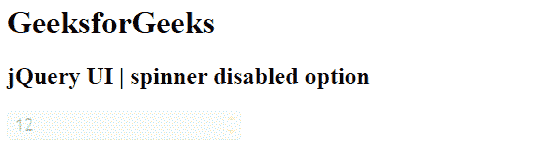

# jQuery 用户界面微调器禁用选项

> 原文:[https://www . geesforgeks . org/jquery-ui-spinner-disabled-option/](https://www.geeksforgeeks.org/jquery-ui-spinner-disabled-option/)

jQuery 用户界面由图形用户界面小部件、视觉效果和使用 jQuery、CSS 和 HTML 实现的主题组成。jQuery 用户界面非常适合为网页构建用户界面。jQueryUI 微调器小部件帮助我们使用上下箭头来增加和减少输入元素的值。在本文中，我们将看到如何使用 jQuery UI 滑块中的**禁用选项**。**禁用选项**用于禁用 jQuery 用户界面微调器。默认情况下，该值为**假。**

**语法:**

```html
$( ".selector" ).spinner(
   { disabled: boolean}
);
```

**参数:**该选项接受如上所述的单个参数，如下所述:

*   **布尔值:**该参数保存真值和假值。

**CDN 链接:**首先，添加 jQuery UI 脚本 CDN 链接，这是您的任务所需要的。

> <link href="“https://code.jquery.com/ui/1.10.4/themes/ui-lightness/jquery-ui.css”" rel="“stylesheet”">

**示例 1:** 在本例中，我们将禁用选项设置为真。它将禁用微调器。

## 超文本标记语言

```html
<!DOCTYPE html>
<html lang="en">
    <head>
        <meta charset="utf-8" />
        <link href=
"https://code.jquery.com/ui/1.10.4/themes/ui-lightness/jquery-ui.css" 
              rel="stylesheet" />
        <script src=
"https://code.jquery.com/jquery-1.10.2.js">
        </script>
        <script src=
"https://code.jquery.com/ui/1.10.4/jquery-ui.js">
        </script>

        <script>
            $(function () {
                $("#gfg").spinner({ disabled: true });
            });
        </script>
    </head>

    <body>
        <h1>GeeksforGeeks</h1>
        <h2>jQuery UI | spinner disabled Option</h2>
        <div id="geeks">
            <input type="text" id="gfg" value="12" />
        </div>
    </body>
</html>
```

**输出:** 

**参考:**T2**https://api.jqueryui.com/spinner/#option-disabled**T5】