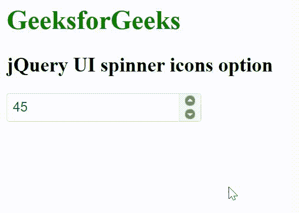

# jQuery 用户界面微调图标选项

> 原文:[https://www . geesforgeks . org/jquery-ui-spinner-icons-option/](https://www.geeksforgeeks.org/jquery-ui-spinner-icons-option/)

jQuery UI 由 GUI 小部件、视觉效果和使用 HTML、CSS 和 jQuery 实现的主题组成。jQuery 用户界面非常适合为网页构建用户界面。jQuery 用户界面微调图标选项用于将图标添加到微调按钮。其默认值为{ *向下:“ui-图标-三角形-1-s”，向上:“ui-图标-三角形-1-n”*}。

**语法:**

```
$( ".selector" ).spinner({
  icons: { 
    down: "custom-down-icon", 
    up: "custom-up-icon" 
  }
});
```

**CDN 链接:**首先，添加项目所需的 jQuery UI 脚本。

> <link rel="”stylesheet”" href="”//code.jquery.com/ui/1.12.1/themes/smoothness/jquery-ui.css”">
> <脚本 src =//code . jquery . com/jquery-1 . 12 . 4 . js "></脚本>
> <脚本 src =//code . jquery . com/ui/1 . 12 . 1/jquery-ui . js "></脚本>

**示例:**

## 超文本标记语言

```
<!DOCTYPE html>
<html lang="en">

<head>
    <meta charset="utf-8">
    <link rel="stylesheet" href=
    "//code.jquery.com/ui/1.12.1/themes/base/jquery-ui.css">
    <script src="https://code.jquery.com/jquery-1.12.4.js">
    </script>
    <script src="https://code.jquery.com/ui/1.12.1/jquery-ui.js">
    </script>

    <script>
        $(function () {
            $("#gfg").spinner({
                icons: {
                    down: "ui-icon-circle-triangle-s",
                    up: "ui-icon-circle-triangle-n"
                }
            });
        });
    </script>
</head>

<body>
    <h1 style="color: green;">GeeksforGeeks</h1>
    <h2>jQuery UI spinner icons option</h2>

    <div id="geeks">
        <input type="text" id="gfg" value="45" />
    </div>
</body>

</html>
```

**输出:**



微调图标

**参考:**T2】https://api.jqueryui.com/spinner/#option-icons