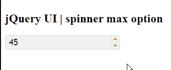

# jQuery 用户界面微调器最大选项

> 原文:[https://www.geeksforgeeks.org/jquery-ui-spinner-max-option/](https://www.geeksforgeeks.org/jquery-ui-spinner-max-option/)

jQuery 用户界面滑块中的最大选项。**最大选项**用于在 jQuery 用户界面微调器中设置最大值。默认情况下，该值为空。

**语法:**

```html
$( ".selector" ).spinner(
   { max: number | 'string' }
);
```

**CDN 链接:**首先，添加 jQuery UI 脚本 CDN 链接，这是您的任务所需要的。

**参数:**该选项接受两个参数，如上所述，如下所述:

*   **数字:**该参数保存最大值的数字。
*   **字符串:**该参数将基于 **numberFormat** 和区域性选项进行解析，否则将返回到原生的 **parseFloat()方法**。

> <link href="“https://code.jquery.com/ui/1.10.4/themes/ui-lightness/jquery-ui.css”" rel="“stylesheet”">

**示例 1:** 在本例中，我们将使用微调器的最大选项作为 50。

## 超文本标记语言

```html
<!doctype html>
<html lang = "en">
   <head>
      <meta charset = "utf-8">
      <link href = 
"https://code.jquery.com/ui/1.10.4/themes/ui-lightness/jquery-ui.css"
            rel = "stylesheet" />
      <script src = 
"https://code.jquery.com/jquery-1.10.2.js">
     </script>
      <script src = 
"https://code.jquery.com/ui/1.10.4/jquery-ui.js">
     </script>

      <script>
         $(function() {
            $( "#gfg" ).spinner( 
               {max: 50}
            );
         });
      </script>
   </head>

   <body>
      <h1>GeeksforGeeks</h1> 
      <h2>jQuery UI | spinner max option</h2>
      <div id = "geeks">
         <input type = "text" id = "gfg" value = "45" />
      </div>
   </body>
</html>
```

**输出:**



**参考:**[**https://API . jquery ui . com/1.11/nert/# option-max**](https://api.jqueryui.com/1.11/spinner/#option-max)