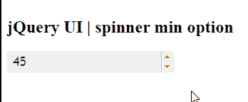

# jQuery 用户界面微调器最小选项

> 原文:[https://www.geeksforgeeks.org/jquery-ui-spinner-min-option/](https://www.geeksforgeeks.org/jquery-ui-spinner-min-option/)

jQuery 用户界面由图形用户界面小部件、视觉效果和使用 jQuery、CSS 和 HTML 实现的主题组成。jQuery 用户界面非常适合为网页构建用户界面。jQueryUI 微调器小部件帮助我们使用上下箭头来增加和减少输入元素的值。在本文中，我们将看到如何使用 jQuery UI 滑块中的 **min 选项**。**最小选项**用于在 jQuery 用户界面微调器中设置最小值。默认情况下，该值为空。

**语法:**

```html
$( ".selector" ).spinner(
   { min : number | 'string'}
);
```

**CDN 链接:**首先，添加 jQuery UI 脚本 CDN 链接，这是您的任务所需要的。

**参数:**该选项接受两个参数，如上所述，如下所述:

*   **数字:**该参数保存最小值的数字。
*   **字符串:**这个参数将根据 numberFormat 和区域性选项进行解析，否则将回落到原生的 parseFloat()方法。

> <link href="“https://code.jquery.com/ui/1.10.4/themes/ui-lightness/jquery-ui.css”" rel="“stylesheet”">

**示例 1:** 在本例中，我们将使用微调器的最小值作为 50。

## 超文本标记语言

```html
<!DOCTYPE html>
<html lang = "en">
   <head>
      <meta charset = "utf-8">
      <link href = 
"https://code.jquery.com/ui/1.10.4/themes/ui-lightness/jquery-ui.css"
            rel = "stylesheet" />
      <script src = 
"https://code.jquery.com/jquery-1.10.2.js">
     </script>
      <script src =
"https://code.jquery.com/ui/1.10.4/jquery-ui.js">
     </script>

      <script>
         $(function() {
            $( "#gfg" ).spinner( 
               {min: 50}
            );
         });
      </script>
   </head>

   <body>
      <h1>GeeksforGeeks</h1> 
      <h2>jQuery UI | spinner min option</h2>
      <div id = "geeks">
         <input type = "text" id = "gfg" value = "45" />
      </div>
   </body>
</html>
```

**输出:**



**参考:**[](https://api.jqueryui.com/1.9/spinner/)**[**【https://API . jquery ui . com/1.11/ners/# option-min】**](https://api.jqueryui.com/1.11/spinner/#option-min)**