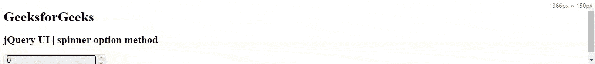
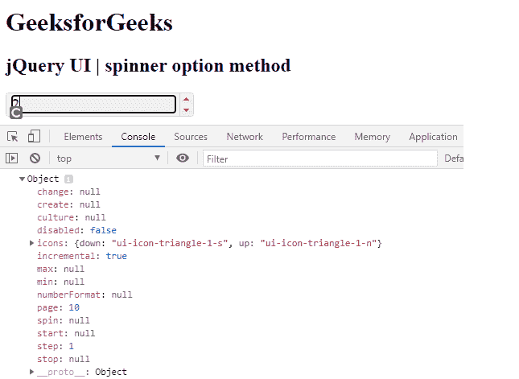
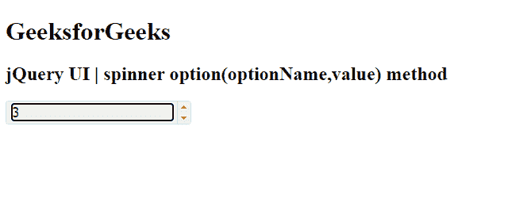
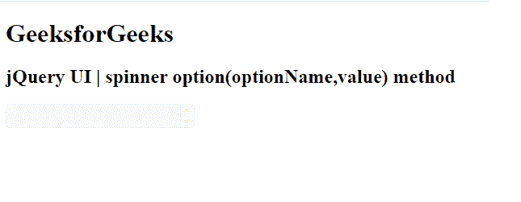
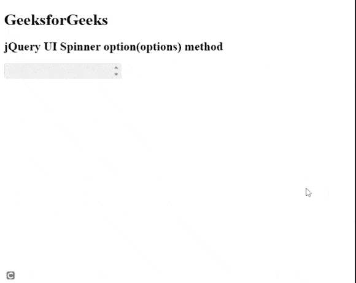

# jQuery UI Spinner 选项()方法

> 原文:[https://www . geesforgeks . org/jquery-ui-spinner-option-method/](https://www.geeksforgeeks.org/jquery-ui-spinner-option-method/)

jQuery UI 由 GUI 小部件、视觉效果和使用 jQuery、CSS 和 HTML 实现的主题组成。jQuery 用户界面非常适合为网页构建用户界面。jQuery UI 微调器小部件帮助我们使用上下箭头来增加和减少输入元素的值。在本文中，我们将看到如何在 jQuery UI 滑块中使用**选项()**方法。**选项()**方法用于获取 jQuery 用户界面微调器中特定当前滑块选项的对象。

**语法:**

```html
var a = $(".selector").spinner("option");
```

```html
var a =  $(".selector").spinner("optionName","value");
```

```html
 var a  =  $(".selector").spinner("options");
```

**进场:**

*   首先，添加项目所需的 jQuery UI 脚本。

> <link href="“https://code.jquery.com/ui/1.10.4/themes/ui-lightness/jquery-ui.css”" rel="”stylesheet”">

**示例 1:** 以下代码演示了*。微调器(选项)*方法。

## 超文本标记语言

```html
<!doctype html>
<html lang = "en">
   <head>
      <meta charset = "utf-8">
      <link href =
       "https://code.jquery.com/ui/1.10.4/themes/ui-lightness/jquery-ui.css"
         rel = "stylesheet">
      <script src =
       "https://code.jquery.com/jquery-1.10.2.js">
      </script>
      <script src =
         "https://code.jquery.com/ui/1.10.4/jquery-ui.js">
      </script>

      <style type = "text/css">
         #gfg input {width: 100px}
      </style>

      <script>
         $(function() {
            $("#gfg").spinner();
            $('button').button();

            var a = $("#gfg").spinner("option");
            console.log(a)
            });

      </script>
   </head>

   <body>
      <h1>GeeksforGeeks</h1>
      <h2>jQuery UI | spinner option method</h2>
      <input id = "gfg" />
   </body>

</html>
```

**输出:**



**控制台输出:**



**例 2:** 下面的代码演示了*。微调器(optionName，value)* 方法。

## 超文本标记语言

```html
<!doctype html>
<html lang = "en">
   <head>
      <meta charset = "utf-8">
      <link href =
        "https://code.jquery.com/ui/1.10.4/themes/ui-lightness/jquery-ui.css"
         rel = "stylesheet">
      <script src =
        "https://code.jquery.com/jquery-1.10.2.js">
      </script>
      <script src =
        "https://code.jquery.com/ui/1.10.4/jquery-ui.js">
      </script>

      <style type = "text/css">
         #gfg input {width: 100px}
      </style>

      <script>
         $(function() {
            $("#gfg").spinner();
            $('button').button();

            var a = $("#gfg").spinner("option","disabled",true);
            console.log(a)
            });

      </script>
   </head>

   <body>
      <h1>GeeksforGeeks</h1>
      <h2>jQuery UI | spinner option method</h2>
      <input id = "gfg" />
   </body>
</html>
```

**输出:**

*   当*禁用*选项为*假*时，给出如下输出。



*   当*禁用*选项为真时，它给出以下输出。**T3】**



**例 3:** 下面的代码演示了*。微调器(选项)*方法。以下代码有 2 个选项，如 *{禁用:假，步骤:2 }。*

## 超文本标记语言

```html
<!doctype html>
<html lang = "en">
   <head>
      <meta charset = "utf-8">
      <link href =
         "https://code.jquery.com/ui/1.10.4/themes/ui-lightness/jquery-ui.css"
         rel = "stylesheet">
      <script src =
           "https://code.jquery.com/jquery-1.10.2.js">
      </script>
      <script src =
           "https://code.jquery.com/ui/1.10.4/jquery-ui.js">
      </script>

      <style type = "text/css">
         #gfg input {width: 100px}
      </style>

      <script>
         $(function() {
            $("#gfg").spinner();
            $('button').button();

            var a = $("#gfg").spinner( "option", { disabled: false,step: 2 } );
            console.log(a)
            });
      </script>
   </head>

   <body>
      <h1>GeeksforGeeks</h1>
      <h2>jQuery UI | spinner option method</h2>
      <input id = "gfg" />
   </body>
</html>    
```

**输出:**



**参考:**T2】https://api.jqueryui.com/category/widgets/