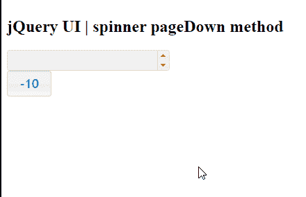

# jQuery UI Spinner pageDown()方法

> 原文:[https://www . geesforgeks . org/jquery-ui-spinner-page down-method/](https://www.geeksforgeeks.org/jquery-ui-spinner-pagedown-method/)

jQuery UI 由 GUI 小部件、视觉效果和使用 jQuery、CSS 和 HTML 实现的主题组成。jQuery 用户界面非常适合为网页构建用户界面。 jQueryUI 微调器小部件帮助我们使用上下箭头来增加和减少输入元素的值。在本文中我们将看到如何在 jQuery UI 微调器中使用 **pageDown()方法** 。 **page down()方法** 用于在 jQuery UI 微调器中没有页面的情况下减少页面值。

**语法:**

```html
$(".selector").spinner("pageDown");
```

**方法:**首先，添加项目所需的 jQuery UI 脚本。

> <link href="“https://code.jquery.com/ui/1.10.4/themes/ui-lightness/jquery-ui.css”" rel="“stylesheet”">
> <脚本 src = " https://code . jquery . com/jquery-1 . 10 . 2 . js "></脚本>
> <脚本 src = " https://code . jquery . com/ui/1 . 10 . 4/jquery-ui . js "></脚本>

**示例:**

## 超文本标记语言

```html
<!doctype html>
<html lang="en">

<head>
    <meta charset="utf-8">
    <link href=
"https://code.jquery.com/ui/1.10.4/themes/ui-lightness/jquery-ui.css"
            rel="stylesheet">
    <script src="https://code.jquery.com/jquery-1.10.2.js">
    </script>

    <script src="https://code.jquery.com/ui/1.10.4/jquery-ui.js">
    </script>

    <style type="text/css">
        #gfg input {
            width: 100px
        }
    </style>

    <script>
        $(function() {
            $("#gfg").spinner();
            $('button').button();

            $('#gfg1').click(function() {
                $("#gfg").spinner("pageDown");
            });
        });
    </script>
</head>

<body>
    <h1>GeeksforGeeks</h1>
    <h2>jQuery UI | spinner pageDown method</h2>
    <input id="gfg" />
    <br/>
    <button id="gfg1">-10</button>
</body>

</html>
```

**输出:**

