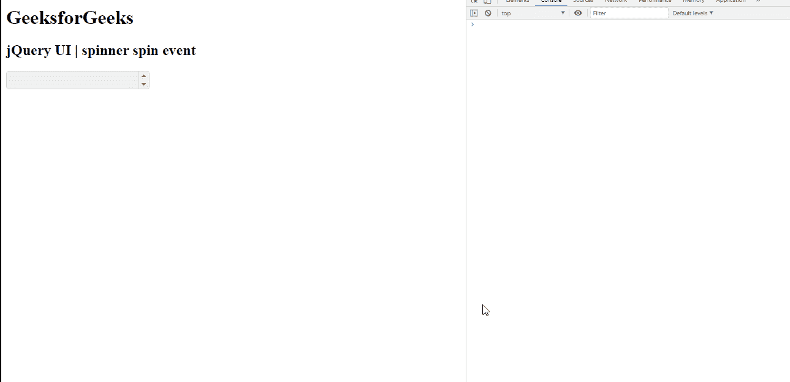

# jQuery 用户界面微调器旋转事件

> 原文:[https://www.geeksforgeeks.org/jquery-ui-spinner-spin-event/](https://www.geeksforgeeks.org/jquery-ui-spinner-spin-event/)

jQuery UI 由 GUI 小部件、视觉效果和使用 jQuery、CSS 和 HTML 实现的主题组成。jQuery 用户界面非常适合为网页构建用户界面。jQueryUI 微调器小部件帮助我们使用上下箭头来增加和减少输入元素的值。在本文中，我们将看到如何在 jQuery UI 滑块中使用**旋转** **事件**。当在 jQuery 用户界面微调器中递增/递减期间触发时，**微调** **事件**被触发。

**语法:**

```html
$( ".selector" ).spinner({
   spin: function( event, ui ) {}
});
```

**CDN 链接:** 首先，添加 jQuery UI 脚本 CDN 链接，为你的任务所需。

> <链接 href = " https://code . jQuery . com/UI/1 . 10 . 4/themes/UI-light/jQuery-UI . CSS " rel = "样式表">
> 
> <脚本 src = "https://code . jQuery . com/jQuery-1 . 10 . 2 . js "></脚本>
> 
> <脚本 src = " https

**输出:**



**参考:**T2】https://api.jqueryui.com/spinner/#event-spin