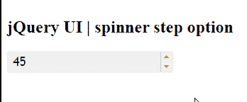

# jQuery 用户界面微调器步骤选项

> 原文:[https://www . geesforgeks . org/jquery-ui-spinner-step-option/](https://www.geeksforgeeks.org/jquery-ui-spinner-step-option/)

jQuery 用户界面由图形用户界面小部件、视觉效果和使用 jQuery、CSS 和 HTML 实现的主题组成。jQuery 用户界面非常适合为网页构建用户界面。jQuery UI 微调器小部件帮助我们使用上下箭头来增加和减少输入元素的值。在本文中，我们将看到如何使用 jQuery UI 滑块中的**步骤选项**。step 选项用于指示在 jQuery 用户界面微调器中要执行的步骤数。默认情况下，该值为 1。

**语法:**

```html
$( ".selector" ).spinner(
   { step : number | 'string'}
);
```

**参数:**该选项接受两个参数，如上所述，如下所述:

*   **编号:**该步的参数大小。
*   **字符串:**这个参数将根据 numberFormat 和区域性选项进行解析，否则将回落到原生的 parseFloat()方法。

**CDN 链接:** 首先，添加 jQuery UI 脚本的 CDN 链接，为你的任务所需。

> <link href="“https://code.jquery.com/ui/1.10.4/themes/ui-lightness/jquery-ui.css”" rel="“stylesheet”">

**示例 1:** 在本例中，我们在每一步中将微调器的值增加 50。

## 超文本标记语言

```html
<!DOCTYPE html>
<html lang = "en">
   <head>
      <meta charset = "utf-8">
      <link href = 
"https://code.jquery.com/ui/1.10.4/themes/ui-lightness/jquery-ui.css"
            rel = "stylesheet" />
      <script src = 
"https://code.jquery.com/jquery-1.10.2.js">
     </script>
      <script src = 
"https://code.jquery.com/ui/1.10.4/jquery-ui.js">
     </script>

      <script>
         $(function() {
            $( "#gfg" ).spinner( 
               {step: 50}
            );
         });
      </script>
   </head>

   <body>
      <h1>GeeksforGeeks</h1> 
      <h2>jQuery UI | spinner step option</h2>
      <div id = "geeks">
         <input type = "text" id = "gfg" value = "45" />
      </div>
   </body>
</html>
```

**输出:**



**参考:**T2**https://api.jqueryui.com/1.11/spinner/#option-step**T5】