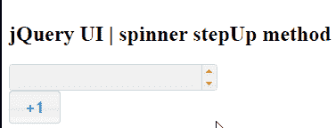

# jQuery UI Spinner stepUp()方法

> 原文:[https://www . geesforgeks . org/jquery-ui-spinner-step up-method/](https://www.geeksforgeeks.org/jquery-ui-spinner-stepup-method/)

jQuery 用户界面由图形用户界面小部件、视觉效果和使用 jQuery、CSS 和 HTML 实现的主题组成。jQuery 用户界面非常适合为网页构建用户界面。jQueryUI 微调器小部件帮助我们使用上下箭头来增加和减少输入元素的值。在本文中，我们将看到如何在 jQuery UI 滑块中使用 **stepUp()方法**。**步进()方法**用于在 jQuery 用户界面微调器中增加给定步数的步长值。这个方法可以调用三个事件开始，停止和旋转。

**语法:**

```html
$(".selector").spinner("stepUp", steps);
```

**参数:**该方法接受如上所述的单个参数，如下所述:

*   **步数:**此参数保存要递增的步数。

**CDN 链接:** 首先，添加 jQuery UI 脚本的 CDN 链接，为你的任务所需。

> <link href="“https://code.jquery.com/ui/1.10.4/themes/ui-lightness/jquery-ui.css”" rel="“stylesheet”">

**示例 1:** 在此示例中，我们将步长值增加给定的步长数，在每一步，该值都增加 1。

## 超文本标记语言

```html
<!Doctype html>
<html lang = "en">
   <head>
      <meta charset = "utf-8">
      <link href =
"https://code.jquery.com/ui/1.10.4/themes/ui-lightness/jquery-ui.css"
            rel = "stylesheet" />
      <script src = 
"https://code.jquery.com/jquery-1.10.2.js">
     </script>
      <script src = 
"https://code.jquery.com/ui/1.10.4/jquery-ui.js">
     </script>

      <style type = "text/css">
         #gfg input {width: 100px}
      </style>

      <script>
         $(function() {
            $("#gfg").spinner();
            $('button').button();

            $('#gfg1').click(function () {
               $("#gfg").spinner("stepUp");
            });
         });
      </script>
   </head>

   <body>
      <h1>GeeksforGeeks</h1> 
      <h2>jQuery UI | spinner stepUp method</h2> 
      <input id = "gfg" />
      <br/>
      <button id = "gfg1">+1</button>
   </body>

</html>
```

**输出:**



**参考:**T2**https://api.jqueryui.com/1.11/spinner/#method-stepUp**T5】