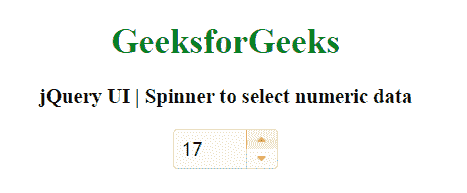
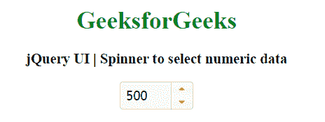

# jQuery UI | Spinner 选择数值数据

> 原文:[https://www . geesforgeks . org/jquery-ui-spinner-to-select-numeric-data/](https://www.geeksforgeeks.org/jquery-ui-spinner-to-select-numeric-data/)

jQuery UI 中的微调器用于通过使用箭头键或使用上/下按钮来增加或减少值。该微调器用于数字输入。
我们将使用代码中的 CDN 链接来添加不同的库和样式。要像任何其他 jQuery 用户界面小部件一样显示这个日历，我们必须链接到 jQuery 和 jQuery 用户界面。这里有一个简单的代码，用所有的 HTML 标签来显示一个微调器。您可以复制这个代码来显示微调器。

**例 1:**

```html
<!DOCTYPE html>
<html>

<head>
    <title>
        jQuery UI | Spinner to select numeric data
    </title>

    <link href=
'https://ajax.googleapis.com/ajax/libs/jqueryui/1.12.1/
themes/ui-lightness/jquery-ui.css'
        rel='stylesheet'>

    <script src=
"https://ajax.googleapis.com/ajax/libs/jquery/3.1.1/jquery.min.js">
    </script>

    <script src=
"https://ajax.googleapis.com/ajax/libs/jqueryui/1.12.1/jquery-ui.min.js">
    </script>
</head>

<body style="text-align:center;">

    <h1 style="color:green;">
        GeeksforGeeks
    </h1>

    <h3>
        jQuery UI | Spinner to
        select numeric data
    </h3>
    <input id="spinner" size=3 value=17>

    <script>
    $(document).ready(function() {
        $( "#spinner" ).spinner();
    });
    </script>
</body>

</html>
```

**输出:**


**默认值:**用于给输入框设置默认值。

**例 2:**

```html
<!DOCTYPE html>
<html>

<head>
    <title>
        jQuery UI | Spinner to select numeric data
    </title>

    <link href=
'https://ajax.googleapis.com/ajax/libs/jqueryui/1.12.1/
themes/ui-lightness/jquery-ui.css'
        rel='stylesheet'>

    <script src=
"https://ajax.googleapis.com/ajax/libs/jquery/3.1.1/jquery.min.js">
    </script>

    <script src=
"https://ajax.googleapis.com/ajax/libs/jqueryui/1.12.1/jquery-ui.min.js">
    </script>
</head>

<body style="text-align:center;">

    <h1 style="color:green;">
        GeeksforGeeks
    </h1>

    <h3>
        jQuery UI | Spinner to
        select numeric data
    </h3>
    <input id="spinner" size=3>

    <script>
    $(document).ready(function() {
        $( "#spinner" ).spinner();
        $( "#spinner" ).val(500)
    });
    </script>
</body>

</html>
```

**输出:**


**最大值和最小值:**可以设置微调器的上限和下限。

```html
<script>
$(document).ready(function() {
    $( "#spinner" ).spinner({
        max: 20,
        min: -10
    });
});
</script>
```

**页面值:**我们可以使用页面值来设置 Page up 或 Page down 按键值。

```html
<script>
$(document).ready(function() {
    $( "#spinner" ).spinner({
        page:50
    });
});
</script>
```

**步长值:**我们可以使用步长来设置上箭头键或下箭头键的值。

```html
<script>
$(document).ready(function() {
    $( "#spinner" ).spinner({
        step:10
    });
});
</script>
```