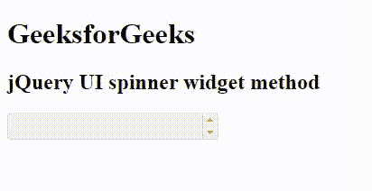

# jQuery UI Spinner 小部件()方法

> 原文:[https://www . geesforgeks . org/jquery-ui-spinner-widget-method/](https://www.geeksforgeeks.org/jquery-ui-spinner-widget-method/)

**jQuery** UI 由 GUI 小部件、视觉效果和使用 jQuery、CSS 和 HTML 实现的主题组成。jQuery 用户界面非常适合为网页构建用户界面。jQueryUI **微调器小部件**帮助我们使用上下箭头增加和减少输入元素的值。在本文中我们将看到如何在 jQuery UI 滑块中使用**小部件** **方法**。**小部件** **方法**返回 jQuery UI 微调器中的微调器小部件元素。

**语法:**

```
$(".selector").spinner("widget");
```

**进场:**

*   首先，添加项目所需的 **jQuery UI** 脚本。

> <link href="“https://code.jquery.com/ui/1.10.4/themes/ui-lightness/jquery-ui.css”" rel="“stylesheet”">

**例 1:**

## 超文本标记语言

```
<!doctype html>
<html lang = "en">
  <head>
    <meta charset = "utf-8">
    <link href = 
"https://code.jquery.com/ui/1.10.4/themes/ui-lightness/jquery-ui.css"
          rel = "stylesheet">
    <script src = "https://code.jquery.com/jquery-1.10.2.js">
       </script>
    <script src = "https://code.jquery.com/ui/1.10.4/jquery-ui.js">
      </script>

    <style type = "text/css">
      #gfg input {width: 100px}
    </style>

    <script>
      $(function() {
        $("#gfg").spinner();
        $('button').button();

        var a = $("#gfg").spinner('widget');
        console.log(a)
      });
    </script>
  </head>

  <body>
    <h1>GeeksforGeeks</h1> 
    <h2>jQuery UI spinner widget method</h2> 
    <input id = "gfg" />
  </body>

</html>
```

**输出:**

