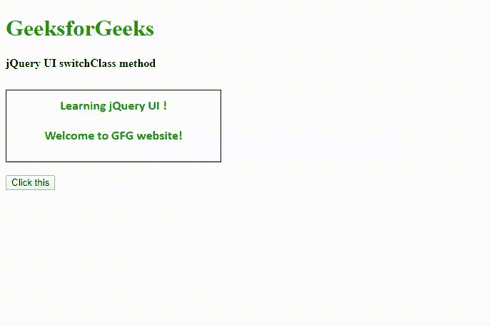
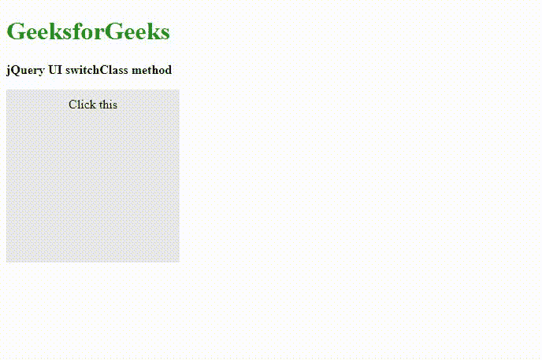

# jQuery UI | switchClass()方法

> 原文:[https://www.geeksforgeeks.org/jquery-ui-switchclass-method/](https://www.geeksforgeeks.org/jquery-ui-switchclass-method/)

**jQuery UI** 框架提供了 **switchClass()** 方法，帮助程序员从一个 CSS 类切换到另一个 CSS 类，并以平滑的方式管理从一种状态到另一种状态的转换。这个方法基本上是添加和移除已定义的类，同时动画化 CSS 代码的样式定义。

**语法:**

```html
$(selector).switchClass( removeClassName, addClassName, 
                duration, easing, complete )

```
.switchClass( removeClassName, addClassName, options )
```html

**参数:**
```

*   **removeClassName:** 多个类之间用空格隔开。用于移除的 CSS 类的名称。类型是*弦*。
*   **addClassName:** 多个类之间用空格隔开。用于向所有选定元素添加动画的 CSS 类的名称。
*   **持续时间:**动画效果运行的时间或持续时间，单位为毫秒。默认值为 400 毫秒，类型为*号*或*串*。
*   **缓和:**用于动画缓和效果的选项或设置。默认值为*“摇摆”*。
*   **完成:**这是视觉效果完成时执行的回调函数。
*   **儿童:**类型为*布尔*。这提到动画是否应该应用于所有子元素或选定元素的后代。
*   **队列:**类型为*弦*或*布尔*。它提到动画是否应该放在效果队列中。

**jQuery 界面链接:**

> <link>href = " https://code . jquery . com/ui/1 . 10 . 4/themes/ui-light/jquery-ui . CSS " rel = " style sheet " type = " text/CSS "/
> T4】src = " https://code . jquery . com/jquery-1 . 10 . 2 . js ">/script>

**示例 1:** 在下面的示例中，我们使用 jQuery 代码演示了 **switchClass()** 方法，视觉效果在页面的 HTML 部分进行处理。结果的输出图像也如下所示。

```html
<!DOCTYPE html>
<html>

<head>
    <meta charset="utf-8">
    <meta name="viewport" content=
        "width=device-width, initial-scale=1"> 

    <title>jQuery UI switchClass method</title>

    <!--Pre-compiled libraries -->
    <link href = 
"https://code.jquery.com/ui/1.10.4/themes/ui-lightness/jquery-ui.css"
        rel = "stylesheet">

    <script src =
"https://code.jquery.com/jquery-1.10.2.js"></script>

    <script src = 
"https://code.jquery.com/ui/1.10.4/jquery-ui.js">
    </script>

    <style>
        .finalClass {
            padding:10px 10px;
            font-family: Calibri;
            font-size: 24px;             
            font-weight: bold;
            color: red;
        }
        .initialClass {
            padding:10px 10px;
            font-family: Calibri;
            font-size: 18px;         
            font-weight: bold;
            color: green;
        }
        #divID{
        text-align:center;
        border:1px solid black;
        width:300px;
        height:100px;
        }

        .height{ 
            height: 10px;
        }
    </style>

    <script>
        $(function() {
            $('#switchBtnId').click(function() {
            $(".initialClass").switchClass(
                    "initialClass", "finalClass", '500');

            $(".finalClass").switchClass(
                    "finalClass", "initialClass", '500');

            return false;
            });
        });
    </script>
</head>

<body>
    <h1 style="color:green">GeeksforGeeks</h1>

    <b>jQuery UI switchClass method</b>

    <div class="height"></div><br>

    <div id="divID">
        <div class = "initialClass">
            Learning jQuery UI !
        </div>

        <div class = "initialClass">
            Welcome to GFG website!
        </div>
    </div>
    <br />

    <input type = "button" id = "switchBtnId"
                value = "Click this" />
</body>

</html>
```

**输出:**


**例 2:**

```html
<!DOCTYPE html>
<html>

<head>
    <meta charset="utf-8">
    <meta name="viewport"
        content="width=device-width, initial-scale=1">

    <title>jQuery UI switchClass method</title>

    <!--Pre-compiled libraries -->
    <link href=
"https://code.jquery.com/ui/1.10.4/themes/ui-lightness/jquery-ui.css"
        rel="stylesheet">

    <script src=
        "https://code.jquery.com/jquery-1.10.2.js">
    </script>

    <script src=
        "https://code.jquery.com/ui/1.10.4/jquery-ui.js">
    </script>

    <style>
        div {
            width: 100px;
            height: 100px;
            background-color: #e9e9e9;
            text-align: center;
            padding: 10px 10px;
        }

        .newClass {
            width: 200px;
            height: 200px;
        }

        .bgClass {
            background-color: green;
        }
    </style>
</head>

<body>
    <h1 style="color:green">GeeksforGeeks</h1>

    <b>jQuery UI switchClass method</b>
    <p></p>

    <div class="bgClass">Click this</div>

    <script>
        $("div").click(function() {
            $(this).switchClass("newClass",
                    "bgClass", 2000, "swing");

            $(this).switchClass("bgClass",
                    "newClass", 2000, "swing");
        });
    </script>
</body>

</html>
```

**输出:**
