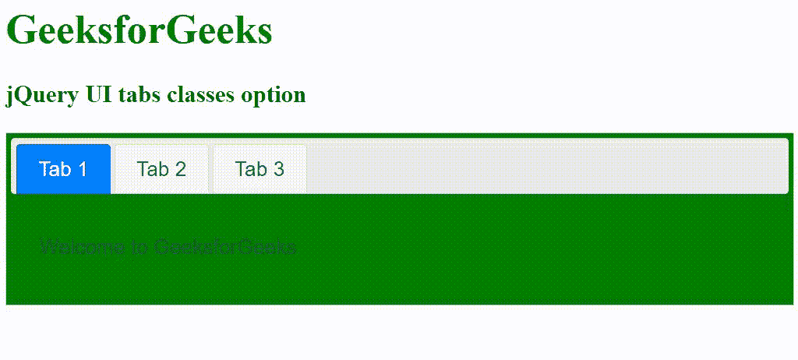

# jQuery 用户界面选项卡类选项

> 原文:[https://www . geesforgeks . org/jquery-ui-tab-class-option/](https://www.geeksforgeeks.org/jquery-ui-tabs-classes-option/)

jQuery UI 由 GUI 小部件、视觉效果和使用 HTML、CSS 和 jQuery 实现的主题组成。jQuery 用户界面非常适合为网页构建用户界面。jQuery 用户界面选项卡类选项用于向元素添加额外的类。

**语法:**

```html
$( ".selector" ).tabs({
  classes: {
    "ui-tabs": "highlight"
  }
});
```

**CDN 链接:**首先，添加项目所需的 jQuery UI 脚本。

> <link rel="”stylesheet”" href="”//code.jquery.com/ui/1.12.1/themes/smoothness/jquery-ui.css”">
> <脚本 src =//code . jquery . com/jquery-1 . 12 . 4 . js "></脚本>
> <脚本 src =//code . jquery . com/ui/1 . 12 . 1/jquery-ui . js "></脚本>

**示例:**

## 超文本标记语言

```html
<!DOCTYPE html>
<html lang="en">

<head>
    <meta charset="utf-8">
    <link rel="stylesheet" href=
    "//code.jquery.com/ui/1.12.1/themes/base/jquery-ui.css">
    <script src="https://code.jquery.com/jquery-1.12.4.js">
    </script>
    <script src="https://code.jquery.com/ui/1.12.1/jquery-ui.js">
    </script>

    <style>
        .highlight {
            background: green;
        }
    </style>

    <script>
        $(function () {
            $("#gfg").tabs({
                event: 'mouseover',
                classes: {
                    "ui-tabs": "highlight",
                }
            });
        });
    </script>
</head>

<body>
    <h1 style="color: green;">GeeksforGeeks</h1>
    <h3>jQuery UI tabs classes option</h3>

    <div id="gfg">
        <ul>
            <li><a href="#gfg1">Tab 1</a></li>
            <li><a href="#gfg2">Tab 2</a></li>
            <li><a href="#gfg3">Tab 3</a></li>
        </ul>
        <div id="gfg1">

<p>Welcome to GeeksforGeeks</p>

        </div>

        <div id="gfg2">

<p>GeeksforGeeks</p>

        </div>

        <div id="gfg3">

<p>Welcome Geeks!</p>

        </div>
    </div>
</body>

</html>
```

**输出:**



**参考:**T2】https://api.jqueryui.com/tabs/#option-classes