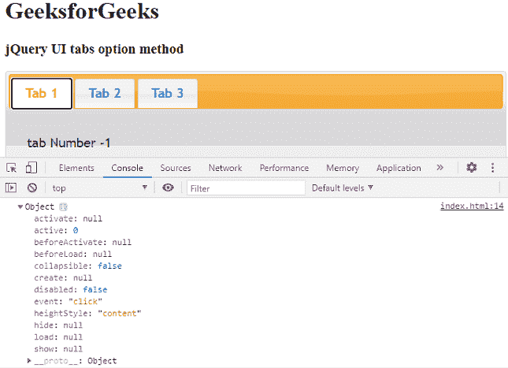

# jQuery UI 选项卡选项()方法

> 原文:[https://www.geeksforgeeks.org/jquery-ui-tabs-option-method/](https://www.geeksforgeeks.org/jquery-ui-tabs-option-method/)

jQuery UI 由 GUI 小部件、视觉效果和使用 jQuery、CSS 和 HTML 实现的主题组成。jQuery 用户界面非常适合为网页构建用户界面。 jQuery UI 选项卡小部件帮助我们将一些内容放在不同的选项卡中，并允许我们在它们之间切换。在本文中，我们将看到如何在 jQuery UI 滑块中使用**选项**方法。
选项 方法 用于在 jQuery UI 中获取特定当前滑块选项的对象。

**语法:**

```html
var a = $( ".selector" ).tabs("option");
```

**参数:**此方法不接受任何参数。

**方法:**首先，添加项目所需的 jQuery UI 脚本。

> <link href="“https://code.jquery.com/ui/1.10.4/themes/ui-lightness/jquery-ui.css”" rel="“stylesheet”">
> <脚本 src = " https://code . jquery . com/jquery-1 . 10 . 2 . js "></脚本>
> <脚本 src = " https://code . jquery . com/ui/1 . 10 . 4/jquery-ui . js "></脚本>

**示例:**

## 超文本标记语言

```html
<!doctype html>
<html lang="en">

<head>
    <meta charset="utf-8">
    <link href=
"https://code.jquery.com/ui/1.10.4/themes/ui-lightness/jquery-ui.css"
        rel="stylesheet">
    <script src=
        "https://code.jquery.com/jquery-1.10.2.js">
    </script>

    <script src=
        "https://code.jquery.com/ui/1.10.4/jquery-ui.js">
    </script>

    <script>
        $(function () {
            $("#gfg").tabs();
            var a = $("#gfg").tabs("option");
            console.log(a)
        });
    </script>
</head>

<body>
    <h1>GeeksforGeeks</h1>
    <h3>jQuery UI tabs option method</h3>

    <div id="gfg">
        <ul>
            <li><a href="#gfg1">Tab 1</a></li>
            <li><a href="#gfg2">Tab 2</a></li>
            <li><a href="#gfg3">Tab 3</a></li>
        </ul>

        <div id="gfg1">
            <p>
                tab Number -1
            </p>
        </div>

        <div id="gfg2">
            <p>
                tab Number -2
            </p>
        </div>

        <div id="gfg3">
            <p>
                tab Number -3
            </p>
        </div>
    </div>
</body>

</html>
```

**输出:**

