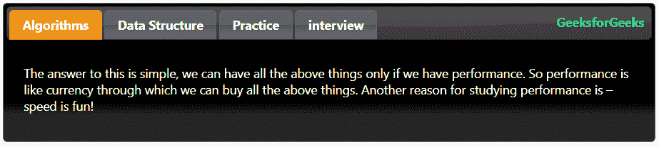
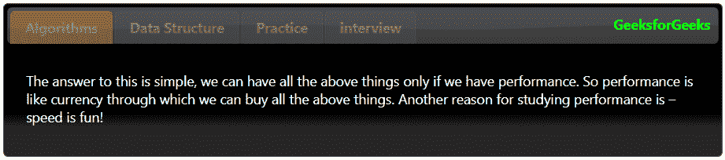
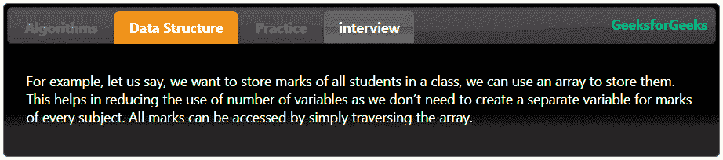
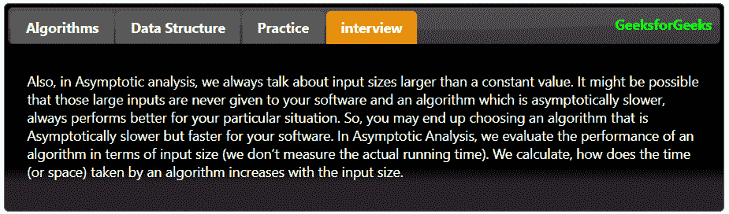

# jquery ui | tab

> 哎哎哎:# t0]https://www . geeksforgeeks . org/jquery-ui-tabs/

选项卡用于在网页上创建多个可交换的部分，就像手风琴一样。它有助于对内容进行分组，并一次查看特定组的内容。

选项卡是通过遵循如下特定标记创建的:

*   标签应该包含在有序列表或无序列表中
*   每个选项卡标题都应该单独包装在一个列表项和一个锚定标记中，该标记由一个 href 属性包围，该属性指定每个选项卡面板的内容
*   每个选项卡面板可以是空的，但是它应该有自己的 id，对应于在相关选项卡的锚元素中输入的散列名称。

选项卡面板中的内容可以在同一个页面上定义，也可以通过 Ajax 加载，两者都由与该面板的锚标签相关联的 href 属性处理。
下面我们使用 jquery UI 编写一个简单的 4 面板选项卡的代码。

标签在一个带有 id 的 div 标签中指定。其 id 在 jquery 代码中指定。在这里，我们选择了第二个标签作为默认标签，当网页打开时将选择该标签。您可以通过在**激活的**选项中指定不同的值来更改它。
**注:**选项卡从“0”开始索引。

以下示例说明了 jquery 选项卡:
**示例 1:** 这个示例代码是一个简单的 jQuery 选项卡，所有选项卡都是可评估的。

*   **程序:**

    ```
    <html>

    <head>
        <link href=
    'https://ajax.googleapis.com/ajax/libs/jqueryui/1.12.1/themes/ui-darkness/jquery-ui.css' 
              rel='stylesheet'>
    </head>
        <style>
            b{
                float: right;
                margin: 7px;
                color: lime;
            }

            #geeks a:hover{
                color: lime;
                background: gray;
            }

        </style>
    <body>
        <br>
        <br>
        <div id="geeks">
            <ul>

                <li><a href="#Algorithms">Algorithms</a></li>
                <li><a href="#Data_Structure">Data Structure</a></li>
                <li><a href="#Practice">Practice</a></li>
                <li><a href="#interview">interview</a></li>

                <b>GeeksforGeeks</b>
            </ul>

            <div id='Algorithms'>
                <p>
                    The answer to this is simple, we can have all the 
                    above things only if we have performance. So 
                    performance is like currency through which we can
                    buy all the above things. Another reason 
                    for studying performance is – speed is fun!
                </p>
            </div>

            <div id='Data_Structure'>
                <p>
                    For example, let us say, we want to store marks of 
                    all students in a class, we can use an array to store
                    them. This helps in reducing the use of number of 
                    variables as we don’t need to create a separate 
                    variable for marks of every subject.  All marks can
                    be accessed by simply traversing the array.
                </p>
            </div>

            <div id='Practice'>
                <p>
                    Asymptotic Analysis is the big idea that handles 
                    above issues in analyzing algorithms. In Asymptotic
                    Analysis, we evaluate the performance of an algorithm
                    in terms of input size (we don’t measure the actual 
                    running time). We calculate, how does the time 
                    (or space) taken by an algorithm increases with 
                    the input size.
                </p>    
            </div>

            <div id='interview'>
                <p>
                    Also, in Asymptotic analysis, we always talk about 
                    input sizes larger than a constant value. It might 
                    be possible that those large inputs are never given
                    to your software and an algorithm  which is 
                    asymptotically slower, always performs better for 
                    your particular situation. So, you may end up choosing
                    an algorithm that is Asymptotically slower but faster 
                    for your software.
                </p>
            </div>

        </div>
        <script src=
    "https://ajax.googleapis.com/ajax/libs/jquery/3.1.1/jquery.min.js">
        </script>
        <script src=
    "https://ajax.googleapis.com/ajax/libs/jqueryui/1.12.1/jquery-ui.min.js">
        </script>
        <script>
            $(document).ready(function() {
                $("#geeks").tabs({
                        active: 0
                    })
            })
        </script>

    </body>

    </html>
    ```

*   **输出:**
    

**例 2:** 默认保持所有标签页关闭，也可以选择默认保持所有标签页关闭。为此，我们使用**可折叠**选项，将其值设置为“真”，并将**活动**选项的值设置为假。

*   **程序:**

    ```
    <html>

    <head>
        <link href=
    'https://ajax.googleapis.com/ajax/libs/jqueryui/1.12.1/themes/ui-darkness/jquery-ui.css' 
              rel='stylesheet'>
    </head>
        <style>
            b{
                float: right;
                margin: 7px;
                color: lime;
            }

            #geeks a:hover{
                color: lime;
                background: gray;
            }

        </style>
    <body>
        <br>
        <br>
        <div id="geeks">
            <ul>

                <li><a href="#Algorithms">Algorithms</a></li>
                <li><a href="#Data_Structure">Data Structure</a></li>
                <li><a href="#Practice">Practice</a></li>
                <li><a href="#interview">interview</a></li>

                <b>GeeksforGeeks</b>
            </ul>

            <div id='Algorithms'>
                <p>
                    The answer to this is simple, we can have all the 
                    above things only if we have performance. So 
                    performance is like currency through which we can
                    buy all the above things. Another reason 
                    for studying performance is – speed is fun!
                </p>
            </div>

            <div id='Data_Structure'>
                <p>
                    For example, let us say, we want to store marks of 
                    all students in a class, we can use an array to store
                    them. This helps in reducing the use of number of 
                    variables as we don’t need to create a separate 
                    variable for marks of every subject.  All marks can
                    be accessed by simply traversing the array.
                </p>
            </div>

            <div id='Practice'>
                <p>
                    Asymptotic Analysis is the big idea that handles 
                    above issues in analyzing algorithms. In Asymptotic
                    Analysis, we evaluate the performance of an algorithm
                    in terms of input size (we don’t measure the actual 
                    running time). We calculate, how does the time 
                    (or space) taken by an algorithm increases with 
                    the input size.
                </p>    
            </div>

            <div id='interview'>
                <p>
                    Also, in Asymptotic analysis, we always talk about 
                    input sizes larger than a constant value. It might 
                    be possible that those large inputs are never given
                    to your software and an algorithm  which is 
                    asymptotically slower, always performs better for 
                    your particular situation. So, you may end up choosing
                    an algorithm that is Asymptotically slower but faster 
                    for your software.
                </p>
            </div>

        </div>
        <script src=
    "https://ajax.googleapis.com/ajax/libs/jquery/3.1.1/jquery.min.js">
        </script>
        <script src=
    "https://ajax.googleapis.com/ajax/libs/jqueryui/1.12.1/jquery-ui.min.js">
        </script>
        <script>
            $(document).ready(function() {
                $("#geeks").tabs({
                        active: false,
                        collapsible: true
                    })
            })
        </script>

    </body>

    </html>
    ```

*   **输出:**
    

**示例 3:** 在本例中，我们将禁用选项卡。我们可以使用**禁用**选项来选择禁用特定选项卡或所有选项卡。首先，我们将禁用选项的值设置为“真”的所有选项卡禁用。

*   **程序:**

    ```
    <html>

    <head>
        <link href=
    'https://ajax.googleapis.com/ajax/libs/jqueryui/1.12.1/themes/ui-darkness/jquery-ui.css' 
              rel='stylesheet'>
    </head>
        <style>
            b{
                float: right;
                margin: 7px;
                color: lime;
            }

            #geeks a:hover{
                color: lime;
                background: gray;
            }

        </style>
    <body>
        <br>
        <br>
        <div id="geeks">
            <ul>

                <li><a href="#Algorithms">Algorithms</a></li>
                <li><a href="#Data_Structure">Data Structure</a></li>
                <li><a href="#Practice">Practice</a></li>
                <li><a href="#interview">interview</a></li>

                <b>GeeksforGeeks</b>
            </ul>

            <div id='Algorithms'>
                <p>
                    The answer to this is simple, we can have all the 
                    above things only if we have performance. So 
                    performance is like currency through which we can
                    buy all the above things. Another reason 
                    for studying performance is – speed is fun!
                </p>
            </div>

            <div id='Data_Structure'>
                <p>
                    For example, let us say, we want to store marks of 
                    all students in a class, we can use an array to store
                    them. This helps in reducing the use of number of 
                    variables as we don’t need to create a separate 
                    variable for marks of every subject.  All marks can
                    be accessed by simply traversing the array.
                </p>
            </div>

            <div id='Practice'>
                <p>
                    Asymptotic Analysis is the big idea that handles 
                    above issues in analyzing algorithms. In Asymptotic
                    Analysis, we evaluate the performance of an algorithm
                    in terms of input size (we don’t measure the actual 
                    running time). We calculate, how does the time 
                    (or space) taken by an algorithm increases with 
                    the input size.
                </p>    
            </div>

            <div id='interview'>
                <p>
                    Also, in Asymptotic analysis, we always talk about 
                    input sizes larger than a constant value. It might 
                    be possible that those large inputs are never given
                    to your software and an algorithm  which is 
                    asymptotically slower, always performs better for 
                    your particular situation. So, you may end up choosing
                    an algorithm that is Asymptotically slower but faster 
                    for your software.
                </p>
            </div>

        </div>
        <script src=
    "https://ajax.googleapis.com/ajax/libs/jquery/3.1.1/jquery.min.js">
        </script>
        <script src=
    "https://ajax.googleapis.com/ajax/libs/jqueryui/1.12.1/jquery-ui.min.js">
        </script>
        <script>
            $(document).ready(function() {

                $( "#geeks" ).tabs({
                    disabled:true
                })

            })
        </script>

    </body>
    </html>                    
    ```

*   **输出:**
    

**示例 4:** 在本例中，我们将禁用一些特定的选项卡。在下面的代码中，我们禁用了第一个和第三个选项卡(索引方面为第 0 和第 2 个):

*   **程序:**

    ```
    <html>

    <head>
        <link href=
    'https://ajax.googleapis.com/ajax/libs/jqueryui/1.12.1/themes/ui-darkness/jquery-ui.css'
            rel='stylesheet'>
    </head>
        <style>
            b{
                float: right;
                margin: 7px;
                color: lime;
            }

            #geeks a:hover{
                color: lime;
                background: gray;
            }

        </style>
    <body>
        <br>
        <br>
        <div id="geeks">
            <ul>

                <li><a href="#Algorithms">Algorithms</a></li>
                <li><a href="#Data_Structure">Data Structure</a></li>
                <li><a href="#Practice">Practice</a></li>
                <li><a href="#interview">interview</a></li>

                <b>GeeksforGeeks</b>
            </ul>

            <div id='Algorithms'>
                <p>
                    The answer to this is simple, we can have all the 
                    above things only if we have performance. So 
                    performance is like currency through which we can
                    buy all the above things. Another reason 
                    for studying performance is – speed is fun!
                </p>
            </div>

            <div id='Data_Structure'>
                <p>
                    For example, let us say, we want to store marks of 
                    all students in a class, we can use an array to store
                    them. This helps in reducing the use of number of 
                    variables as we don’t need to create a separate 
                    variable for marks of every subject.  All marks can
                    be accessed by simply traversing the array.
                </p>
            </div>

            <div id='Practice'>
                <p>
                    Asymptotic Analysis is the big idea that handles 
                    above issues in analyzing algorithms. In Asymptotic
                    Analysis, we evaluate the performance of an algorithm
                    in terms of input size (we don’t measure the actual 
                    running time). We calculate, how does the time 
                    (or space) taken by an algorithm increases with 
                    the input size.
                </p>    
            </div>

            <div id='interview'>
                <p>
                    Also, in Asymptotic analysis, we always talk about 
                    input sizes larger than a constant value. It might 
                    be possible that those large inputs are never given
                    to your software and an algorithm  which is 
                    asymptotically slower, always performs better for 
                    your particular situation. So, you may end up choosing
                    an algorithm that is Asymptotically slower but faster 
                    for your software.
                </p>
            </div>

        </div>
        <script src=
    "https://ajax.googleapis.com/ajax/libs/jquery/3.1.1/jquery.min.js">
        </script>
        <script src=
    "https://ajax.googleapis.com/ajax/libs/jqueryui/1.12.1/jquery-ui.min.js">
        </script>
        <script>
            $(document).ready(function() {

                $( "#geeks" ).tabs({
                    active: 1,
                    disabled:[0, 2]
                })

            })
        </script>

    </body>
    </html>                    
    ```

*   **输出:**
    

**示例 5:** 我们可以选择默认打开哪个元素，同样默认鼠标点击事件打开选项卡，同样我们将此更改为鼠标悬停打开或激活该选项卡

*   **程序:**

    ```
    <html>
    <head>
        <link href=
    'https://ajax.googleapis.com/ajax/libs/jqueryui/1.12.1/themes/ui-darkness/jquery-ui.css'
            rel='stylesheet'>
    </head>
        <style>
            b{
                float: right;
                margin: 7px;
                color: lime;
            }

            #geeks a:hover{
                color: lime;
                background: gray;
            }

        </style>
    <body>
        <br>
        <br>
        <div id="geeks">
            <ul>

                <li><a href="#Algorithms">Algorithms</a></li>
                <li><a href="#Data_Structure">Data Structure</a></li>
                <li><a href="#Practice">Practice</a></li>
                <li><a href="#interview">interview</a></li>

                <b>GeeksforGeeks</b>
            </ul>

            <div id='Algorithms'>
                <p>
                    The answer to this is simple, we can have all the 
                    above things only if we have performance. So 
                    performance is like currency through which we can
                    buy all the above things. Another reason 
                    for studying performance is – speed is fun!
                </p>
            </div>

            <div id='Data_Structure'>
                <p>
                    For example, let us say, we want to store marks of 
                    all students in a class, we can use an array to store
                    them. This helps in reducing the use of number of 
                    variables as we don’t need to create a separate 
                    variable for marks of every subject.  All marks can
                    be accessed by simply traversing the array.
                </p>
            </div>

            <div id='Practice'>
                <p>
                    Asymptotic Analysis is the big idea that handles 
                    above issues in analyzing algorithms. In Asymptotic
                    Analysis, we evaluate the performance of an algorithm
                    in terms of input size (we don’t measure the actual 
                    running time). We calculate, how does the time 
                    (or space) taken by an algorithm increases with 
                    the input size.
                </p>    
            </div>

            <div id='interview'>
                <p>
                    Also, in Asymptotic analysis, we always talk about 
                    input sizes larger than a constant value. It might 
                    be possible that those large inputs are never given
                    to your software and an algorithm  which is 
                    asymptotically slower, always performs better for 
                    your particular situation. So, you may end up choosing
                    an algorithm that is Asymptotically slower but faster 
                    for your software.
                </p>
            </div>

        </div>
        <script src=
    "https://ajax.googleapis.com/ajax/libs/jquery/3.1.1/jquery.min.js">
        </script>
        <script src=
    "https://ajax.googleapis.com/ajax/libs/jqueryui/1.12.1/jquery-ui.min.js">
        </script>
        <script>
            $(document).ready(function() {

                $( "#geeks" ).tabs({
                    event:'mouseover'
                })

            })
        </script>

    </body>
    </html>                    
    ```

*   **输出:**
    

**示例 6:** 在本例中，我们将根据该选项卡的内容更改选项卡页面高度。要做到这一点，我们将被要求尽可能短地定义最小高度。以及根据内容增加选项卡页面高度的溢出属性。

**Program:**

*   ```
    <html>
    <head>
        <link href=
    'https://ajax.googleapis.com/ajax/libs/jqueryui/1.12.1/themes/ui-darkness/jquery-ui.css'
            rel='stylesheet'>
    </head>
        <style>
            b{
                float: right;
                margin: 7px;
                color: lime;
            }

            #geeks a:hover{
                color: lime;
                background: gray;
            }

        </style>
    <body>
        <br>
        <br>
        <div id="geeks">
            <ul>

                <li><a href="#Algorithms">Algorithms</a></li>
                <li><a href="#Data_Structure">Data Structure</a></li>
                <li><a href="#Practice">Practice</a></li>
                <li><a href="#interview">interview</a></li>

                <b>GeeksforGeeks</b>
            </ul>

            <div id='Algorithms'>
                <p>
                    The answer to this is simple, we can have all the 
                    above things only if we have performance. So 
                    performance is like currency through which we can
                    buy all the above things. Another reason 
                    for studying performance is – speed is fun!
                </p>
            </div>

            <div id='Data_Structure'>
                <p>
                    For example, let us say, we want to store marks of 
                    all students in a class, we can use an array to store
                    them. This helps in reducing the use of number of 
                    variables as we don’t need to create a separate 
                    variable for marks of every subject.  All marks can
                    be accessed by simply traversing the array.
                </p>
            </div>

            <div id='Practice'>
                <p>
                    Asymptotic Analysis is the big idea that handles 
                    above issues in analyzing algorithms. In Asymptotic
                    Analysis, we evaluate the performance of an algorithm
                    in terms of input size (we don’t measure the actual 
                    running time). We calculate, how does the time 
                    (or space) taken by an algorithm increases with 
                    the input size.
                </p>    
            </div>

            <div id='interview'>
                <p>
                    Also, in Asymptotic analysis, we always talk about 
                    input sizes larger than a constant value. It might 
                    be possible that those large inputs are never given
                    to your software and an algorithm  which is 
                    asymptotically slower, always performs better for 
                    your particular situation. So, you may end up choosing
                    an algorithm that is Asymptotically slower but faster 
                    for your software.
                </p>
            </div>

        </div>
        <script src=
    "https://ajax.googleapis.com/ajax/libs/jquery/3.1.1/jquery.min.js">
        </script>
        <script src=
    "https://ajax.googleapis.com/ajax/libs/jqueryui/1.12.1/jquery-ui.min.js">
        </script>
        <script>
            $(document).ready(function() {
                $("#geeks").tabs().css({
                   'min-height': '100px',
                   'overflow': 'auto'
                });
            })
        </script>

    </body>
    </html>                    
    ```

    *   **输出:**
    