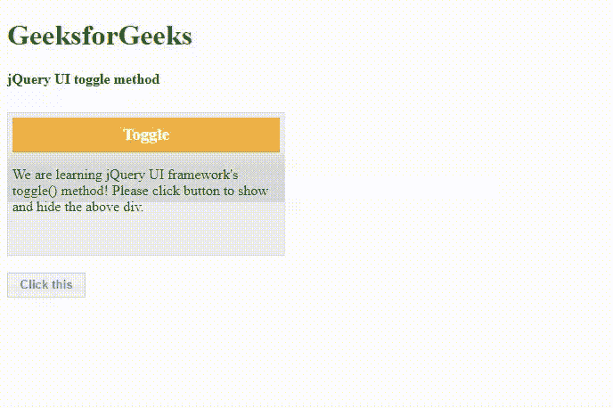
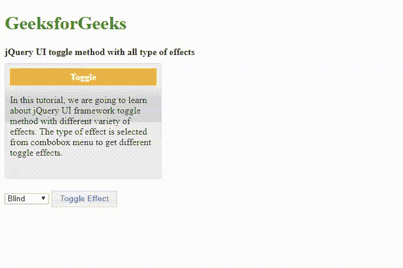

# jQuery UI | toggle()方法

> 原文:[https://www.geeksforgeeks.org/jquery-ui-toggle-method/](https://www.geeksforgeeks.org/jquery-ui-toggle-method/)

**jQuery UI** 框架提供**切换()**方法，根据所选元素的状态和用户选择的切换效果类型，显示**显示**或**隐藏**功能之间的切换。

**语法:**

```html
(selector).toggle( effectType [, options ] [, duration ] [, complete ] )
```

**参数:**该方法接受上述和下述四个参数:

*   **效果类型:**类型为*弦。*指定用于切换过渡的效果类型。
*   **选项:**类型为*对象*。它为缓和选项指定了面向效果的特定设置。
*   **时长:**类型为*号*或*弦*。这指定了切换效果应该运行多长时间。例如“快”、“慢”或默认值 400 ms。
*   **完成:**这是切换效果完成时调用的回调方法。

**返回值:**返回给定切换效果的选中元素。

**jQuery 界面链接:**

> <link>href = " https://code . jquery . com/ui/1 . 10 . 4/themes/ui-light/jquery-ui . CSS " rel = " style sheet " type = " text/CSS "/
> T4】src = " https://code . jquery . com/jquery-1 . 10 . 2 . js ">/script>

**示例 1:** 在以下示例中，**切换()**功能在带有**脉动**效果类型的 jQuery 代码中实现，该效果类型作为显示匹配元素的切换效果的参数传递。**脉动**效果类型以打开或关闭的方式调整选定元素的不透明度。*UI-widget-content**UI-widget-header*是 jQuery UI CSS 框架提供的内置类，让界面更具交互性和美观性。

```html
<!DOCTYPE html>
<html>

<head>
    <meta charset="utf-8">
    <meta name="viewport" content=
        "width=device-width,initial-scale=1"> 

    <title>jQuery UI toggle method</title>

    <!--Pre-compiled libraries of jQuery UI -->
    <link href = 
"https://code.jquery.com/ui/1.10.4/themes/ui-lightness/jquery-ui.css"
            rel = "stylesheet">

    <script src = 
        "https://code.jquery.com/jquery-1.10.2.js">
    </script>

    <script src = 
        "https://code.jquery.com/ui/1.10.4/jquery-ui.js">
    </script>

    <style>
        .mainDiv {
            width: 550px; 
            height: 180px;
        }

        #toggleBtnId {
            padding: .4em 1em;
            text-decoration: none; 
        }

        #container { 
            width: 300px;
            height: 150px; 
            padding: 0.3em;
            position: relative;
        }

        #container h3 { 
            margin: 0; 
            padding: 0.4em;
            text-align: center;
        }     

        .height{
            height: 10px;
        }
    </style>

    <script>
        $(function() {
            function toggleEffect() {
                $( "#container" ).toggle('pulsate', 500);
            };

            $( "#toggleBtnId" ).click(function() {
                toggleEffect();
                return false;
            });
        });
    </script>
</head>

<body>
    <h1 style="color:green">
        GeeksforGeeks
    </h1>

    <b>jQuery UI toggle method</b>

    <div class="height"></div><br/>

    <div class = "mainDiv">
        <div id = "container" 
            class = "ui-widget-content">

            <h3 class = "ui-widget-header">
                Toggle
            </h3>

            <p>
                We are learning jQuery UI framework's
                toggle() method! Please click button
                to show and hide the above div.
            </p>
        </div>
    </div>

    <input type = "button" id = "toggleBtnId"
            class = "ui-state-default"
            value = "Click this" />
</body>

</html>
```

**输出:**


**示例 2:**jQuery UI 框架提供了以多种视觉切换效果为参数的 **toggle()** 方法。在下面的示例代码中，我们将演示使用组合框菜单选项来选择几个切换效果类型的方法。当用户选择效果类型时，会传递到 **toggle()** 方法进行输出，如输出图像所示。程序员可以编写代码，并根据应用程序的要求选择效果类型作为参数。

```html
<!DOCTYPE html>
<html lang="en">

<head>
    <meta charset="utf-8">

    <meta name="viewport" content=
        "width=device-width, initial-scale=1">

    <title>
        jQuery UI toggle Method with All effects
    </title>

    <link href = 
"https://code.jquery.com/ui/1.10.4/themes/ui-lightness/jquery-ui.css"
            rel = "stylesheet">

    <script src=
        "http://code.jquery.com/jquery-2.1.3.js">
    </script>

    <script src=
        "http://code.jquery.com/ui/1.11.2/jquery-ui.js">
    </script>

    <style>
        .height { 
            height: 10px;
        }

        .divClass { 
            width: 500px;
            height: 200px;
        }

        #btnID { 
            padding: .4em 1em;
            text-decoration: none;
        }
        #container { 
            width: 250px; 
            height: 180px; 
            padding: 0.5em;
            position: relative;
        }

        #container h4 { 
            margin: 0; 
            padding: 0.3em;
            text-align: center;
        }
    </style>

    <script>
        $( function() {

            // Toggle the selected effect
            // type by the user
            function toggleEffect() {

            var effectType = $( "#typesOfEffectId" ).val(); 

            // Toggle the effect with call back
            $( "#container" ).toggle( effectType, 800);
            };

            // Set effect from select menu value
            $( "#btnID" ).on( "click", function() {
                toggleEffect();
            });
        });
    </script>
</head>

<body>
    <h1 style="color:green">
        GeeksforGeeks
    </h1> 

    <b>
        jQuery UI toggle method
        with all type of effects
    </b>

    <div class="height"></div>

    <div class="divClass">

        <div id="container" class="ui-widget-content">
            <h4 class="ui-widget-header">Toggle</h4>

            <p>
                In this tutorial, we are going to
                learn about jQuery UI framework
                toggle method with different variety
                of effects. The type of effect is
                selected from combobox menu to get
                different toggle effects.
            </p>
        </div>
    </div>
    <br/>

    <select name="effectTypes" id="typesOfEffectId">
        <option value="blind">Blind</option>
        <option value="clip">Clip</option>
        <option value="drop">Drop</option>
        <option value="explode">Explode</option>
        <option value="fade">Fade</option>
        <option value="fold">Fold</option>
        <option value="highlight">Highlight</option>
        <option value="puff">Puff</option>
        <option value="shake">Shake</option>
        <option value="bounce">Bounce</option> 
        <option value="slide">Slide</option>
    </select>

    <button id="btnID" class="ui-state-default">
        Toggle Effect
    </button>
</body>

</html>
```

**输出:**
