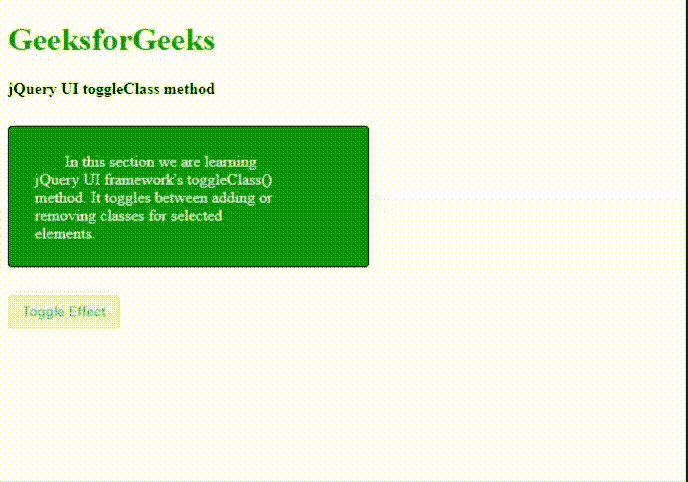
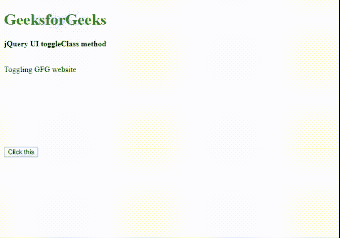

# jQuery UI | toggleClass 方法

> 原文:[https://www.geeksforgeeks.org/jquery-ui-toggleclass-method/](https://www.geeksforgeeks.org/jquery-ui-toggleclass-method/)

jQuery UI 框架类和方法明确改进了 jQuery **toggle()** 和 **toggleClass()** 方法，使其对用户和开发人员更具交互性。jQuery UI 提供了内置的 **toggleClass()** 方法，该方法通过向匹配或选定的元素添加或移除 CSS 类来管理视觉切换效果。它有助于从一种 CSS 转换状态转换到另一种状态，同时保持 jQuery 代码中的所有样式变化。

**语法:**

```
$(selector).toggleClass(className [, switch ] [,
          duration ] [, easing ] [, complete ] )

```

或者

```
$(selector).toggleClass(className [, switch ] [, options])

```

或者

```
$(selector).toggleClass([state] )

```

**参数:**它接受一个参数“类名”，该参数是将要为所选元素添加、切换或移除的类的名称。“类名”的类型是*字符串*。不止一个类被空格隔开。
T5】选项:

*   **开关:**类型为*布尔*。它帮助 **toggleClass(** )方法根据“真”或“假”值在添加类或移除类之间切换。
*   **持续时间:**此选项允许您选择视觉切换效果的持续时间(以毫秒为单位)。类型有*号*或*弦*。默认值为 400，可能的值为“快”、“慢”、“正常”。
*   **缓和:**类型为*弦*。这个选项提到，切换效果需要什么样的缓和或进展。基本平滑过渡的默认值为“摆动”。
*   **完成:**这是当选定元素的切换效果完成时调用的回调方法。回调函数可用于处理用户验证。

**返回值:**通过切换新类返回所选元素。

**示例 1:** 以下示例演示了脚本部分的 **toggleClass()** 方法。它通过按钮点击事件在*容器*元素中添加和删除“牛顿曲线”类来显示切换效果。

```
<!DOCTYPE html>
<html>

<head>
    <meta charset="utf-8">
    <meta name="viewport" 
          content="width=device-width, initial-scale=1">

    <title>jQuery UI toggleClass</title>
    <link href=
"https://code.jquery.com/ui/1.10.4/themes/ui-lightness/jquery-ui.css"
          rel="stylesheet">
    <script src=
            "https://code.jquery.com/jquery-1.10.2.js">
  </script>
    <script src=
            "https://code.jquery.com/ui/1.10.4/jquery-ui.js">
  </script>

    <style>
        .divID {
            width: 360px;
            height: 140px;
            position: relative;
            background: green;
            border: 1px solid black;
        }

        .height {
            height: 10px;
        }

        #btnId {
            padding: .6em 1em;
            text-decoration: none;
        }

        #container {
            position: relative;
            width: 250px;
            padding: 1em;
            letter-spacing: 0;
            font-size: 1.0em;
            color: white;
        }

        .newToggleClass {
            text-indent: 30px;
            letter-spacing: .5em;
            width: 360px;
            height: 90px;
            padding: 10px;
            margin: 10px;
            font-size: 1.0em;
        }
    </style>

    <script type="text/javascript">
        $(function() {
            $("#btnId").on("click", function() {
                $("#container").toggleClass("newToggleClass", 3000);
            });
        });
    </script>
</head>

<body>
    <h1 style="color:green">GeeksforGeeks</h1>
    <b class="highlight">jQuery UI toggleClass method </b>
    <div class="height"> </div>
    <br>
    <div class="divID ui-corner-all">
        <div id="container" class="newToggleClass">
            In this section we are learning jQuery UI 
          framework's toggleClass() method. It toggles 
          between adding or removing classes for selected elements.
        </div>
    </div>
    <div class="height"> </div>
    <br>
    <button id="btnId" 
            class="ui-state-default ui-corner-all">
      Toggle Effect
  </button>
</body>

</html>
```

**输出:**


**示例 2:** 以下示例通过按钮点击事件向 *paraId* 元素添加和删除多个类，即“字体样式”、“填充”和“边框”，演示了 **toggleClass()** 方法。

```
<!DOCTYPE html>
<html>

<head>
    <meta charset="utf-8">
    <meta name="viewport"
          content="width=device-width, initial-scale=1">

    <title>jQuery UI toggleClass</title>
    <link href=
"https://code.jquery.com/ui/1.10.4/themes/ui-lightness/jquery-ui.css"
          rel="stylesheet">
    <script src=
            "https://code.jquery.com/jquery-1.10.2.js">
  </script>
    <script src=
            "https://code.jquery.com/ui/1.10.4/jquery-ui.js">
  </script>
    <style>
        .font-styles {
            background: red;
            font-size: 2em;
            width: 350px;
        }

        .padding {
            padding: 1em;
        }

        .border {
            border: 1px solid black;
            border-radius: 25px;
        }

        #paraId {
            width: 350px;
            height: 150px;
        }
    </style>

    <script type="text/javascript">
        $(document).ready(function() {
            $('.btnClass').click(function() {
                $("#paraId").toggleClass(
                  "font-styles padding border", 2500);
            });
        });
    </script>
</head>

<body>
    <h1 style="color:green">GeeksforGeeks</h1>
    <b class="highlight">jQuery UI toggleClass method </b>
    <div class="height"> </div>
    <br>
    <p id="paraId">Toggling GFG website </p>
    <button class="btnClass">Click this</button>
</body>

</html>
```

**输出:**
