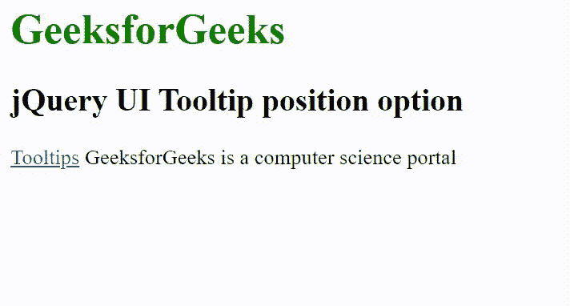

# jquery ui 工具提示位置选项

> 哎哎哎:# t0]https://www . geeksforgeeks . org/jquery-ui-tooltip-position option/

jQuery UI 由 GUI 小部件、视觉效果和使用 HTML、CSS 和 jQuery 实现的主题组成。jQuery 用户界面非常适合为网页构建用户界面。jQuery UI 工具提示位置选项用于设置工具提示相对于关联目标元素的位置。

**语法:**

```html
$( ".selector" ).tooltip({
  position: { my: "left+15 center", at: "right center" }
});
```

**CDN 链接:**首先，添加项目所需的 jQuery UI 脚本。

> <link rel="”stylesheet”" href="”//code.jquery.com/ui/1.12.1/themes/smoothness/jquery-ui.css”">
> <脚本 src =//code . jquery . com/jquery-1 . 12 . 4 . js "></脚本>
> <脚本 src =//code . jquery . com/ui/1 . 12 . 1/jquery-ui . js "></脚本>

**示例:**

## 超文本标记语言

```html
<!DOCTYPE html>
<html lang="en">

<head>
    <meta charset="utf-8">
    <link rel="stylesheet" href=
    "//code.jquery.com/ui/1.12.1/themes/base/jquery-ui.css">
    <script src="https://code.jquery.com/jquery-1.12.4.js">
    </script>
    <script src="https://code.jquery.com/ui/1.12.1/jquery-ui.js">
    </script>

    <script>
        $(document).ready(function () {
            $("#p1").tooltip({
                position: {
                    my: "left+15 center",
                    at: "right center"
                }
            });
        });
    </script>
</head>

<body>
    <h1 style="color: green;">GeeksforGeeks</h1>
    <h2>jQuery UI Tooltip position option</h2>

    <p id="p1">
        <a href="#" title="This is a tooltip">Tooltips</a>
        GeeksforGeeks is a computer science portal
    </p>

</body>

</html>
```

**输出:**



**参考:**[https://API . jquery ui . com/tooltip/# option-position](https://api.jqueryui.com/tooltip/#option-position)