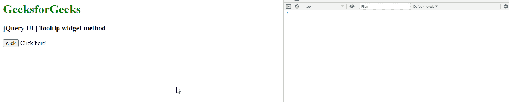
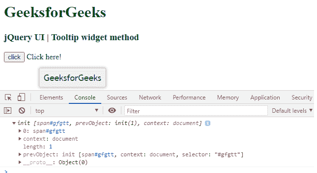

# jQuery UI 工具提示小工具()方法

> 原文:[https://www . geesforgeks . org/jquery-ui-tooltip-widget-method/](https://www.geeksforgeeks.org/jquery-ui-tooltip-widget-method/)

jQuery UI 由 GUI 小部件、视觉效果和使用 jQuery、CSS 和 HTML 实现的主题组成。jQuery 用户界面非常适合为网页构建用户界面。jQuery UI 工具提示小部件帮助我们添加新的主题，并允许自定义。在本文中，我们将看到如何在 jQuery UI 工具提示中使用**小部件**方法。**小工具**方法用于获取 jQuery UI **的实例。**

**语法:**

```html
var a = $(".selector").tooltip("widget");
```

**参数:**此方法不接受任何参数。

**CDN 链接:**

*   首先，添加项目所需的 jQuery UI 脚本。

> <link href="”https://code.jquery.com/ui/1.10.4/themes/ui-lightness/jquery-ui.css”" rel="”stylesheet”">
> <脚本 src = " https://code . jquery . com/jquery-1 . 10 . 2 . js "></脚本>
> <脚本 src = " https://code . jquery . com/ui/1 . 10 . 4/jquery-ui . js "></脚本>

**示例:**

## 超文本标记语言

```html
<!DOCTYPE html>
<html lang="en">
  <head>
    <meta charset="utf-8" />
    <link href=
"https://code.jquery.com/ui/1.10.4/themes/ui-lightness/jquery-ui.css"
      rel="stylesheet"/>
    <script src=
"https://code.jquery.com/jquery-1.10.2.js">
    </script>
    <script src=
"https://code.jquery.com/ui/1.10.4/jquery-ui.js">
    </script>

    <h1 style="color: green">GeeksforGeeks</h1>
    <h3>jQuery UI | Tooltip widget method</h3>

    <script>
      $(function () {
        $("#gfgtt").tooltip({
          track: true,
        });
        $("#gfg").click(function () {
          var a = $("#gfgtt").tooltip("widget");
          console.log(a);
        });
      });
    </script>
  </head>

  <body>
    <input id="gfg" type="submit" name="GeeksforGeeks" value="click" />
    <span id="gfgtt" title="GeeksforGeeks"> Click here!</span>
  </body>
</html>
```

**输出:**

 

**参考:**T2】https://api.jqueryui.com/tooltip/#method-widget