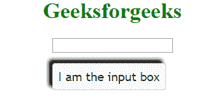

# jQuery UI | Tooltip

> 哎哎哎:# t0]https://www . geeksforgeeks . org/jquery-ui-tooltip/

jQuery 用户界面中的工具提示小部件不同于传统的工具提示，主要是因为它更具主题性，并且更具可定制性。一些可用的定制包括:

*   像脚注等额外的内容也可以通过 Ajax 检索来显示。
*   自定义警告和错误字段的字段。
*   自定义位置，即工具提示位于元素上方的中心。

默认情况下，淡入淡出动画用于显示工具提示。

**语法:**

```
$( "#div_tooltip" ).tooltip({
});
```

**属性值:**

*   **内容:**该属性表示工具提示的内容。默认情况下，它的值是一个返回 title 属性的函数。
*   **禁用:**该属性设置为真时禁用工具提示。默认情况下，它的值为 false。
*   **隐藏:**该属性表示隐藏工具提示时的动画效果。默认情况下，其值为真。
*   **项目:**该选项指示哪些项目可以显示工具提示。默认情况下，它的值是[title]。
*   **位置:**该属性决定工具提示相对于相关目标元素的位置。默认情况下，它的值是返回标题属性的函数。可能的值有:my、at、of、碰撞、使用、内部。
*   **显示:**该属性表示如何动画显示工具提示。默认情况下，其值为真。
*   **tooltipClass:** 该属性是一个可以添加到工具提示小部件中的类，用于警告或错误等工具提示。默认情况下，其值为空。
*   **轨迹:**该属性设置为 true 时，工具提示跟随/跟踪鼠标。默认情况下，它的值为 false。

工具提示是可添加的，它将覆盖用 title 属性编写的父字符串。这给了我们一个优势，因为我们可以通过使用脚本来更改工具提示，就像同一个元素可以在不同的需求下显示不同的工具提示字符串一样。让我们试试。在这里，我们将标题定义为“欢迎来到 geeksforgeeks”，它在 javascript 代码中被覆盖。
**例 1:**

```
<html>

<head>
    <link href=
'https://ajax.googleapis.com/ajax/libs/jqueryui/1.12.1/themes/ui-lightness/jquery-ui.css'
          rel='stylesheet'>
</head>

<body>
    <center>
        <h1 style="color:green">
          GeeksforGeeks
      </h1>
        <div id=div_tooltip 
             title='Welcome to geeksforgeeks'>
            Bring your Mouse here
        </div>

        <script src=
"https://ajax.googleapis.com/ajax/libs/jquery/3.1.1/jquery.min.js">
        </script>
        <script src=
"https://ajax.googleapis.com/ajax/libs/jqueryui/1.12.1/jquery-ui.min.js">
        </script>

        <script>
            $(document).ready(function() {

                $("#div_tooltip").tooltip({});
            })
        </script>
    </center>
</body>

</html>
```

**输出:**


**覆盖 Tooltip 中的标题:**jQuery UI 中 Tooltip 小部件的另一个主要优点是，可以在定义元素时按照指定覆盖标题。这可以通过在 JavaScript 代码的内容选项中指定消息来实现。

**例 2:**

```
<html>

<head>
    <link href=
'https://ajax.googleapis.com/ajax/libs/jqueryui/1.12.1/themes/ui-lightness/jquery-ui.css'
          rel='stylesheet'>
</head>

<body>
    <center>
        <h1 style="color:green">GeeksforGeeks</h1>
        <div id=div_tooltip 
             title='Welcome to geeksforgeeks'>
          Bring your Mouse here
      </div>

        <script src=
"https://ajax.googleapis.com/ajax/libs/jquery/3.1.1/jquery.min.js">
      </script>
        <script src=
"https://ajax.googleapis.com/ajax/libs/jqueryui/1.12.1/jquery-ui.min.js">
      </script>

        <script>
            $(document).ready(function() {
                $("#div_tooltip").tooltip({
                    content: "This is my content"
                });
            })
        </script>
    </center>
</body>

</html>
```

**输出:**


**禁用工具提示:**该属性设置为真时禁用工具提示。默认情况下，它的值为 false。

**例 3:**

```
<html>

<head>
    <link href=          
'https://ajax.googleapis.com/ajax/libs/jqueryui/1.12.1/themes/ui-lightness/jquery-ui.css'
          rel='stylesheet'>
</head>

<body>
    <center>
        <h1 style="color:green">GeeksforGeeks</h1>
        <div id=div_tooltip
             title='Welcome to geeksforgeeks'>
          Bring your Mouse here
      </div>

        <script src=
"https://ajax.googleapis.com/ajax/libs/jquery/3.1.1/jquery.min.js">
      </script>
        <script src=
"https://ajax.googleapis.com/ajax/libs/jqueryui/1.12.1/jquery-ui.min.js">
      </script>

        <script>
            $(document).ready(function() {

                $("#div_tooltip").tooltip({
                    disabled: true
                });

            })
        </script>
    </center>
</body>

</html>
```

**输出:**


**项目:**项目属性用于设置显示为工具提示的不同元素消息。在下面的例子中，一个文本框保留在 div 标签中。默认情况下，写在文本框内的消息显示为工具提示，但是通过将项目设置为 div 标记，并将写在 div 标记的 title 属性内的消息显示为工具提示。

**例 4:**

```
<html>

<head>
    <link href=
'https://ajax.googleapis.com/ajax/libs/jqueryui/1.12.1/themes/ui-lightness/jquery-ui.css'
          rel='stylesheet'>
</head>

<body>
    <center>
        <h1 style="color:green">GeeksforGeeks</h1>
        <div id=div_tooltip title='I am inside a Div tag'>
            <input type=textbox 
                   name=my_text 
                   id=my_text 
                   title='I am the input box'>
        </div>

        <script src=
"https://ajax.googleapis.com/ajax/libs/jquery/3.1.1/jquery.min.js">
      </script>
        <script src=
"https://ajax.googleapis.com/ajax/libs/jqueryui/1.12.1/jquery-ui.min.js">
      </script>

        <script>
            $(document).ready(function() {

                $("#my_text").tooltip({
                    items: 'div'
                });

            })
        </script>
    </center>
</body>

</html>
```

**输出:**


**位置:**该属性用于在相对于主元素的任意位置显示工具提示。
可能的值有。

*   **我的:**这是工具提示框。
*   **在:**显示工具提示的元素。

**还要注意:**

*   所有水平对齐可以采取三个位置:左或右或中心。
*   All vertical alignment can take three positions: top or bottom or center.

    检查这条线

    ```
    position: { my: "left center", at: "right top" } 
    ```

    这里，工具提示的左侧中心位置( *my:“左侧中心”*)将与主元素右侧顶部位置(*在:“右侧顶部”*)对齐

    **例 5:**

    ```
    <html>

    <head>
        <link href=
    'https://ajax.googleapis.com/ajax/libs/jqueryui/1.12.1/themes/ui-lightness/jquery-ui.css' 
              rel='stylesheet'>
    </head>

    <body>
        <center>
            <h1 style="color:green">GeeksforGeeks</h1>

            <div align=center>
                <input type=textbox
                       name=my_text
                       id=my_text
                       title=''>
            </div>

            <script src=
    "https://ajax.googleapis.com/ajax/libs/jquery/3.1.1/jquery.min.js">
            </script>
            <script src=
    "https://ajax.googleapis.com/ajax/libs/jqueryui/1.12.1/jquery-ui.min.js">
            </script>

            <script>
                $(document).ready(function() {

                    $("#my_text").tooltip({
                        content: "I am the textbox",
                        position: {
                            my: "left center",
                            at: "right top"
                        }
                    });
                })
            </script>
        </center>
    </body>

    </html>
    ```

    **输出:**
    

    **显示-隐藏工具提示:**显示&隐藏是两个独立的选项，但是我们可以一起学习。*显示*属性用于添加效果来管理工具提示的外观。这是显示工具提示时创建的动画。*隐藏*属性用于添加效果来管理工具提示的消失。这是隐藏工具提示时创建的动画。
    对于显示和隐藏选项，使用以下示例中的几种效果。
    **例 6:**

    ```
    <html>

    <head>
        <link href=
    'https://ajax.googleapis.com/ajax/libs/jqueryui/1.12.1/themes/ui-lightness/jquery-ui.css'
              rel='stylesheet'>
    </head>

    <body>
        <center>
            <h1 style="color:green">Geeksforgeeks</h1>

            <input type=textbox 
                   name=my_text 
                   id=my_text 
                   title='I am the input box'>

            <script src=
    "https://ajax.googleapis.com/ajax/libs/jquery/3.1.1/jquery.min.js">
          </script>
            <script src=
    "https://ajax.googleapis.com/ajax/libs/jqueryui/1.12.1/jquery-ui.min.js">
          </script>

            <script>
                $(document).ready(function() {

                    $("#my_text").tooltip({
                        show: {
                            effect: "slide",
                            duration: 400
                        },
                        hide: {
                            effect: "pulsate",
                            duration: 400
                        }
                    });
                })
            </script>
        </center>
    </body>

    </html>
    ```

    **输出:**
    