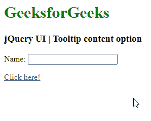

# jQuery 用户界面工具提示内容选项

> 原文:[https://www . geeksforgeeks . org/jquery-ui-工具提示-内容-选项/](https://www.geeksforgeeks.org/jquery-ui-tooltips-content-option/)

jQuery UI 由 GUI 小部件、视觉效果和使用 jQuery、CSS 和 HTML 实现的主题组成。jQuery 用户界面非常适合为网页构建用户界面。 jQuery UI 工具提示小部件帮助我们添加新主题并允许自定义。在本文中，我们将看到如何在工具提示中使用*内容* 选项。 *内容*选项用于在工具提示中添加一些内容。

**语法:**

```html
$( ".selector" ).tooltips(
   { content: "GeeksforGeeks!" }
);
```

**参数:**

*   **字符串:**要在工具提示中插入的值。

**方法:**首先，添加项目所需的 jQuery UI 脚本。

> <link href="”https://code.jquery.com/ui/1.10.4/themes/ui-lightness/jquery-ui.css”" rel="”stylesheet”">
> <脚本 src = " https://code . jquery . com/jquery-1 . 10 . 2 . js "></脚本>
> <脚本 src = " https://code . jquery . com/ui/1 . 10 . 4/jquery-ui . js "></脚本>

**示例:**以下示例演示了工具提示的*内容*选项。

## 超文本标记语言

```html
<!doctype html>
<html lang="en">

<head>
    <meta charset="utf-8">
    <link href=
"https://code.jquery.com/ui/1.10.4/themes/ui-lightness/jquery-ui.css"
        rel="stylesheet">
    <script src="https://code.jquery.com/jquery-1.10.2.js">
    </script>

    <script src="https://code.jquery.com/ui/1.10.4/jquery-ui.js">
    </script>

    <h1 style="color:green;">
        GeeksforGeeks
    </h1>

    <h3>
        jQuery UI | Tooltip content option
    </h3>

    <script>
        $(function () {
            $("#gfg1").tooltip({
                content: "GeeksforGeeks!"
            });
            $("#gfg1").tooltip();
            $("#gfg2").tooltip();
        });
    </script>
</head>

<body>
    <label for="name">Name:</label>
    <input id="gfg1" title="GeeksforGeeks">

    <p><a id="gfg2" href="" title="GeeksforGeeks">
        Click here!
    </a></p>
</body>

</html>
```

**输出:**



**参考:**T2】https://api.jqueryui.com/category/widgets/