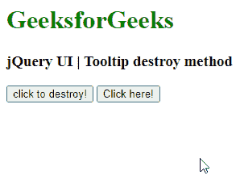

# jQuery UI 工具提示销毁()方法

> 原文:[https://www . geeksforgeeks . org/jquery-ui-toolties-destroy-method/](https://www.geeksforgeeks.org/jquery-ui-tooltips-destroy-method/)

jQuery UI 由 GUI 小部件、视觉效果和使用 jQuery、CSS 和 HTML 实现的主题组成。jQuery 用户界面非常适合为网页构建用户界面。 jQuery UI 工具提示小部件帮助我们添加新主题并允许自定义。在本文中，我们将看到如何在 jQuery UI 工具提示中使用 **销毁**选项。 **销毁**选项用于销毁 jQuery UI **中的工具提示。**

**语法:**

```
$(".selector").tooltip("destroy");
```

**参数:**此方法不接受任何参数。

**CDN 链接:**首先，添加项目所需的 jQuery UI 脚本。

> <link href="“https://code.jquery.com/ui/1.10.4/themes/ui-lightness/jquery-ui.css”" rel="“stylesheet”">
> <脚本 src = " https://code . jquery . com/jquery-1 . 10 . 2 . js "></脚本>
> <脚本 src = " https://code . jquery . com/ui/1 . 10 . 4/jquery-ui . js "></脚本>

**示例:**以下示例演示了工具提示的**摧毁**选项。一旦‘点击毁灭！’选项时，它会破坏

## 超文本标记语言

```
<!DOCTYPE html>
<html lang="en">
  <head>
    <meta charset="utf-8" />
    <link
      href=
"https://code.jquery.com/ui/1.10.4/themes/ui-lightness/jquery-ui.css"
      rel="stylesheet"
    />
    <script src=
"https://code.jquery.com/jquery-1.10.2.js">
    </script>
    <script src=
"https://code.jquery.com/ui/1.10.4/jquery-ui.js">
    </script>

    <h1 style="color: green">GeeksforGeeks</h1>
    <h3>jQuery UI | Tooltip destroy method</h3>

    <script>
      $(function () {
        $("#gfgtt").tooltip({
          track: true,
        });
        $("#gfg").click(function () {
          $("#gfgtt").tooltip("destroy");
        });
      });
    </script>
  </head>

  <body>
    <input
      id="gfg"
      type="submit"
      name="GeeksforGeeks"
      value="click to destroy!"
    />
    <button id="gfgtt" title="GeeksforGeeks">Click here!</button>
  </body>
</html>
```

**输出:**



**参考:**T2】https://api.jqueryui.com/tooltip/#method-destroy