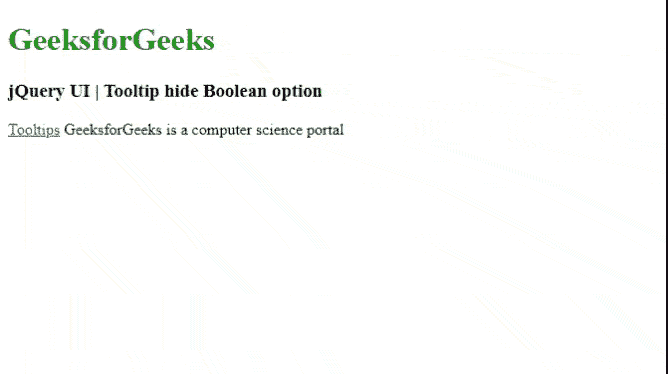
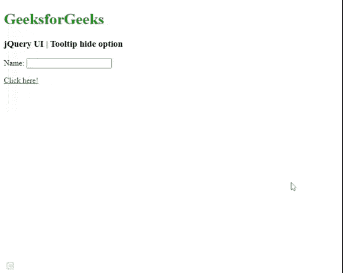
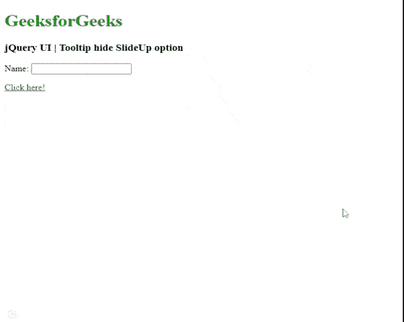

# jQuery 用户界面工具提示隐藏选项

> 原文:[https://www . geeksforgeeks . org/jquery-ui-工具提示-隐藏-选项/](https://www.geeksforgeeks.org/jquery-ui-tooltips-hide-option/)

jQuery UI 由 GUI 小部件、视觉效果和使用 jQuery、CSS 和 HTML 实现的主题组成。jQuery 用户界面非常适合为网页构建用户界面。jQuery UI 工具提示小部件帮助我们添加新的主题，并允许自定义。在本文中，我们将看到如何在 jQuery UI 工具提示中使用*隐藏* 选项。*隐藏* 选项用于在工具提示中隐藏时添加动画效果。默认情况下，该值为**真。**

**语法:**

```html
$( ".selector" ).tooltips(
   { hide : true }
);
```

**参数:**

*   **布尔:**如果设置为*假，*没有隐藏效果。
*   **数字:**工具提示隐藏的时间(毫秒)。
*   **字符串:** 该字符串用于隐藏工具提示的选定效果。该效果将使用默认的持续时间和放松来隐藏。
*   **对象:**使用对象作为隐藏工具提示，其中提供了*效果、缓和、持续时间、*和*延迟*属性。

**进场:**

*   首先，添加项目所需的 jQuery UI 脚本。

> <link href="”https://code.jquery.com/ui/1.10.4/themes/ui-lightness/jquery-ui.css”" rel="”stylesheet”">

**示例 1:** 以下示例演示了工具提示的布尔类型隐藏选项。

## 超文本标记语言

```html
<!doctype html>
<html lang="en">

<head>
    <meta charset="utf-8">
    <link href=
"https://code.jquery.com/ui/1.10.4/themes/ui-lightness/jquery-ui.css"
        rel="stylesheet">
    <script src=
     "https://code.jquery.com/jquery-1.10.2.js">
    </script>

    <script src=
     "https://code.jquery.com/ui/1.10.4/jquery-ui.js">
    </script>

    <h1 style="color:green;">
        GeeksforGeeks
    </h1>

    <h3>
        jQuery UI | Tooltip hide Boolean option
    </h3>  
</head>  
<body>

    <p id="p1">
    <a href="#" title="This is a tooltip">Tooltips</a>
    GeeksforGeeks is a computer science portal</p>

     <script>
        $(document).ready(function() {
            $("#p1").tooltip({
                hide: { true }               
            });                  

        });
    </script>
</body>

</html>
```

**输出:**



工具提示隐藏

点击工具提示链接，我们得到以下工具提示作为输出。

```html
This is a tooltip
```

**示例 2:** 以下示例演示了工具提示的隐藏，使用*爆炸*动画效果，时间为 400 毫秒。这里显示了使用*爆炸*作为字符串和使用 400 毫秒作为*号*选项。

## 超文本标记语言

```html
<!doctype html>
<html lang="en">

<head>
    <meta charset="utf-8">
    <link href=
"https://code.jquery.com/ui/1.10.4/themes/ui-lightness/jquery-ui.css"
        rel="stylesheet">

    <script src="https://code.jquery.com/jquery-1.10.2.js">
    </script>

    <script src="https://code.jquery.com/ui/1.10.4/jquery-ui.js">
    </script>

    <h1 style="color:green;">
        GeeksforGeeks
    </h1>

    <h3>
        jQuery UI | Tooltip hide option
    </h3>

    <script>
        $(function () {
            $("#gfg1").tooltip({
                hide: { effect: "explode", duration: 400 }
            });
            $("#gfg1").tooltip();
            $("#gfg2").tooltip();
        });
    </script>
</head>

<body>
    <label for="name">Name:</label>
    <input id="gfg1" title="GeeksforGeeks">

<p><a id="gfg2" href="" title="GeeksforGeeks">
        Click here!
    </a></p>

</body>  
</html> 
```

**输出:**



**示例 3:** 以下示例演示了在 200 毫秒内使用*向上滑动*选项隐藏动画。

## 超文本标记语言

```html
<!doctype html>
<html lang="en">

<head>
    <meta charset="utf-8">
    <link href=
"https://code.jquery.com/ui/1.10.4/themes/ui-lightness/jquery-ui.css"
        rel="stylesheet">
    <script src="https://code.jquery.com/jquery-1.10.2.js"></script>

    <script src="https://code.jquery.com/ui/1.10.4/jquery-ui.js">
    </script>

    <h1 style="color: green;">
        GeeksforGeeks
    </h1>

    <h3>
        jQuery UI | Tooltip hide SlideUp option
    </h3>

    <script>
        $(function () {
            $("#gfg1").tooltip({
                hide: { effect: "slideUp", duration: 200 }
            });
            $("#gfg1").tooltip();
            $("#gfg2").tooltip();
        });
    </script>
</head>

<body>
    <label for="name">Name:</label>
    <input id="gfg1" title="GeeksforGeeks">

<p><a id="gfg2" href="" title="GeeksforGeeks">
        Click here!
    </a></p>

</body>

</html>  

```

**输出:**



**参考:**T2】https://api.jqueryui.com/category/widgets/