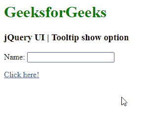
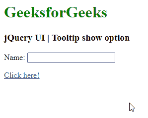
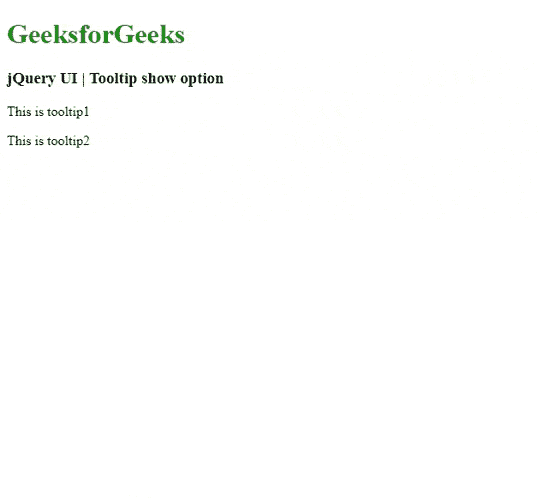

# jQuery 用户界面工具提示显示选项

> 原文:[https://www . geeksforgeeks . org/jquery-ui-tooltip-show-option/](https://www.geeksforgeeks.org/jquery-ui-tooltips-show-option/)

jQuery UI 由 GUI 小部件、视觉效果和使用 jQuery、CSS 和 HTML 实现的主题组成。jQuery 用户界面非常适合为网页构建用户界面。jQuery UI 工具提示小部件帮助我们添加新的主题，并允许自定义。在本文中，我们将看到如何在 jQuery UI 工具提示中使用*显示*选项。*显示* 选项用于在 jQuery 用户界面工具提示中显示时添加动画效果。默认情况下，该值为 *true* **。**

**语法:**

```html
$(".selector").tooltips(
   { show : true }
);
```

**参数:**

*   **布尔值:**如果设置为*假*则没有显示效果。
*   **数字:**显示工具提示的时间(毫秒)。
*   **字符串:**该字符串用于显示工具提示的选定效果。该效果将用于显示使用默认的持续时间和缓和。
*   **对象:**工具提示使用对象作为值显示，其中提供了效果、缓和、持续时间和延迟属性。

**进场:**

*   首先，添加项目所需的 jQuery UI 脚本。

> <link href="”https://code.jquery.com/ui/1.10.4/themes/ui-lightness/jquery-ui.css”" rel="”stylesheet”">

**示例 1:** 以下代码演示了以毫秒为单位的*显示*选项的设置

## 超文本标记语言

**输出:**



**示例 2:** 以下代码演示了使用布尔值设置*显示*选项。

## 超文本标记语言

**输出:**



**示例 3:** 以下示例演示了工具提示*使用*向下滑动*和*折叠*功能显示*选项。为了更好地理解，请参考输出图像。

## 超文本标记语言

**输出:**



**参考:**T2】https://api.jqueryui.com/category/widgets/