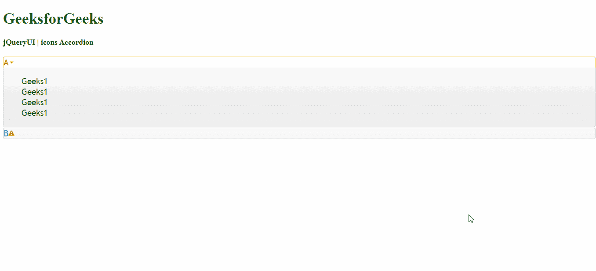
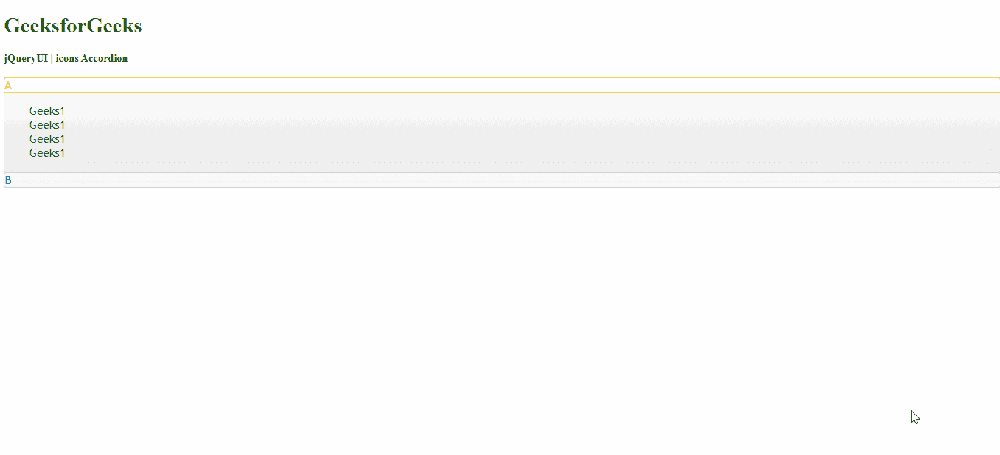

# jQueryUI 手风琴图标选项

> 原文:[https://www . geeksforgeeks . org/jqueryui-accordion-icons-option/](https://www.geeksforgeeks.org/jqueryui-accordion-icons-option/)

图标选项用于设置标题的图标以及标题处于活动状态的时间。如果设置为 false，则该标题将没有标题。

默认为

```html
{ 
    "header": "ui-icon-triangle-1-e", 
    "activeHeader": "ui-icon-triangle-1-s" 
}
```

**值:**

*   **图标名称:**我们要在表头显示的图标。

**方法:**首先，添加项目所需的 jQuery Mobile 脚本。

> <src = " https://Ajax . Google APIs . com/Ajax/libs/jquery ui/1 . 8 . 16/jquery-ui . js "></script><link href = " http://Ajax . Google APIs . com/Ajax

**例 1:**

## 超文本标记语言

```html
<!DOCTYPE html> 
<html> 

<head> 
    <meta charset="utf-8"> 
    <meta name="viewport" content= 
        "width=device-width, initial-scale=1"> 

    <script src= 
"https://ajax.googleapis.com/ajax/libs/jquery/1.7.1/jquery.js"> 
    </script> 

    <script src= 
"https://ajax.googleapis.com/ajax/libs/jqueryui/1.8.16/jquery-ui.js"> 
    </script> 

    <link href= 
"http://ajax.googleapis.com/ajax/libs/jqueryui/1.8.16/themes/ui-lightness/jquery-ui.css"
        rel="stylesheet" type="text/css" /> 

    <style> 
        .height { 
            height: 10px; 
        } 
    </style> 

    <script> 
        $(function () { 
            $( "#gfg" ).accordion(
                   { icons: { "header": "ui-icon-alert", "activeHeader": "ui-icon-minus" } }

                );
        }); 
    </script> 
    <style>
         #gfg{font-size: 17px;}
    </style>
</head> 

<body> 
    <h1 style="color:green">GeeksforGeeks</h1> 
    <b>jQueryUI | icons Accordion</b> 
    <br>
    <br>
    <div id="gfg">
        <h2>A</h2>
         <div>Geeks1
            <br>Geeks1
            <br>Geeks1
            <br>Geeks1
            <br>
        </div>
        <h2>B</h2>
        <div>Geeks2
            <br>Geeks2
            <br>Geeks2
            <br>Geeks2
        </div>
    </div> 
</body> 

</html>
```

**输出:**



**例 2:**

## 超文本标记语言

```html
<!DOCTYPE html> 
<html> 

<head> 
    <meta charset="utf-8"> 
    <meta name="viewport" content= 
        "width=device-width, initial-scale=1"> 

    <script src= 
"https://ajax.googleapis.com/ajax/libs/jquery/1.7.1/jquery.js"> 
    </script> 

    <script src= 
"https://ajax.googleapis.com/ajax/libs/jqueryui/1.8.16/jquery-ui.js"> 
    </script> 

    <link href= 
"http://ajax.googleapis.com/ajax/libs/jqueryui/1.8.16/themes/ui-lightness/jquery-ui.css"
        rel="stylesheet" type="text/css" /> 

    <style> 
        .height { 
            height: 10px; 
        } 
    </style> 

    <script> 
        $(function () { 
            $( "#gfg" ).accordion(
                   { icons: false }

                );
        }); 
    </script> 
    <style>
         #gfg{font-size: 17px;}
    </style>
</head> 

<body> 
    <h1 style="color:green">GeeksforGeeks</h1> 
    <b>jQueryUI | icons Accordion</b> 
    <br>
    <br>
    <div id="gfg">
        <h2>A</h2>
         <div>Geeks1
            <br>Geeks1
            <br>Geeks1
            <br>Geeks1
            <br>
        </div>
        <h2>B</h2>
        <div>Geeks2
            <br>Geeks2
            <br>Geeks2
            <br>Geeks2
        </div>
    </div>
</body> 

</html>
```

**输出:**

