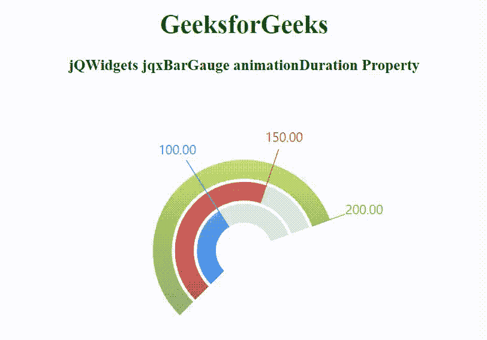

# jQWidgets jqxBarGauge 动画持续时间属性

> 原文:[https://www . geesforgeks . org/jqwidgets-jqxbargage-animation duration-property/](https://www.geeksforgeeks.org/jqwidgets-jqxbargauge-animationduration-property/)

jQWidgets 是一个 JavaScript 框架，用于为 PC 和移动设备制作基于 web 的应用程序。它是一个非常强大和优化的框架，独立于平台，并得到广泛支持。jqxBarGauge 表示一个 jQuery 条形图小部件，它为给定的值绘制一个条形图。

animationDuration 属性用于确定动画时间(以毫秒为单位)。若要禁用此属性，请将其值设置为 0。它的默认值是 1000 毫秒。

**语法:**

```
$('.selector').jqxBarGauge({
  values: [array],
  animationDuration: 500
});
```

**链接文件:**从 https://www.jqwidgets.com/download/链接下载 jQWidgets。在 HTML 文件中，找到下载文件夹中的脚本文件:

> <link rel="”stylesheet”" href="”jqwidgets/styles/jqx.base.css”" type="”text/css”">
> <脚本类型= " text/JavaScript " src = " scripts/jquery-1 . 11 . 1 . min . js "></脚本类型>
> <脚本类型= " text/JavaScript " src = " jqwidgets/jqxcore . js "></脚本类型>
> <脚本类型= " text/JavaScript " src = " jqwidgets/jqxdraw . js

以下示例说明了 jQWidgets 中的 jqxBarGauge animationDuration 属性:

**示例:**

## 超文本标记语言

```
<!DOCTYPE html>
<html lang="en">

<head>
    <link rel="stylesheet" href=
        "jqwidgets/styles/jqx.base.css" type="text/css" />
    <script type="text/javascript" src="scripts/jquery-1.11.1.min.js">
    </script>
    <script type="text/javascript" src="jqwidgets/jqxcore.js">
    </script>
    <script type="text/javascript" src="jqwidgets/jqxdraw.js">
    </script>
    <script type="text/javascript" src="jqwidgets/jqxbargauge.js">
    </script>
</head>

<body>
    <h1 style="color: green;">
        GeeksforGeeks
    </h1>

    <h3>
        jQWidgets jqxBarGauge animationDuration Property
    </h3>

    <div id="gfg"></div>

    <script type="text/javascript">
        $(document).ready(function () {
            $('#gfg').jqxBarGauge({
                values: [100, 150, 200],
                max: 200,
                endAngle: 20,
                animationDuration: 500
            });
        });
    </script>
</body>

</html>
```

**输出:**



**参考:**[https://www . jqwidgets . com/jquery-widgets-documentation/documentation/jqxbargage/jquery-bar-gauge-API . htm](https://www.jqwidgets.com/jquery-widgets-documentation/documentation/jqxbargauge/jquery-bar-gauge-api.htm)