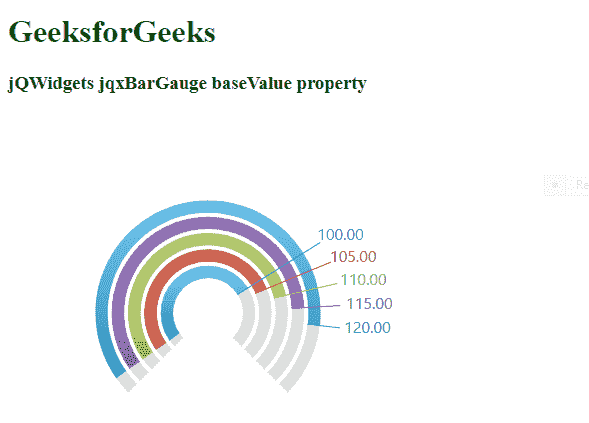

# jQWidgets jqxBarGauge 基础值属性

> 原文:[https://www . geeksforgeeks . org/jqwidgets-jqxbargage-base value-property/](https://www.geeksforgeeks.org/jqwidgets-jqxbargauge-basevalue-property/)

jQWidgets 是一个 JavaScript 框架，用于为 PC 和移动设备制作基于 web 的应用程序。它是一个非常强大和优化的框架，独立于平台，并得到广泛支持。

**jqxbar gauge**代表一个 jQuery 条形图部件，它为给定值绘制条形图。这里 **基础值**属性用于设置棒线规的基础值。默认值为**空。**

**语法:**

```html
$('.selector').jqxBarGauge({
    values: [array], 
    max: number,
    baseValue: number
});
```

**CDN 链接:**从 https://www.jqwidgets.com/download/链接下载 jQWidgets。在 HTML 文件中，找到下载文件夹中的脚本文件:

> <link rel="”stylesheet”" href="”jqwidgets/styles/jqx.base.css”" type="”text/css”">
> <脚本类型= " text/JavaScript " src = " scripts/jquery-1 . 11 . 1 . min . js "></脚本类型>
> <脚本类型= " text/JavaScript " src = " jqwidgets/jqxcore . js "></脚本类型>
> <脚本类型= " text/JavaScript " src = " jqwidgets/jqxdraw . js

下面是展示实现的示例

**例 1:**

## 超文本标记语言

```html
<!DOCTYPE html>
<html lang="en">
  <head>
    <link
      rel="stylesheet"
      href="jqwidgets/styles/jqx.base.css"
      type="text/css"
    />
    <script type="text/javascript" 
            src="scripts/jquery-1.11.1.min.js">
    </script>
    <script type="text/javascript" 
            src="jqwidgets/jqxcore.js">
    </script>
    <script type="text/javascript" 
            src="jqwidgets/jqxdraw.js">
    </script>
    <script type="text/javascript" 
            src="jqwidgets/jqxbargauge.js">
    </script>

    <h1 style="color: green">GeeksforGeeks</h1>
    <h3>jQWidgets jqxBarGauge baseValue property</h3>

    <script type="text/javascript">
      $(document).ready(function () {
        $("#gfg").jqxBarGauge({
          values: [100, 105, 110, 115, 120],
          max: 140,
          baseValue: 5,
        });
      });
    </script>
  </head>
  <body>
    <div id="gfg"></div>
  </body>
</html>
```

**输出:**



**参考:**[https://www . jqwidgets . com/jquery-widgets-documentation/documentation/jqxbargage/jquery-bar-gauge-入门. htm](https://www.jqwidgets.com/jquery-widgets-documentation/documentation/jqxbargauge/jquery-bar-gauge-getting-started.htm?search=)