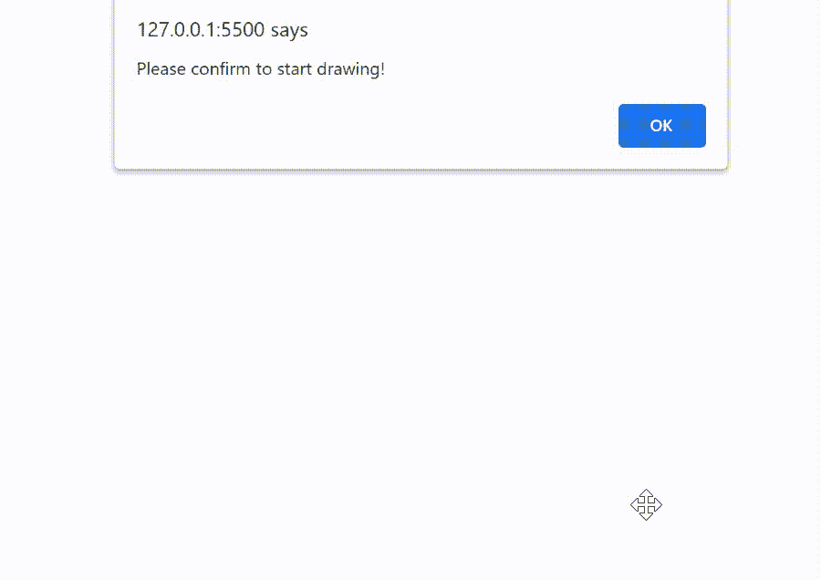

# jQWidgets jqxBarGauge draw start 事件

> 原文:[https://www . geesforgeks . org/jqwidgets-jqxbargage-draw start-event/](https://www.geeksforgeeks.org/jqwidgets-jqxbargauge-drawstart-event/)

**jQWidgets** 是一个 JavaScript 框架，用于为 PC 和移动设备制作基于 web 的应用程序。它是一个非常强大和优化的框架，独立于平台，并得到广泛支持。jqxBarGauge 表示一个 jQuery 条形图小部件，它为给定的值绘制一个条形图。

当 barGauge 再次开始渲染时，触发 **drawStart** 事件。该事件通常与**drawind**事件结合使用。

**语法:**

```html
$('.selector').on("drawStart", function () {
});
```

**链接文件:**下载 [jQWidgets](https://www.jqwidgets.com/download/) 链接。在 HTML 文件中，在下载的文件夹中找到脚本文件。

> <link rel="”stylesheet”" href="”jqwidgets/styles/jqx.base.css”" type="”text/css”">
> <脚本类型= " text/JavaScript " src = " scripts/jquery-1 . 11 . 1 . min . js "></脚本类型>
> <脚本类型= " text/JavaScript " src = " jqwidgets/jqxcore . js "></脚本类型>
> <脚本类型= " text/JavaScript " src = " jqwidgets/jqxdraw . js

**示例:**下面的示例说明了 jQWidgets。jqxBarGauge **drawStart** 事件。

## 超文本标记语言

```html
<!DOCTYPE html>
<html lang="en">

<head>
    <link rel="stylesheet" 
          href="jqwidgets/styles/jqx.base.css" 
          type="text/css" />
    <script type="text/javascript" 
            src="scripts/jquery-1.11.1.min.js">
    </script>
    <script type="text/javascript" 
            src="jqwidgets/jqxcore.js">
    </script>
    <script type="text/javascript" 
            src="jqwidgets/jqxdraw.js">
    </script>
    <script type="text/javascript" 
            src="jqwidgets/jqxbargauge.js">
    </script>
</head>

<body>
    <center>
        <h1 style="color:green;">
            GeeksforGeeks
        </h1>

        <h3>
            jQWidgets jqxBarGauge drawStart Event
        </h3>

        <div id="gfg"></div>
    </center>

    <script type="text/javascript">
        $(document).ready(function () {
            $('#gfg').on("drawStart", function () {
                alert("Please confirm to start drawing!");
            });

            $('#gfg').jqxBarGauge({
                values: [100, 150, 200],
                max: 200
            })
        });
    </script>
</body>

</html>
```

**输出:**



**参考:**[https://www . jqwidgets . com/jquery-widgets-documentation/documentation/jqxbargage/jquery-bar-gauge-API . htm](https://www.jqwidgets.com/jquery-widgets-documentation/documentation/jqxbargauge/jquery-bar-gauge-api.htm)