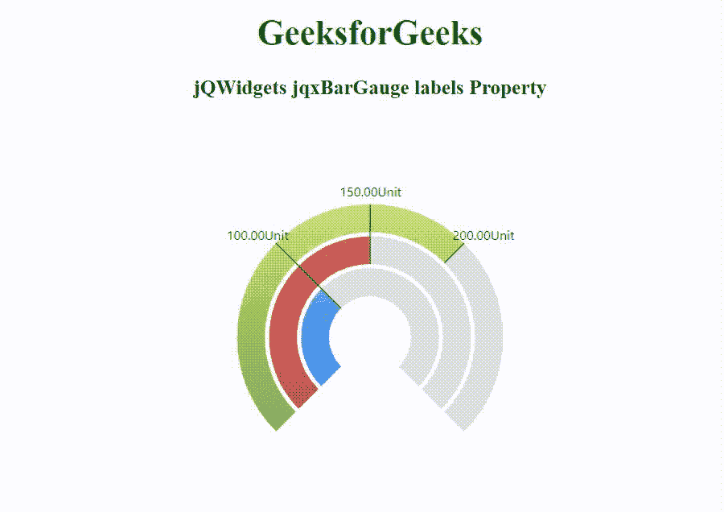

# jQWidgets jqxBarGauge 标签属性

> 原文:[https://www . geeksforgeeks . org/jqwidgets-jqxbargauge-labels-property/](https://www.geeksforgeeks.org/jqwidgets-jqxbargauge-labels-property/)

jQWidgets 是一个 JavaScript 框架，用于为 PC 和移动设备制作基于 web 的应用程序。它是一个非常强大和优化的框架，独立于平台，并得到广泛支持。jqxBarGauge 表示一个 jQuery 条形图小部件，它为给定的值绘制一个条形图。

标签属性用于在每个线段上对 BarGauge 标签进行精细设置。它接受对象类型值，默认值为 null。

**语法:**

```html
$('.selector').jqxBarGauge({
  values: [array],
  labels: { 
  }
});
```

**链接文件:**从 https://www.jqwidgets.com/download/链接下载 jQWidgets。在 HTML 文件中，找到下载文件夹中的脚本文件:

> <link rel="”stylesheet”" href="”jqwidgets/styles/jqx.base.css”" type="”text/css”">
> <脚本类型= " text/JavaScript " src = " scripts/jquery-1 . 11 . 1 . min . js "></脚本类型>
> <脚本类型= " text/JavaScript " src = " jqwidgets/jqxcore . js "></脚本类型>
> <脚本类型= " text/JavaScript " src = " jqwidgets/jqxdraw . js

以下示例说明了 jQWidgets 中的 jqxBarGauge 标签属性:

**示例:**

## 超文本标记语言

```html
<!DOCTYPE html>
<html lang="en">

<head>
    <link rel="stylesheet" href=
        "jqwidgets/styles/jqx.base.css" type="text/css" />
    <script type="text/javascript" src="scripts/jquery-1.11.1.min.js">
    </script>
    <script type="text/javascript" src="jqwidgets/jqxcore.js">
    </script>
    <script type="text/javascript" src="jqwidgets/jqxdraw.js">
    </script>
    <script type="text/javascript" src="jqwidgets/jqxbargauge.js">
    </script>
</head>

<body>
    <center>
        <h1 style="color: green;">
            GeeksforGeeks
        </h1>

        <h3>
            jQWidgets jqxBarGauge labels Property
        </h3>

        <div id="gfg"></div>
    </center>

    <script type="text/javascript">
        $(document).ready(function () {
            $('#gfg').jqxBarGauge({
                values: [100, 150, 200],
                max: 300,
                labels: {
                    connectorColor: 'green',
                    font: {
                        color: 'green',
                        size: 12,
                    },
                    formatFunction: function (value, index) {
                        return value + 'Unit';
                    }
                }
            });
        });
    </script>
</body>

</html>
```

**输出:**



**参考:**[https://www . jqwidgets . com/jquery-widgets-documentation/documentation/jqxbargage/jquery-bar-gauge-API . htm](https://www.jqwidgets.com/jquery-widgets-documentation/documentation/jqxbargauge/jquery-bar-gauge-api.htm)