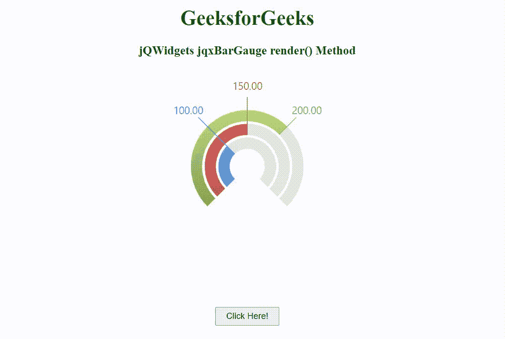

# jQWidgets jqxbargage 渲染()方法

> 原文:[https://www . geeksforgeeks . org/jqwidgets-jqxbargage-render-method/](https://www.geeksforgeeks.org/jqwidgets-jqxbargauge-render-method/)

jQWidgets 是一个 JavaScript 框架，用于为 PC 和移动设备制作基于 web 的应用程序。它是一个非常强大和优化的框架，独立于平台，并得到广泛支持。jqxBarGauge 表示一个 jQuery 条形图小部件，它为给定的值绘制一个条形图。

render()方法用于呈现 jqxBarGauge 小部件。它不接受任何参数，也不返回值。

**语法:**

```
$('.selector').jqxBarGauge('render');
```

**链接文件:**从 https://www.jqwidgets.com/download/链接下载 jQWidgets。在 HTML 文件中，找到下载文件夹中的脚本文件:

> <link rel="”stylesheet”" href="”jqwidgets/styles/jqx.base.css”" type="”text/css”">
> <脚本类型= " text/JavaScript " src = " scripts/jquery-1 . 11 . 1 . min . js "></脚本类型>
> <脚本类型= " text/JavaScript " src = " jqwidgets/jqxcore . js "></脚本类型>
> <脚本类型= " text/JavaScript " src = " jqwidgets/jqxdraw . js

以下示例说明了 jQWidgets 中的 jqxBarGauge render()方法:

**示例:**

## 超文本标记语言

```
<!DOCTYPE html>
<html lang="en">

<head>
    <link rel="stylesheet" href=
"jqwidgets/styles/jqx.base.css" type="text/css" />
    <script type="text/javascript" 
            src="scripts/jquery-1.11.1.min.js">
    </script>
    <script type="text/javascript" 
            src="jqwidgets/jqxcore.js">
    </script>
    <script type="text/javascript" 
            src="jqwidgets/jqxdraw.js">
    </script>
    <script type="text/javascript" 
            src="jqwidgets/jqxbargauge.js">
    </script>
</head>

<body>
    <center>
        <h1 style="color: green;">
            GeeksforGeeks
        </h1>

        <h3>
            jQWidgets jqxBarGauge render() Method
        </h3>

        <div id="gfg"></div>
        <br>

        <input type="button" id="jqxbutton" value="Click Here!"
            style="margin-top: 50px; padding: 5px 15px" />
    </center>

    <script type="text/javascript">
        $(document).ready(function () {
            $('#gfg').jqxBarGauge({
                values: [100, 150, 200],
                max: 300,
                height: 300
            });
        });

        $('#jqxbutton').click(function () {
            $("#gfg").jqxBarGauge('render');
        });
    </script>
</body>

</html>
```

**输出:**



**参考:**[https://www . jqwidgets . com/jquery-widgets-documentation/documentation/jqxbargage/jquery-bar-gauge-API . htm](https://www.jqwidgets.com/jquery-widgets-documentation/documentation/jqxbargauge/jquery-bar-gauge-api.htm)