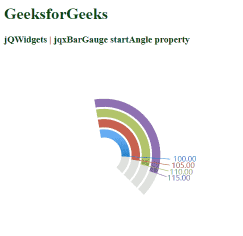

# jQWidgets jqxBarGauge 开始角度属性

> 原文:[https://www . geesforgeks . org/jqwidgets-jqxbargage-startangle-property/](https://www.geeksforgeeks.org/jqwidgets-jqxbargauge-startangle-property/)

**jQWidgets** 是一个 JavaScript 框架，用于为 PC 和移动设备制作基于 web 的应用程序。它是一个非常强大的、独立于平台的、优化的框架，受到广泛支持。

**jqxBarGauge** 代表一个 jQuery 条形图部件，它为给定值绘制条形图。

*开始角度*属性用于设置棒线规的 ***开始角度*** 。默认值为 **225。**

**语法:**

```
$('.selector').jqxBarGauge({
    values: [array], 
    max: number,
    startAngle: number
});
```

**CDN 链接:**从 https://www.jqwidgets.com/download/链接下载 jQWidgets。在 HTML 文件中，找到下载文件夹中的脚本文件:

> <link rel="”stylesheet”" href="”jqwidgets/styles/jqx.base.css”" type="”text/css”">
> <脚本类型= " text/JavaScript " src = " scripts/jquery-1 . 11 . 1 . min . js "></脚本类型>
> <脚本类型= " text/JavaScript " src = " jqwidgets/jqxcore . js "></脚本类型>
> <脚本类型= " text/JavaScript " src = " jqwidgets/jqxdraw . js

**示例:**下面是展示实现的示例。

## 超文本标记语言

```
<!DOCTYPE html>
<html lang="en">

<head>
    <link rel="stylesheet"
          href="jqwidgets/styles/jqx.base.css" 
          type="text/css" />

    <script type="text/javascript" 
            src="scripts/jquery-1.11.1.min.js">
    </script>

    <script type="text/javascript" 
            src="jqwidgets/jqxcore.js">
    </script>

    <script type="text/javascript" 
            src="jqwidgets/jqxdraw.js">
    </script>

    <script type="text/javascript" 
            src="jqwidgets/jqxbargauge.js">
    </script>

    <script type="text/javascript">
        $(document).ready(function () {
            $('#gfg').jqxBarGauge({
                values: [100, 105, 110, 115], 
                max: 140, 
                startAngle: 100
            });
        });
    </script>
</head>

<body>
    <h1 style="color: green;">
        GeeksforGeeks
    </h1>

    <h3>
        jQWidgets | jqxBarGauge startAngle property
    </h3>

    <div id="gfg"></div>
</body>

</html>
```

**输出:**



**参考:**[https://www . jqwidgets . com/jquery-widgets-documentation/documentation/jqxbargage/jquery-bar-gauge-API . htm](https://www.jqwidgets.com/jquery-widgets-documentation/documentation/jqxbargauge/jquery-bar-gauge-api.htm)